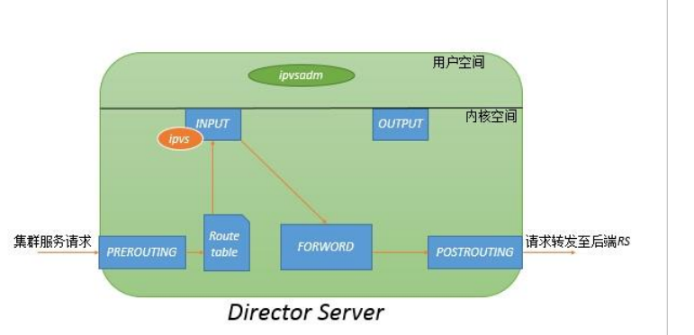

LVS-> Linux Virtual Server

IPVS

LVS的ip负载均衡技术是通过IPVS模块来实现的，IPVS是LVS集群系统的核心软件，它的主要作用是：安装在Director Server上，同时在Director Server上虚拟出一个IP地址，用户必须通过这个虚拟的IP地址访问服务器，这个虚拟IP一般称为LVS的VIP，即Virtual IP。访问的请求首先经过VIP到达负载调度器，然后由负载调度器从Real Server列表中 选取一个服务节点响应用户的请求。在用户的请求到达负载调度器后，调度器如何将请求发送到提供服务的RealServer节点，而RealServer节点如何返回数据给用户，是IPVS实现的重点技术。

ipvs：工作于内核空间，主要用于使用户定义的策略生效。

ipvsadm：工作于用户空间，主要用于用户定义和管理集群服务的工具。

