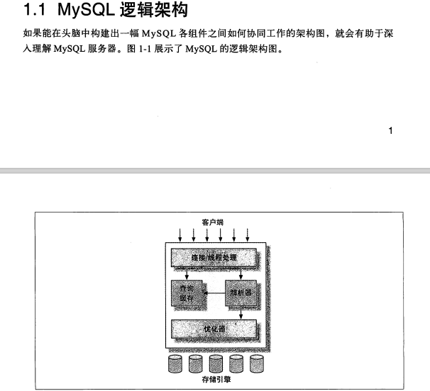

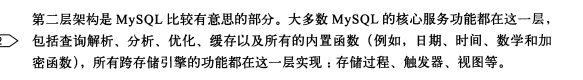

#### 优化与执行

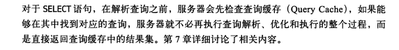

#### 并发控制

#### 读写锁

读锁是共享的，相互不阻塞，写锁是会阻塞其他的写锁和读锁，

#### 锁粒度

锁的资源越少，系统的并发程度越高

#### 锁策略

#### 表锁（table lock)

表锁是MySQL中最基本的锁策略，开销最小的策略:

锁定整张表，用户对表进行写操作，都需要获得写锁，回族赛其他用户对该表的读写操作。没有写锁的时候，其他读取的用户才能获取读锁，读锁之间不阻塞。

服务器会为了alter table之类的语句使用表锁 ，忽略存储引擎机制。

#### 行级锁(row lock)

行级锁最大程度支持并发处理，带来了最大的锁开销。行级锁在存储引擎层，在MySQL服务器层没有实现。

### 事务

除非通过严格的ACID测试，否则谈论事务的概念是不够的。

ACID

Atomicity 原子性

一个事务必须被视为不可分割的最小工作单元，要么全部成功，要么全部失败，

不能只执行一部分操作，这就是事物的原子性。

Consistency 一致性

数据库总是从一个一致性状态切换到另一个一致性状态

Isolation 隔离性

事务之间是不可见的

Durability 持久性

一旦事务提交，所做的修改会永久保存到数据库中，此时即使系统奔溃，修改的数据也不会丢失。

#### 隔离级别

READ UNCOMMITED 未提交读 

READ COMMITED 提交读 （脏读）

REPEATABLE READ 可重复读 （解决不可重复读）默认 隔离级别

SERFIALIZABLE 序列化 （解决幻读）

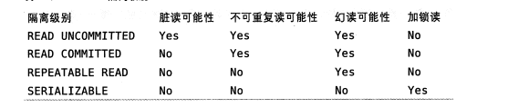

#### 死锁

数据库实现了各种思死锁检测和死锁超时机制。

目前处理死锁的方法是

将持有最少行级排他锁的事务进行回滚。

死锁发生后，只有部分或完全回滚其中的一个事务，才能打破死锁。

这是无法避免的，要考虑如何重新执行死锁回滚的事务就行。

#### 多版本并发控制

MVCC

MVCC是行级锁的一个变种，很多情况下避免了枷锁操作，大部分实现了非阻塞读操作，写操作只锁定必要的行。

MVCC的实现，是通过保存数据在某个时间点的快照来实现的，也就是说，不管执行多长时间，每个事务看到的数据都是一致的，根据事务开始时间不同，每个事务同一时间看到的数据可能是不一样的。

MVCC的实现不同，典型的有乐观optimistic并发控制 和悲观pessimistic并发控制

InnoDB的MVCC 是通过在每行记录后面保存两个隐藏的列来实现的，这两个列，一方面保存了行的创建时间，一个保存了行的过期时间，存储的不是实际的时间，而是系统版本号，每开始一个新的事务，系统版本号会自动递增。

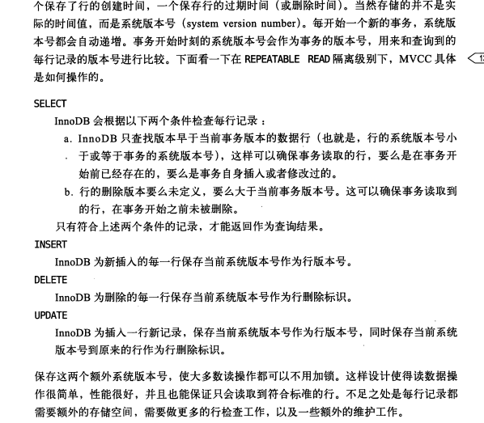

MVCC只在REPEATABLE 和 READ COMMITED两个隔离级别下工作，其他两个隔离级别都和MVCC不兼容，

因为READ UNCOMMITE总是读取最新的数据行， 而SERIALIZABLE会对所有读取的行枷锁。

#### MySQL的存储引擎

##### InnoDB是MySQL默认的事务型引擎，也是最重要，使用最广泛的存储引擎。被设计用来处理大量的短期事务，

InnoDB的数据存储在表空间中，表空间是由InnoDB管理的一个黑盒子。有一系列文件组成。

InnoDB采用MVCC支持高并发，实现了四个标准的给隔离级别，默认是可重复读。

通过间隙锁（next-key locking) 策略防止幻读出现。

间隙锁使得InnoDB不仅仅锁定查询涉及的行，还会对索引中的间隙进行锁定，防止幻影行的插入。

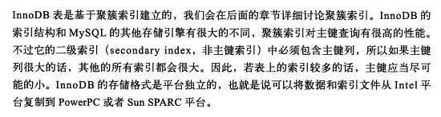

InnoDB做了很多优化，包括从磁盘读取数据时采取的可预测性读，能够自动在内存中创建hash索引以加速读操作的自适应哈希索引，以及加速插入操作的插入缓冲区。

#### MyISAM存储引擎

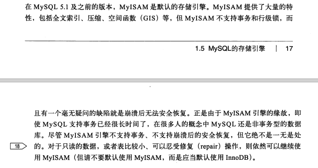

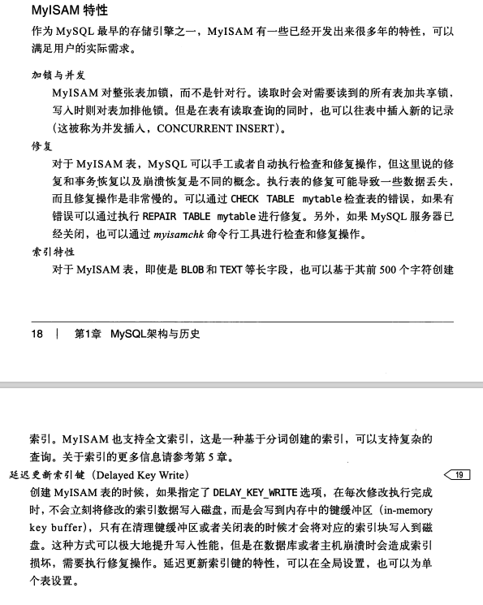

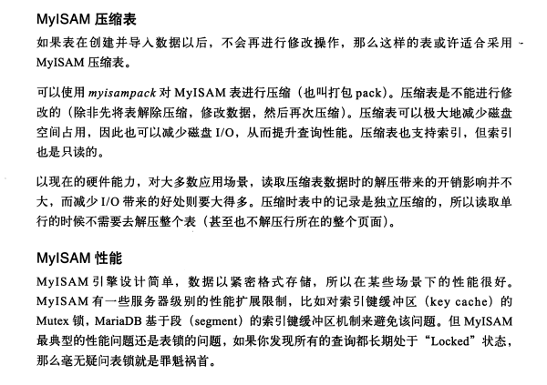

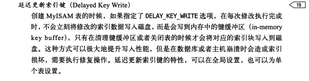

Memory

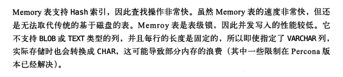