explain 

id select _type table partitions type possible_keys   key key_len  ref rows   filtered  extra 

### id 

id相同  执行顺序 从上到下  

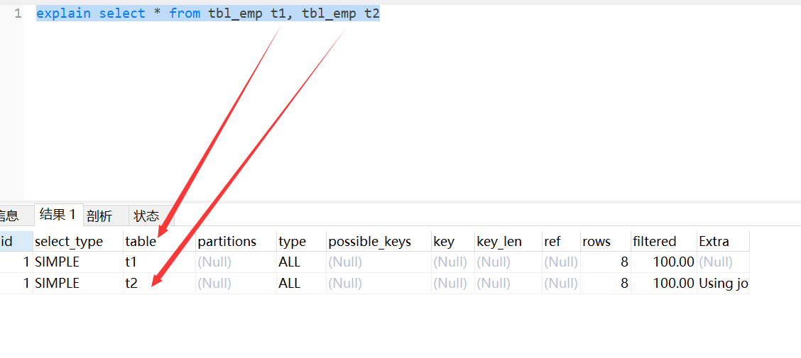

id 值越大      越先被执行

相同按顺序 不同大的先执行

### Select_type 

subquery 子查询

primary 查询

derived  衍生    

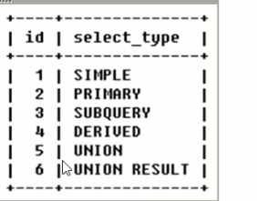

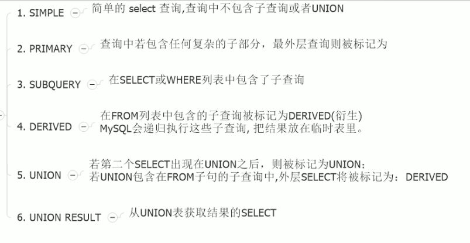

### Table

### type

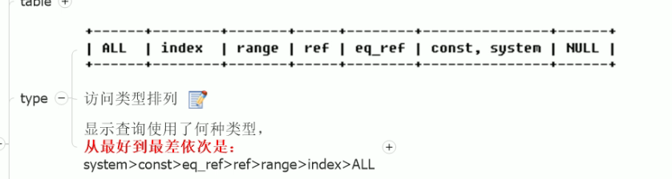

ssytem const eq_ref ref range index all 

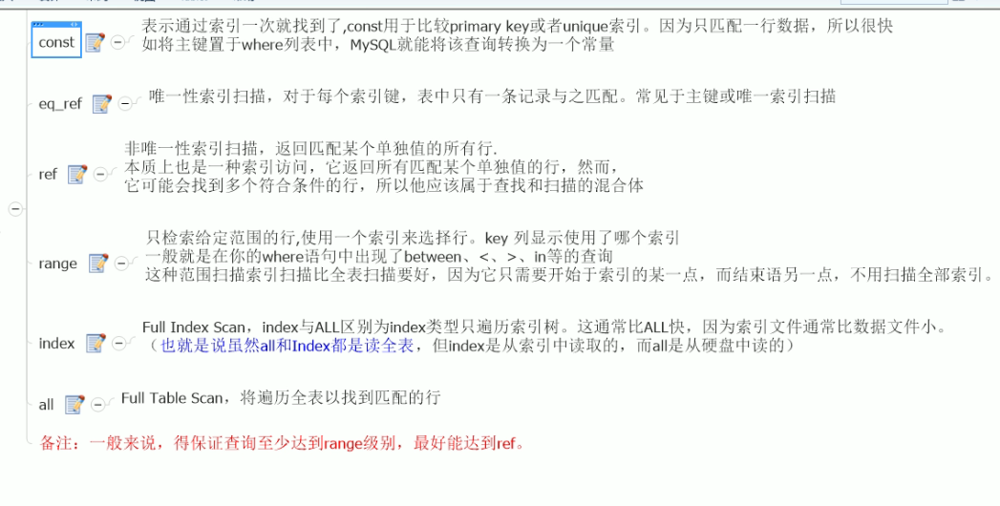

### possible_keys key

是否使用到了索引 到底用到了哪个索引

### key_len

显示索引字段的最大可能长度 并非实际使用长度    

同样的查询条件下 越小越好

### Ref

显示索引的哪一列被使用了  如果可能是一个常数    说明哪些条件 被作为 索引查询的值

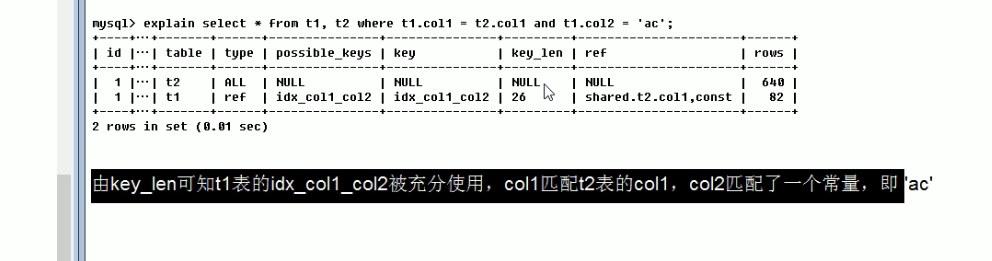

### Rows

当然是越小越好

### Extra

一个字段里有多种值

包含不适合在其他列中显示 但是非常重要的信息

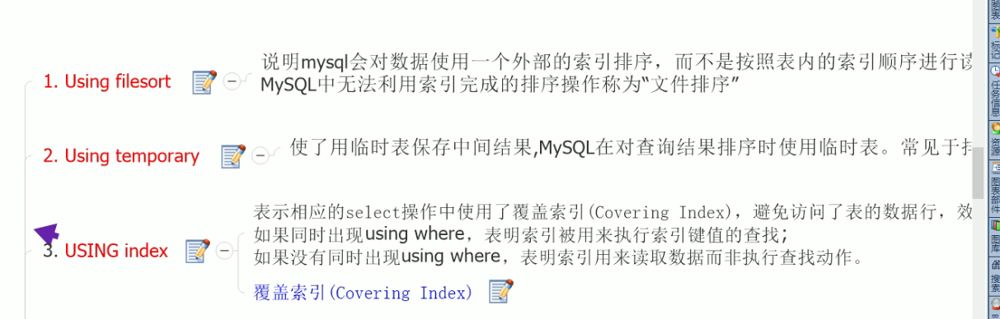

MySQL无法利用索引排序的排序操作叫做文件排序

##### varchar 类型绝对不能没有单引号  会导致全表扫描

少用or  or也会导致索引失效

范围之后全部失效

所以要注意%的位置

全职匹配

MySQL有内置的优化器 

索引的功能 查找与排序

常量排序 不会导致Using Filesort 

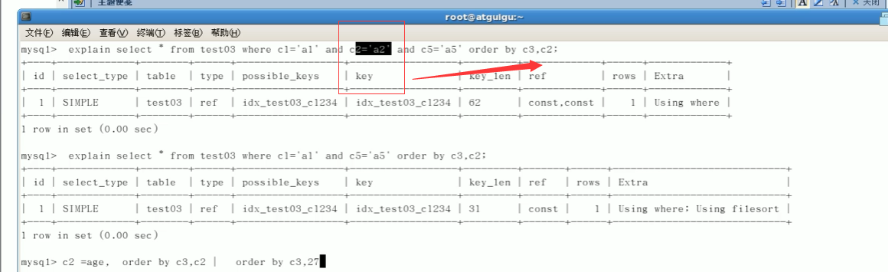

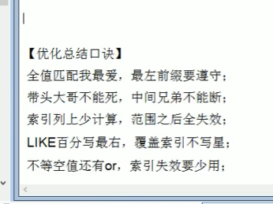

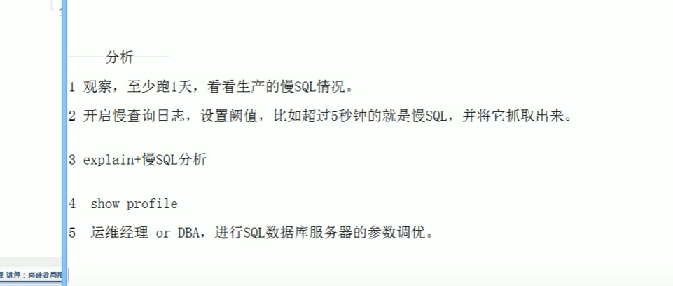

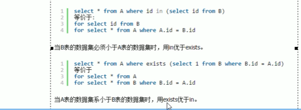

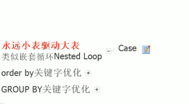

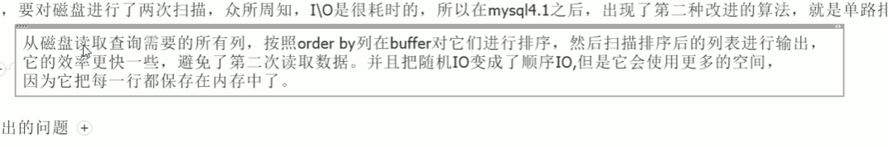

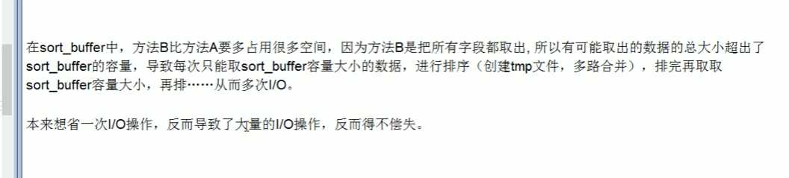

这个顺序也是很重要的

desc 逆序就会索引失效

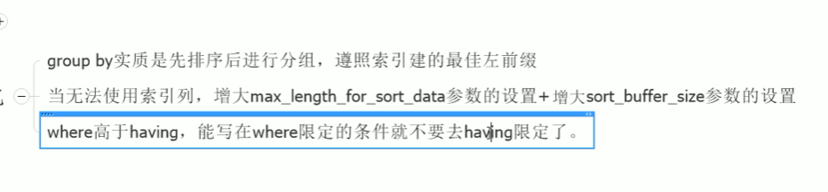

# MySQL锁

###  	读锁

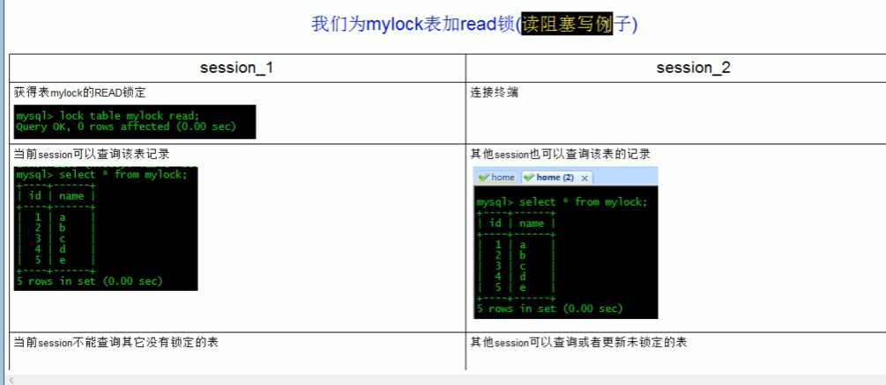

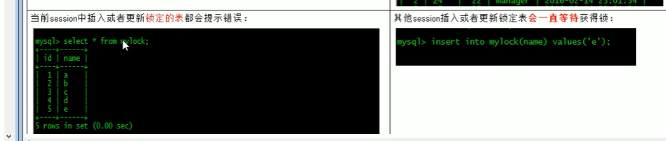

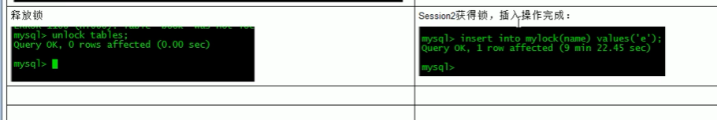

#### 写锁

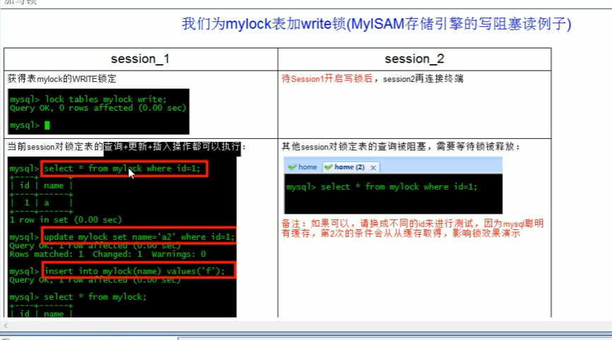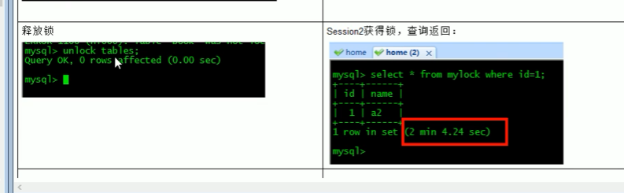

MySQL 读锁阻塞其他session的写操作 ， 写锁读写全部都阻塞

### 行级锁

##### 锁一行

begin ;

select * from where id = 1 for update ;

commit ;