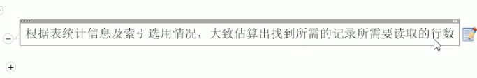
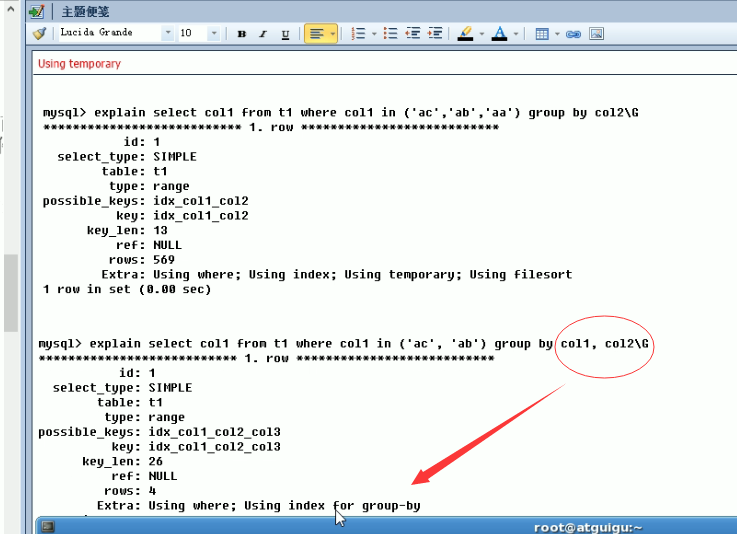

explain 

id select _type table partitions type possible_keys   key key_len  ref rows   filtered  extra 

### id 

id相同  执行顺序 从上到下  

id 值越大      越先被执行

相同按顺序 不同大的先执行

### Select_type 

subquery 子查询

primary 查询

derived  衍生    

### Table

### type

ssytem const eq_ref ref range index all 

### possible_keys key

是否使用到了索引 到底用到了哪个索引

### key_len

显示索引字段的最大可能长度 并非实际使用长度    

同样的查询条件下 越小越好

### Ref

显示索引的哪一列被使用了  如果可能是一个常数    说明哪些条件 被作为 索引查询的值

### Rows

当然是越小越好

### Extra

一个字段里有多种值

包含不适合在其他列中显示 但是非常重要的信息

MySQL无法利用索引排序的排序操作叫做文件排序

