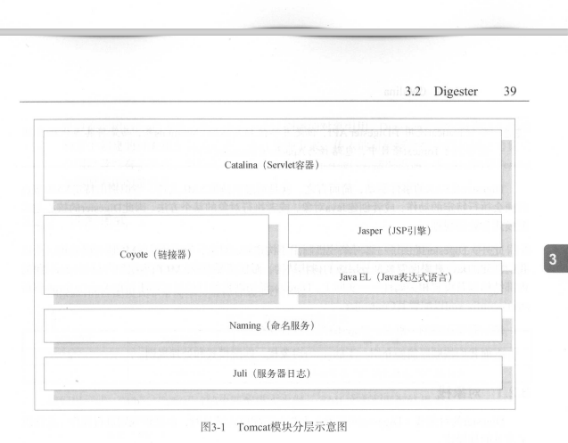
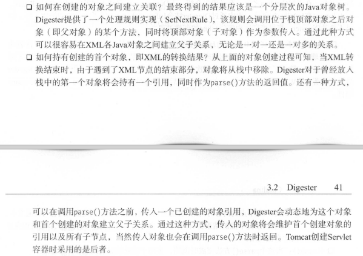
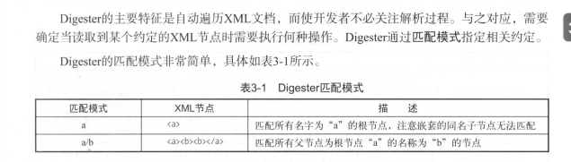

Servlet容器是tomcat的核心组件，所有基于JSP/Servlet 的java web应用均需要依托Servlet容器并对外提供服务，通过Catalina 我们可以熟悉Tomcat的工作机制，包括他对各种应用形式、部署场景及Servlet规范的综合考虑。

1. 什么是Catalina
2. XML解析工具Digester
3. Catalina的标准创建过程
4. Catalina加载Web应用以及处理请求的过程
5. DefaultServlet和JspServlet

#### 什么是Catalina

Servlet容器实现命名

Catalina包扣了前面讲到的所有容器组件，以及后续章节涉及的安全 会话 集群 部署 管理等Servlet容器架构的各个方面， 松耦合的方式继承coyote， 以完成请求协议进行数据读写， 同时包括我们的启动入口，Shell程序等。

Tomcat本质上是一款Servlet容器， 因此Catalina是tomcat的核心，其他模块均为Catalina提供支撑。

通过Coyote模块提供链接通信，Jasper模块提供JSP引擎， Naming提供JNDI服务， Juli提供日志服务。本章进一步细化tomcat servlet 容器的实现，以使读者详细了解tomcat servlet容器的相关功能。

#### Digester

Catalina根据Digester解析xml配置文件，并创建应用服务器。

Tomcat再Catalina创建过程中通过Digester结合LifecycleListener做了大量初始化工作，不熟悉Digester，很难彻底理解Catalina的创建过程。

Digester是将XML转为java对象的事件驱动型工具，是对SAX的封装。

Digester的事件驱动，简而言之，通过流读取xml文件，识别出特定xml节点后执行特定动作，或创建对象，或执行方法，所以digester的核心是匹配模式和处理规则。

Digester提供了一套对象栈机制用于构造java对象，这是因为xml是分层结构，所以创建的java对象也该是分层级的树状结构。

Digester 是非线程安全的，。

##### Digester 对象栈

Digester的对象栈主要在匹配模式满足时， 由处理规则进行操作。提供了常见的栈操作。

Digester的设计模式是指，xml节点开始的部分，开始触发处理规则事件创建java对象，将其放入栈。处理节点子节点的时候，该对象都将维护在栈中，当遇到该节点的结束部分时，对象会从栈中取出并清除。

##### 匹配模式

### 创建Server

