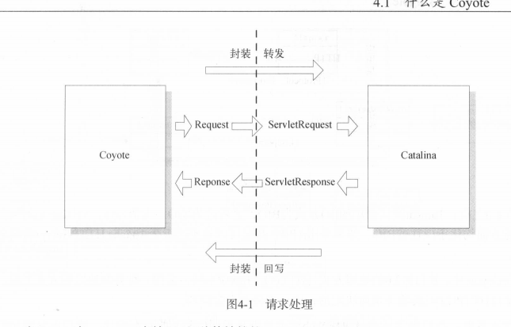
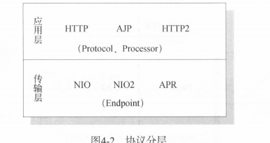
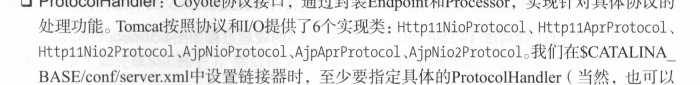
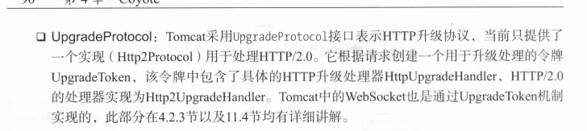
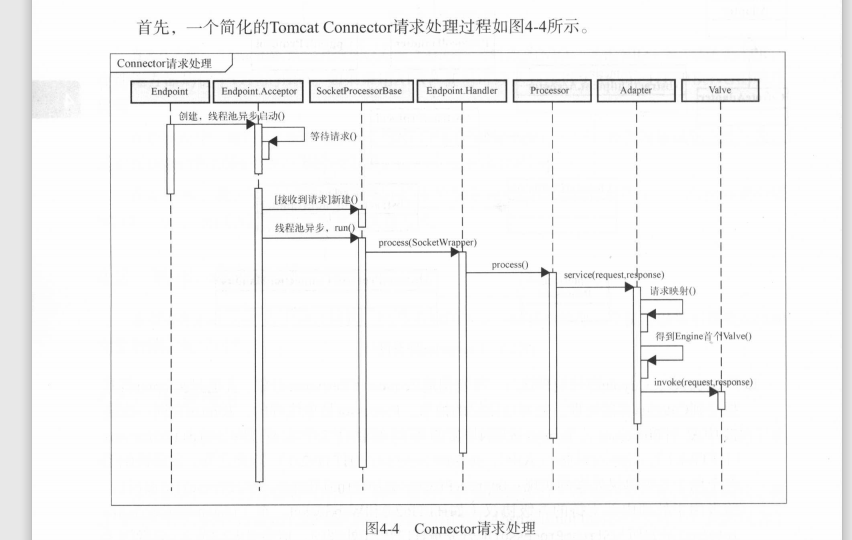

Catalina是tomcat提供的Servlet容器实现,负责处理来自客户端的请求并输出响应。但是仅有Servlet容器是无法对外提供服务的，需要由链接器接收来自客户端的请求，并按照既定协议进行解析，然后交由Servlet容器进行处理。可以说Servlet容器和链接器是tomcat最核心的两个组件

什么是Coyote， tomcat链接器的基础知识

Coyote的主要概念以及请求处理过程

Http AJp HTTp2.0 协议知识

NIO NIO2 APR 这三I/O方式

客户端通过Coyote与服务器建立链接，发送请求并接收响应。

Coyote封装了底层的网络通信 （Socket请求以及响应处理） 为Catalina容器提供了统一的接口，使Catalina容器与具体请求协议和IO方式解耦，Coyote将Socket输入转换为Request对象， 交由容器进行处理，处理请求完成后，Catalina通过Coyote提供的Response对象将结果写入输出流

Coyote作为独立模块， 负责具体协议和IO的处理， 和Servlet规范没有直接关系，

因此他的Request 和 Response对象也未实现相应的Servlet接口， 而是在Catalina中进一步封装为ServletRequest和ServletResponse

Coyote支持Http1.1 AJP HTTP 2.0 

针对Http和AJP协议， Coyote又按照IO方式 分别提供了不同的选择方案

NIO NIO2 APR（需要独立的APR库）

#### Web请求处理

Endpoint :Coyote 通信断电，通信监听的接口， 具体Socket的接收处理类，对传输层的抽象。

根据实现方式的不同提供了NioEndPoint AprEndpoint Nio2Endpoint 三个实现

Processor : Coyote协议处理接口，负责构造Request 和Response对象 并通过Adapter将其提交到Catalina容器处理，单线程的，tomcat按照协议不同提供三个实现类， 

ProtocolHandler ：Coyote协议接口，通过封装Endpoint 和Processor，实现针对具体协议的处理功能，

#### 请求处理

过程：

Connector启动时，会同时启动持有的endpoint实例，endpoint并行运行多个线程，由属性acceptorThreadCount决定，每个线程运行一个AbstractEndpoint.Acceptor实例，监听端口通信，始终循环监听。

监听到请求时，Acceptor将socket封装为SocketWrapper实例，交由SocketProceessor对象处理，如NIO采用轮询检测selectionkey是否就绪，如果就绪，获取一个有效的SocketProcessor对象并提交线程池处理

SocketProcessor是个线程池Worker实例， 判断socket状态， 然后提交到ConnectionHandler处理

首先会根据缓存获取Processor对象， 如果不存在那么根据协商协议构造Processor，不存在协商协议，那么从回收队列中获取一个释放的Processor对象使用，如果回收队列中没有可用的对象，那么由具体的协议创建一个Processor使用

ConnectionHandler调用Processor.process () 方法进行请求处理， 如果不是协议协商的请求， 那么Processor则会直接调用CoyoteAdapter.service() 方法交由Catalina容器处理，如果是协商协议，那么Processor会返回SocketState.UPGRADEING 由ConnectionHandler进行协议升级。

ConnectionHandler会构造一个升级的Processor实例

