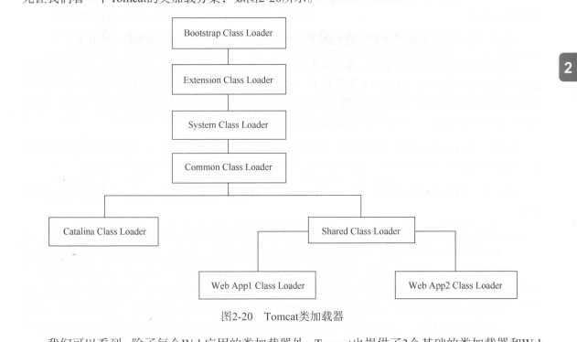
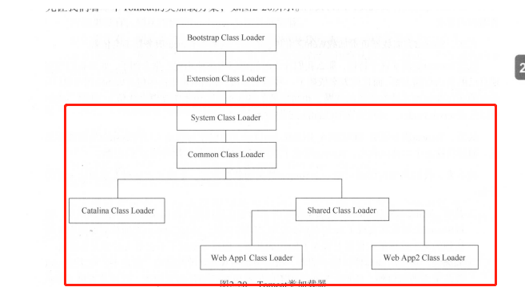
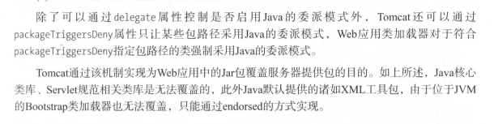
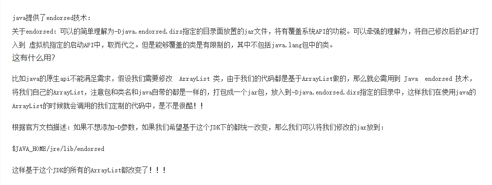

Tomcat的Web应用类加载与java默认的委派机制有些不同

1. 从缓存中加载

2. 如果缓存没有，从JVM的Bootstrap类加载器加载

3. 如果没有，从当前类的加载器加载（WEB-INF/classes WEB-INF/li 的顺序

4. 如果没有，从父类加载器加载 ，由于父类加载器采用默认的委派模式

   所以加载顺序为 System Common Shared 

也就是从System这下面开始

