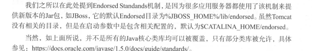
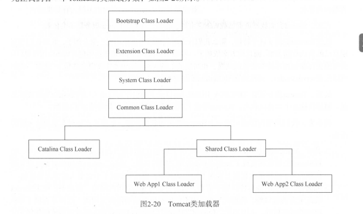
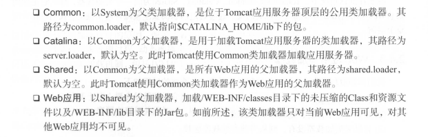
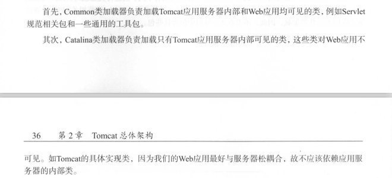
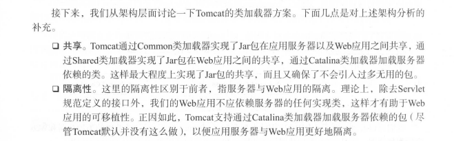

JVM提供了默认的三个加载器，以父子树的方式创建，采用委派方式确保应用程序可通过自身的类加载器加载所有可见的Java类。

结构如图

Bootstrap Class Loader ->Extension Class Loader -> System Class Loader

Bootstrap :用于加载JVM提供的基础运行类，位于%JAVA_HOME%/jre/lib 目录下的核心类库

Extension : Java 提供的一个标准扩张机制 用于加载除核心类库以外的jar包，只要复制到指定扩展目录下的jar，JVM会自动加载，默认拓展目录是%JAVA_HOME%/jre/lib/ext  典型的应用场景是， Java使用类加载器加载JVM默认提供但是不属于核心类库的jar 比如jce（加密扩张）不推荐将应用程序依赖的库放到这下面，因为该目录的类库对所有jvm运行的应用可见。

System: 通常加载classpath指定目录下的 或者-classpath指定下的jar包 ，一般用于加载应用的jar包和启动入口类。（比如tomcat的bootstrap就由System完成）

#### Tomcat加载器

​	应用服务器会自行创建类加载器实现灵活控制，这一方面是对规范的实现，

Servlet规范要求每个Web应用都有独立的类加载器实例，另一方面也有架构层面的考虑。

1. 隔离性：Web应用类库相互隔离，避免依赖库 或者应用包相互影响，如果我们有两个应用，一个采用Spring2.5 一个采用Spring 4.0 应用服务器使用一个类加载器加载，那么web应用会因为Jar的覆盖而导致无法启动成功 

2. 灵活性 ：web应用之间的类加载器相互独立，那么只能针对一个web引用进行重写部署，相应的类加载器也将会重新创建，不影响其他类的使用，如果只有一个类加载器，那么类加载依赖是复杂的，无法完整一处某个web应用的类。
3.  性能 ： web都有一个加载器， web应用再加载类的时候，不会搜索其他web应用包含的jar包，自然高于应用服务器只有一个类加载器的情况

