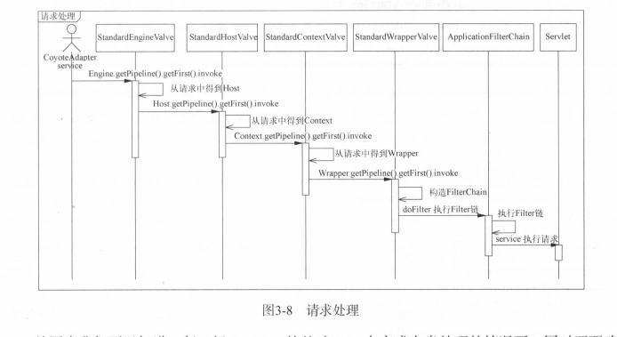
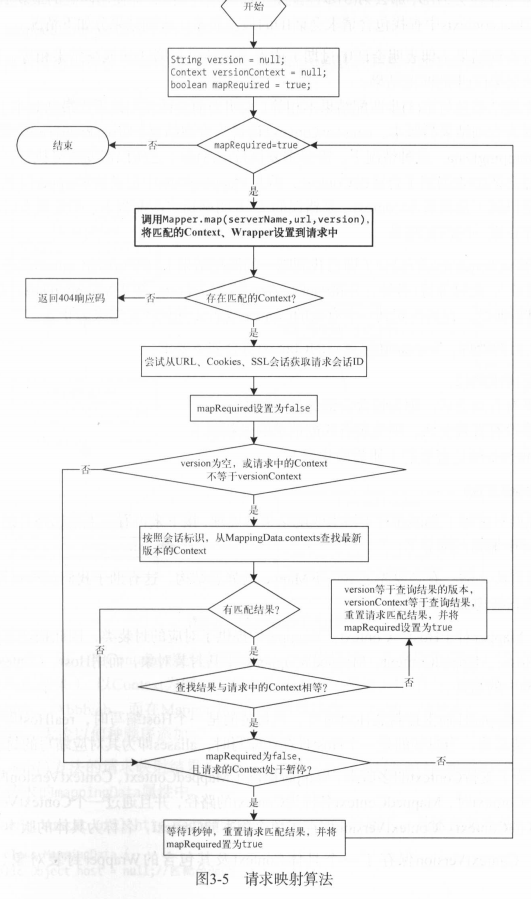
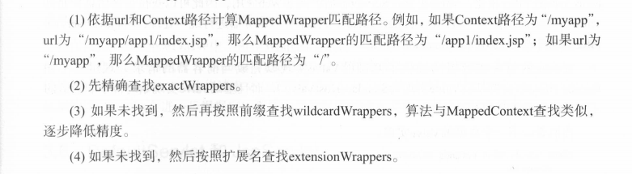

Connector#endpoint->Connector#processor->Service#CoyoteAdpater->Mapper->Engine->HostValve->ContextValve->WrapperValve->构造FilterChain->ApplicationFilterChain->Servlet

tomcat通过Mapper维护亲求链接与Host ContextWrapper等Container的映射。同时通过MapperListerner监听所有Host Context Wrapper组件 在相关组件启动 停止是注册或移除相关映射。

同时通过CoyoteAdapter将Connector与Mapper Container联系起来。Connector接收到数据之后，首先调用CoyoteAdapter.service（） 完成请求处理

1. 更具Connector的请求和响应创建Servlet请求 （org.apache.catalina.connector.Request）和 响应 （org.apache.catalina.connector.Response

2. 转换请求参数并完成请求映射 校验uri，最终根据uri定位到一个有效的wrapper
3. 等到当前Engine的第一个Valve并执行 invoke，以完成客户端请求处理 

4. 如果为异步请求， 获得请求读取事件监听器， 如果读取请求结束， 触发ReadListerner.onallDataRead

5. 如果为同步请求 

    Flush并关闭请求输入流

   Flush并关闭响应输出流

   #### 请求映射

   分为两部分，一部分为CoyoteAdapter.postParseRequest负责根据请求路径匹配的结果。

   第二部分位于Mapper.map 负责完成具体请求路径的匹配。

   

