# Tomcat如何处理Request

首先我们还是打断点


TaskThread是tomcat实现的Thread的实现类  这里是调用的开始 很明显 这是一个独立的线程 说明 tomcat 开了新的线程用于处理用户的请求 

那我们看看 这个东西什么时候被构造的 就知道是谁负责接待用户线程 构造这个TaskThread了 哈哈


打了断点发现根本就不是一个请求一个构造 可能这里用了原型模式 

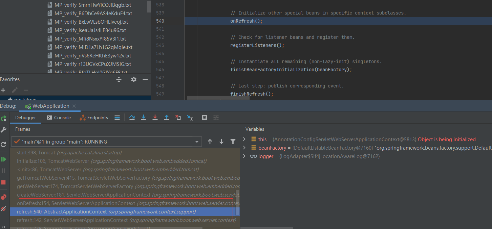

在ioc容器 refresh#onRefresh（）有个createWebServer()

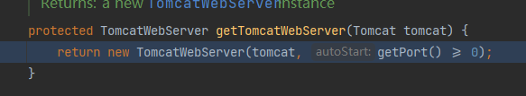

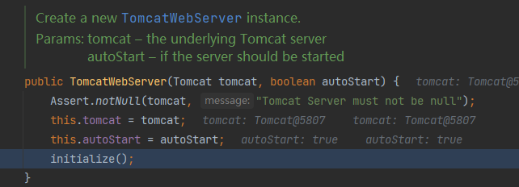

emmmm

 实例化之后开始初始化

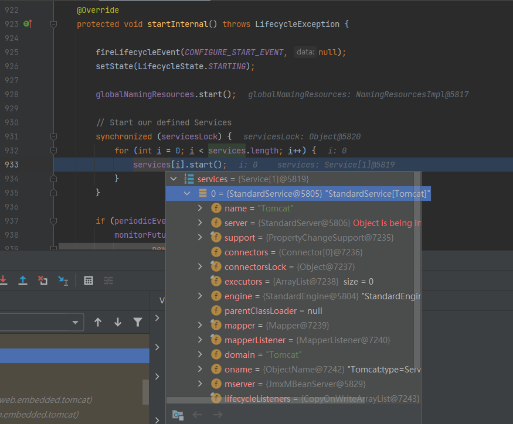

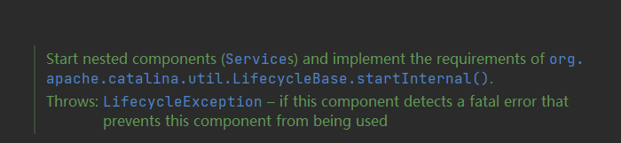

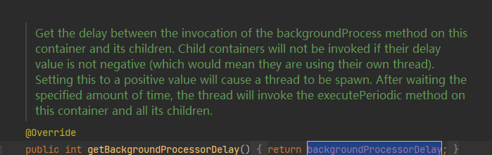

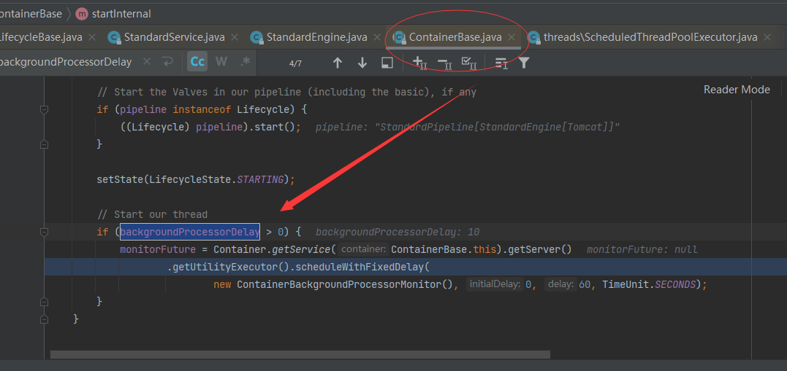

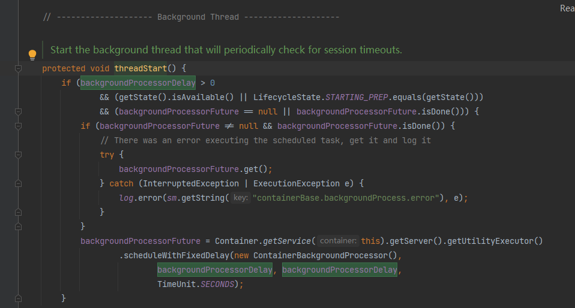


大体解释就是不是在初始化TomcatService 在调用开始方法的时候 容器会开个定时任务 看样子是个生命周期的监听器  每一分钟执行这个

上面那个ContainerBackgroundProcessor就是这个了 

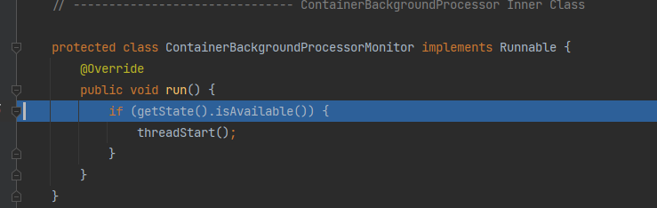

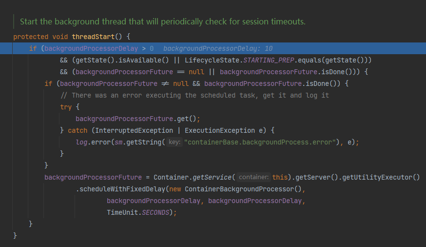

然后就是在refresh#finishRefresh 开启实际webServer

这时候会添加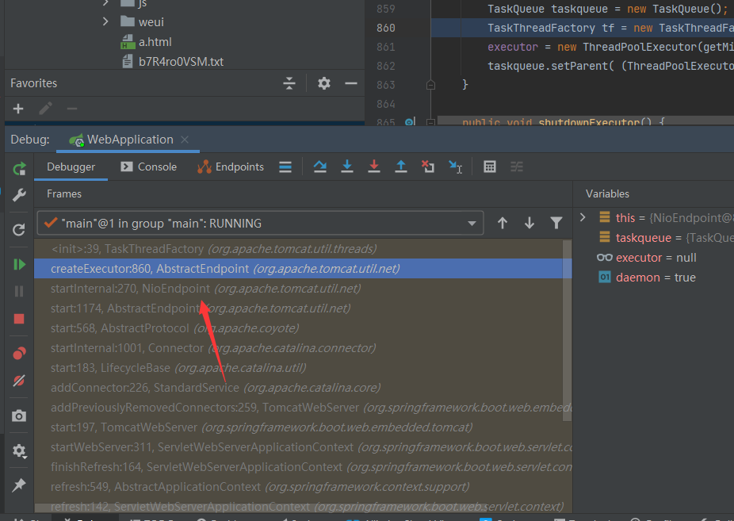

添加Connector 

并且启动Connector 这里实际上就是不同的IO协议了  

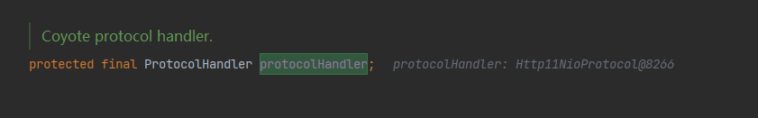

不论Tomcat的容器设计得如何精妙，本质上Tomcat就是个http服务器，需要从socket中获得HTTP数据流；另一方面，容器只能处理封装好的org.apache.coyote.Request （这个类的具体用途下面会讲到），从socket到Request之间需要有个转换过程。因此，连接socket和容器之间的重任就交给了Coyote
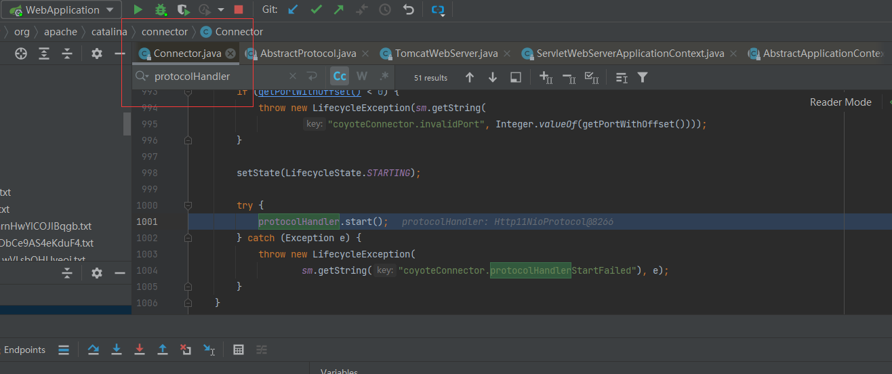

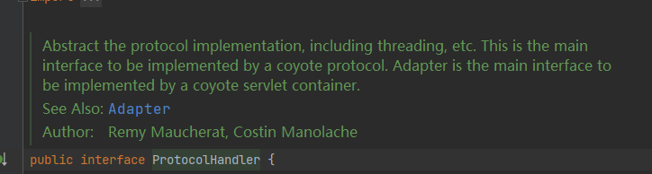

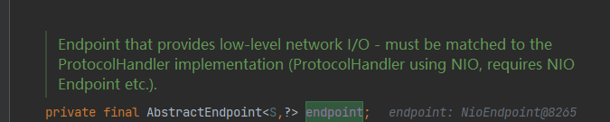

这就是说白了Connector是用基于ProtocolHander ProtocolHandler 要用对应的EndPoint

看了下被实例化的代码 这是在onRefresh的时候 也就是创建WebServer的时候  新建Connector的时候 根据不同的协议 来创建不同的ProtocolHandler 同事

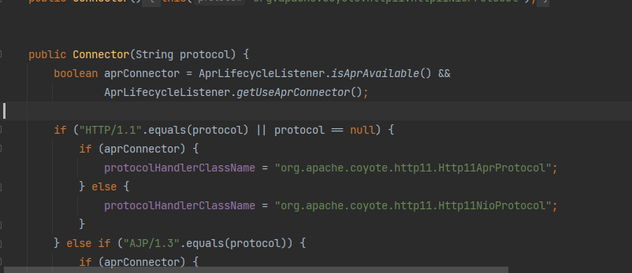

利用反射实例化

ProtocolHandler里的endpoint 

扯远了 还是继续探讨startWebServer这里  上面说到开启Connector connector调用 持有的 ProtocolHandler 也就是Coyote

Coyote实际上 持有endPoint  最后还是调用到了 endPoint 的启动方法  （poller是轮询器）

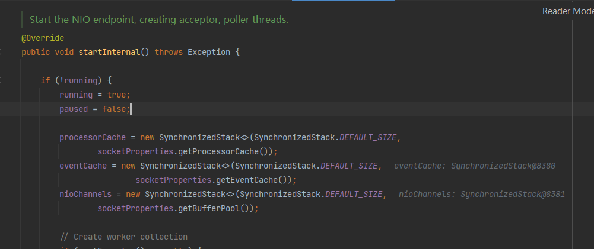

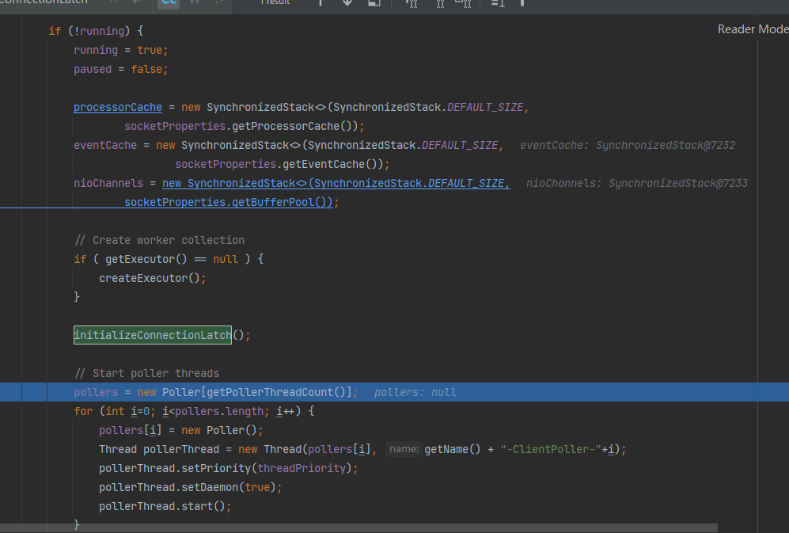

是吧 endpoitn 的启动 就是 开启Executor线程  默认 core是 10 Max是 200 阻塞队列是无线

然后实际上重写了阻塞队列 emmmm 改为先判断maxThread 再 判丢到这个2的31次方-1 的阻塞队列里


然后就是 创建两个poller 轮询器 （这个肯定可以配置了拉）           

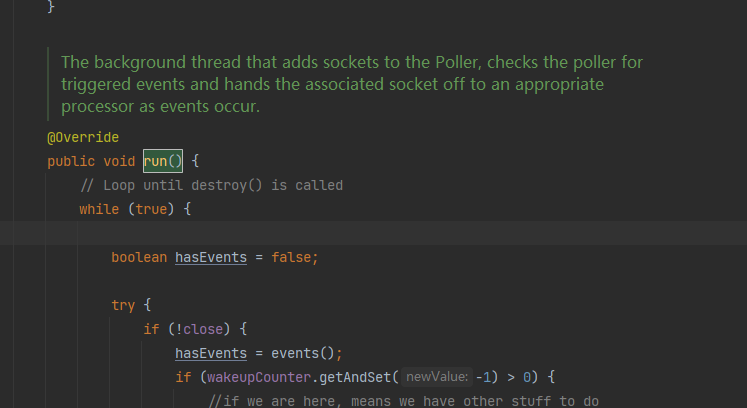

NIoEndpint 用个数组持有这个引用然后 构建 这些poller （也实现了Runnable接口）    然后启动

看描述这个Poller负责 把sockets 请求转为一个事件

```
@Override
public void run() {
    // Loop until destroy() is called  是吧这就看出来这大概率是个非阻塞的方法
    while (true) {

        boolean hasEvents = false;

        try {
            if (!close) {
                hasEvents = events();
                if (wakeupCounter.getAndSet(-1) > 0) {
                    //if we are here, means we have other stuff to do
                    //do a non blocking select
                    keyCount = selector.selectNow();
                } else {
                    keyCount = selector.select(selectorTimeout);
                }
                wakeupCounter.set(0);
            }
            if (close) {
                events();
                timeout(0, false);
                try {
                    selector.close();
                } catch (IOException ioe) {
                    log.error(sm.getString("endpoint.nio.selectorCloseFail"), ioe);
                }
                break;
            }
        } catch (Throwable x) {
            ExceptionUtils.handleThrowable(x);
            log.error("",x);
            continue;
        }
        //either we timed out or we woke up, process events first
        if ( keyCount == 0 ) hasEvents = (hasEvents | events());

        Iterator<SelectionKey> iterator =
            keyCount > 0 ? selector.selectedKeys().iterator() : null;
        // Walk through the collection of ready keys and dispatch
        // any active event.
        while (iterator != null && iterator.hasNext()) {
            SelectionKey sk = iterator.next();
            NioSocketWrapper attachment = (NioSocketWrapper)sk.attachment();
            // Attachment may be null if another thread has called
            // cancelledKey()
            if (attachment == null) {
                iterator.remove();
            } else {
                iterator.remove();
                processKey(sk, attachment);
            }
        }//while

        //process timeouts
        timeout(keyCount,hasEvents);
    }//while

    getStopLatch().countDown();
}
```

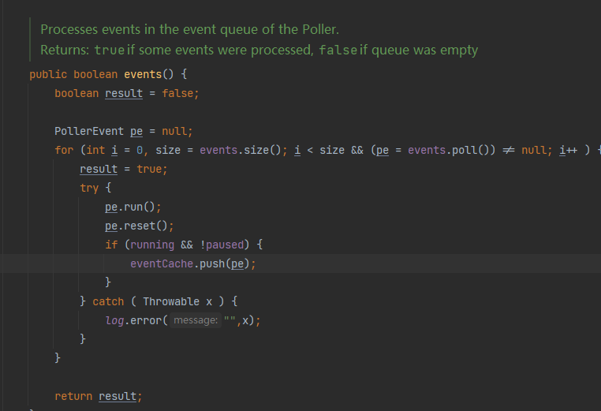

这里比较复杂 我决定 后面写个Poller PollerEvent的专门分析 现在先不搞


我们接着往下看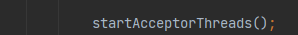

现在该开启Acceptor线程了

这个线程 先判断 endpoint 是否中断  连接数是否超限 （10000）   

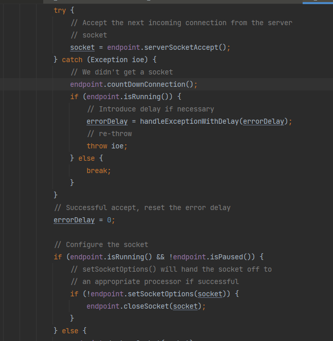


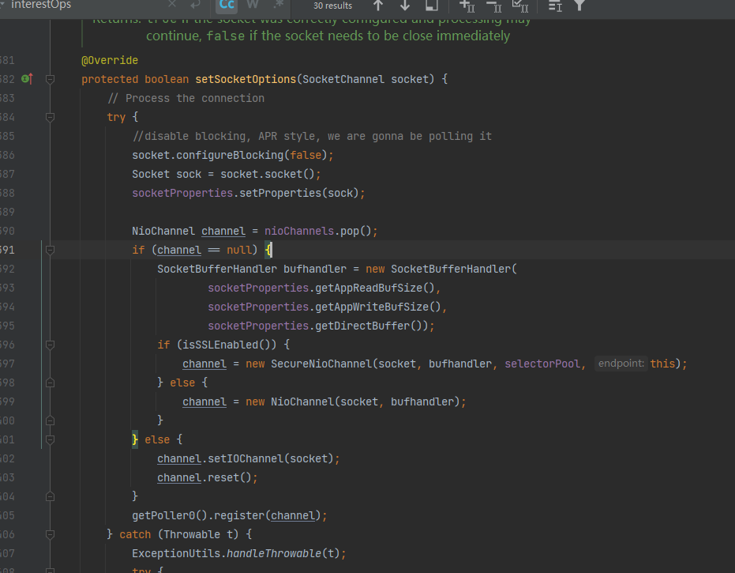

Acceptor像是接收socket请求 并建立和NioEndpoint的关系 然后不管这样


Acceptor 接收到Socket后 把这个东西封装成一个SocketWrapper变成个PollerEvent  Poller轮询到这个世间   执行一堆判断  

然后Endpoint 把这个开个新线程来处理

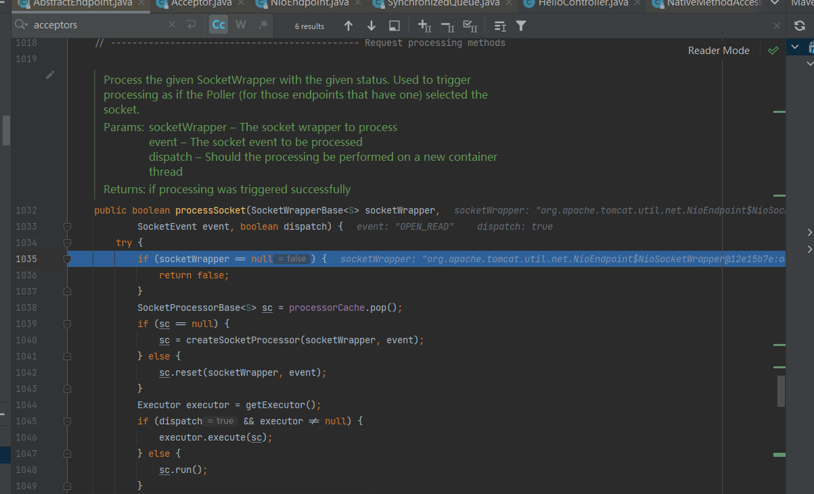

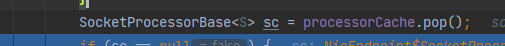这个好像就是Acceptor的时候注入的

不管怎么样这里做的事情就是把SockertWrapper 封装到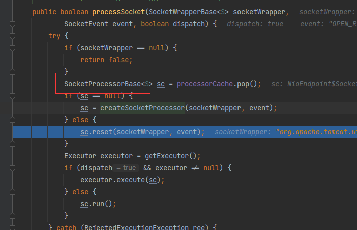

SocketProcessor socket处理器里 

然后交给exector处理器来处理 emmmmmmmm 就很简单 感人至深    

然后进入之后本质上就是获取 Socket和 之前设置的Processor

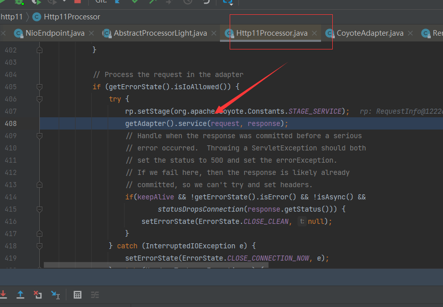

Coyote的重要作用是吧 通过适配器 把Socket对象封装为能处理的Request  实际上是根据CoyoteAdapte构造的

然后就是调用 连接中的服务Service->Container->PipeLine（）这里面的Valve(Engine->Host->Context-Wrapper )

Pipeline就是构造职责链  Valve是处理器

 然后调用过滤器 和一堆其他东西

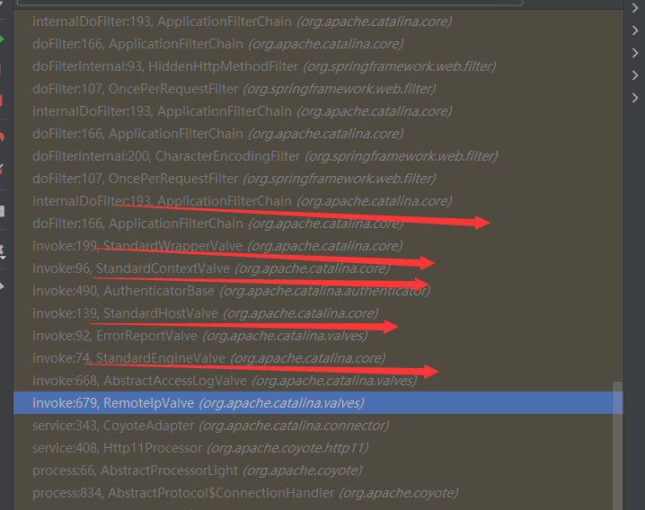

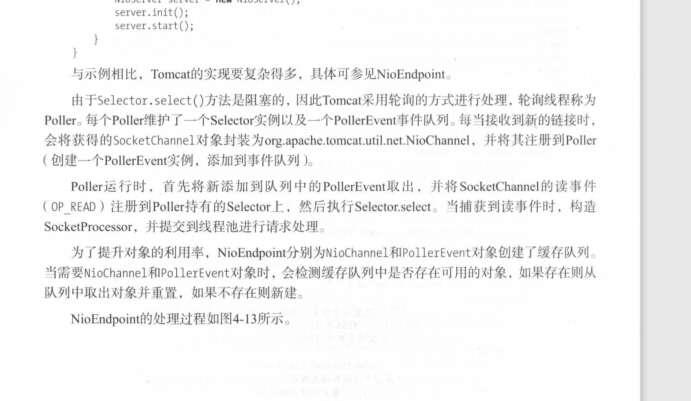