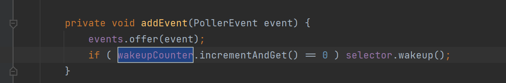

# Tomcat的Acceptor和Poller原理

我们可以直接tomcat实际上使用了 一个accpetor 线程  两个poller 线程  来分别执行 接收的注册和Poll


交给Coyote的Processor来实际处理

这里本质上就是给executor执行器  就是个被改造过的阻塞队列  优先判断maxThreads 而不是优先丢到阻塞队列里


首先一个请求进来 Acceptor

在轮询中 发现 


点进去一开就是


是吧 NIo里的accpet方法 实际上就是获取到了这个请求的 Channel


```
protected boolean setSocketOptions(SocketChannel socket) {
    // Process the connection
    try {
        //disable blocking, APR style, we are gonna be polling it
        //然后对这个socket进行了设置 改成了非阻塞
        socket.configureBlocking(false);
        Socket sock = socket.socket();
        socketProperties.setProperties(sock);

        NioChannel channel = nioChannels.pop();
        if (channel == null) {
            SocketBufferHandler bufhandler = new SocketBufferHandler(
                    socketProperties.getAppReadBufSize(),
                    socketProperties.getAppWriteBufSize(),
                    socketProperties.getDirectBuffer());
            if (isSSLEnabled()) {
                channel = new SecureNioChannel(socket, bufhandler, selectorPool, this);
            } else {
                channel = new NioChannel(socket, bufhandler);
            }
        } else {
            channel.setIOChannel(socket);
            channel.reset();
        }
        getPoller0().register(channel);
    } catch (Throwable t) {
        ExceptionUtils.handleThrowable(t);
        try {
            log.error("",t);
        } catch (Throwable tt) {
            ExceptionUtils.handleThrowable(tt);
        }
        // Tell to close the socket
        return false;
    }
    return true;
```


这一步大体上是给了个包装的channel 目的是为了在有ssl协议的情况下 实现一致

然后把内置的ByteBuffer都给清空了emmmm 


这里面就是个简单的取模  根据请求次数 来决定哪个Poller（轮询器）来注册这个


主题注册逻辑来看  emmmmmm

 就会发现就是完善对象间的引用 

然后设置一个ENDPOint 的注册事件PollerEvent 

然后丢到一个无界队列里  这个队列就是Poller下的一个成员


同时我们看到另一个轮询的线程（实际上是两个） 也就是Poller开始

获取event事件


看到pe的run就懂了

这他妈不就是一个nio的  为channel 绑定一个selector 的selectkey 吗 emmmm一模一样

channel.register(Selector, selectionkey); 注册了一个READ事件 为啥呢 因为之前这个channel是通过 ServerSockertChannel.accpet得到的 不需要再像之前那样accept了....

如果不是之前acceptor设置的register事件


emmmmmm看样子就是直接取消   如果没有selectkey的话  如果有那就兼容key 和 channel上的 感兴趣事件 然后放回去

emmm不管怎么样 正常来说 是可以被处理的是吧 

我们继续


上面已经获取了现在PollerEvent事件 emmmmm 

例行把wakeupCount 设置成-1  如果原本的值大于0 说明 已经有东西在里面了 



也就是添加事件的时候 默认是-1  如果是0 那就唤醒  如果超了0 也就是多个事件一起被丢到eventList里 （也就是Acceptor接了很多） 然后 获取现在selector的selectionKey 的数目

如果不大于0 可能就一个 是吧    那就加个会过期的select（） 因为select()是阻塞操作 所以加个事件来过期

这些破事后，我们继续设定现在wakeupCount 为0 

算了来推演下 第一次进来PollerEvent   分为两种情况  一种是addEvent之前   

  wakeupCounter 被设置成0  原本值就是0 所以 被阻塞  这个时候addEvent 进来了  但是不会被处理 因为在阻塞emmmm   然后wakeupCounter被设置成0 

继续执行逻辑


因为keyCount 是0 这很正常，因为还没执行过events();  event队列还有之前那个acceptor  

这时候就开始判断是之前是否有 如果之前有 那你看这里就不去队列里取了

开始获取selectionKey 判断这是啥子事件 

然后执行对应的操作；

这个atachment就是获取Selectkey被注册时候一起丢过去的NioSocketChannel 就是events() 里面 获取PollerEvent对象的那个操作 那很明显 实际上判断selectionKey这个是哪个事件 就肯定是在processKey(sk, attchMent) 这里了 不过很奇怪 为啥这里要传sk selectionKey 逻辑来说 sk已经没有价值了 是吧 猜测下 这里是为了获取sk对应selector 对这个进行操作  傻逼了 他还没判断具体是哪个事件  肯定要把这个一起传过去


emmmm首先做的是保证单个线程执行单个socket处理

说白了就是把selectionkey 的 事件改成0 啥都不关心这样

然后给他来个SocketProcessorBase一个线程类 emmmmm 并带上标识 也就是 读事件这样 这本质上就是从selectionkey来的 只是换成了tomcat内部的定义这样 


这时候终于 大驾光临了 我们的exectors 开始执行这个被封装的对象 感人


这下子 我就搞清楚了 是如何被执行的  那现在又有了另一个 问题 写会去这件事 是啥时候操作的

emmmmm 然后我们发现这个SocketProcessorBase实际上由不同的协议来实现 是吧 

看看NIO的

首先被exectors执行后 

获取自身对应的selector的selectkey

Performs SSL handshake hence 这里做了一些ssl的操作 

然后根据之前注册的socketevent状态 开始调用handler 也就是protocolHandler 


是吧 最后我追踪啥时候写回去 发现之前 不是有pipeline和 valve  从 engine -> host - context wrapper 然后一堆过滤器 到servlet吗   然后返回也是一样的  最后也是返回到 这 一步步退  退回到 pipieline的调用者CoyoteAdapter

这个顺便做了映射查询是吧   查询实际上对应的是哪个servlet


说白了就是nio是吧 socketchannel 写回去