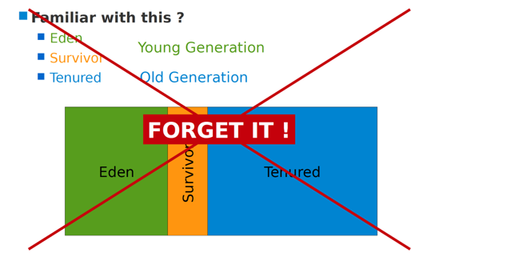
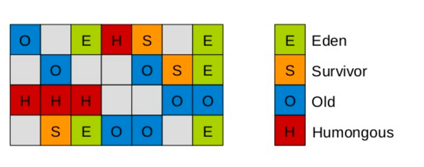

**二，了解G1**

- 可以像CMS收集器一样可以和应用并发运行
- 压缩空闲的内存碎片，却不需要冗长的GC停顿
- 对GC停顿可以做更好的预测
- 不想牺牲大量的吞吐量性能
- 不需要更大的Java Heap

GC时G1的运行方式与CMS方式类似，会有一个全局并发标记(concurrent global marking phase)的过程，去确定堆里对象的的存活情况。并发标记完成之后，G1知道哪些regions空闲空间多(可回收对象多),优先回收这些空的regions，释放出大量的空闲空间。这是为什么这种垃圾回收方式叫G1的原因(Garbage-First)。

G1将其收集和压缩活动集中在堆中可能充满可回收对象(即垃圾)的区域，使用暂停预测模型来满足用户定义的暂停时间目标，并根据指定的暂停时间目标选择要收集的区域数量。

需要注意的是，G1不是实时收集器。它能够以较高的概率满足设定的暂停时间目标，但不是绝对确定的。根据以前收集的数据，G1估算出在用户指定的目标时间内可以收集多少个区域。因此，收集器对于收集区域的成本有一个相当准确的模型，它使用这个模型来确定在暂停时间目标内收集哪些区域和收集多少区域。

G1的第一篇paper（附录1）发表于2004年，在2012年才在jdk1.7u4中可用。oracle官方计划在jdk9中将G1变成默认的垃圾收集器，以替代CMS。为何oracle要极力推荐G1呢，G1有哪些优点？

**首先，G1的设计原则就是简单可行的性能调优**

开发人员仅仅需要声明以下参数即可：

> -XX:+UseG1GC -Xmx32g -XX:MaxGCPauseMillis=200

其中-XX:+UseG1GC为开启G1垃圾收集器，-Xmx32g 设计堆内存的最大内存为32G，-XX:MaxGCPauseMillis=200设置GC的最大暂停时间为200ms。如果我们需要调优，在内存大小一定的情况下，我们只需要修改最大暂停时间即可。

**其次，G1将新生代，老年代的物理空间划分取消了。**

这样我们再也不用单独的空间对每个代进行设置了，不用担心每个代内存是否足够。

取而代之的是，G1算法将堆划分为若干个区域（Region），它仍然属于分代收集器。不过，这些区域的一部分包含新生代，新生代的垃圾收集依然采用暂停所有应用线程的方式，将存活对象拷贝到老年代或者Survivor空间。老年代也分成很多区域，G1收集器通过将对象从一个区域复制到另外一个区域，完成了清理工作。这就意味着，在正常的处理过程中，G1完成了堆的压缩（至少是部分堆的压缩），这样也就不会有cms内存碎片问题的存在了。

在G1中，还有一种特殊的区域，叫Humongous区域。 如果一个对象占用的空间超过了分区容量50%以上，G1收集器就认为这是一个巨型对象。这些巨型对象，默认直接会被分配在年老代，但是如果它是一个短期存在的巨型对象，就会对垃圾收集器造成负面影响。为了解决这个问题，G1划分了一个Humongous区，它用来专门存放巨型对象。如果一个H区装不下一个巨型对象，那么G1会寻找连续的H分区来存储。为了能找到连续的H区，有时候不得不启动Full GC。

PS：在java 8中，持久代也移动到了普通的堆内存空间中，改为元空间。

**对象分配策略**

说起大对象的分配，我们不得不谈谈对象的分配策略。它分为3个阶段：

1. TLAB(Thread Local Allocation Buffer)线程本地分配缓冲区

2. Eden区中分配

3. Humongous区分配

   TLAB为线程本地分配缓冲区，它的目的为了使对象尽可能快的分配出来。如果对象在一个共享的空间中分配，我们需要采用一些同步机制来管理这些空间内的空闲空间指针。在Eden空间中，每一个线程都有一个固定的分区用于分配对象，即一个TLAB。分配对象时，线程之间不再需要进行任何的同步。

对TLAB空间中无法分配的对象，JVM会尝试在Eden空间中进行分配。如果Eden空间无法容纳该对象，就只能在老年代中进行分配空间。

最后，G1提供了两种GC模式，Young GC和Mixed GC，两种都是Stop The World(STW)的。下面我们将分别介绍一下这2种模式。

https://www.cnblogs.com/lsgxeva/p/10231201.html