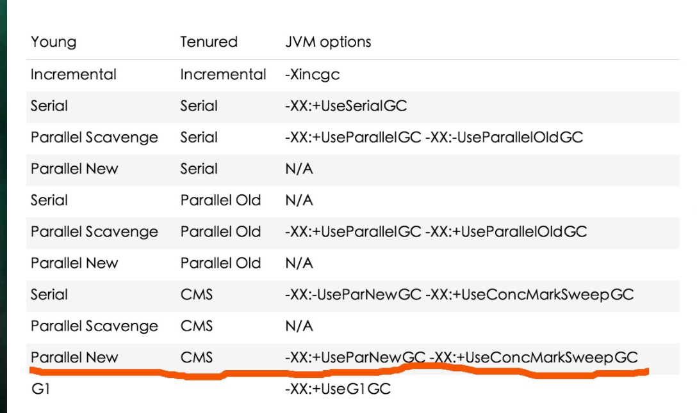

## JVM日志查看-CMS为例

#### what is CMS

cms 是jvm中为老年代(tunured)实现垃圾收集的一种算法

CMS(concurrent mark and sweep) 并发标记清理

#### 常见搭配

##### ParNew+CMS

young : parNew (mark - copy) 

tenured : CMS (Concurrent makr-sweep)

###### 适用场景:保证响应、减少服务器停顿的场景（相应的缺点是付出更多的cpu消耗)

#### jvm搭配说明

