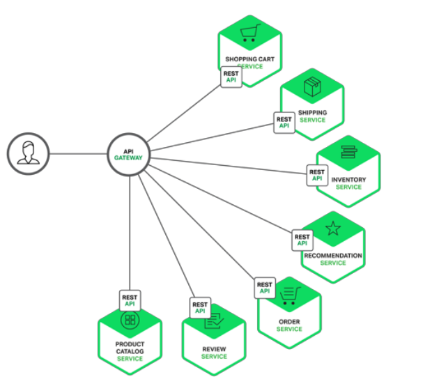
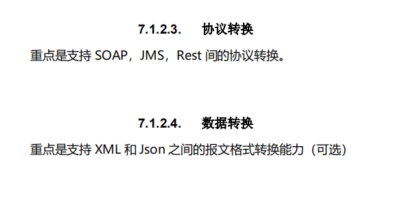
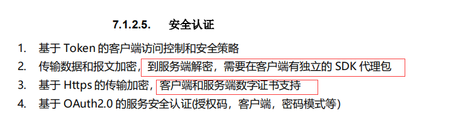

Api Gateway是一个服务器，进入系统的唯一节点，从这个角度上看和Facade模式很像。

封装了内部系统的架构，提供API给各个客户端。

还有其他功能，比如授权 监控 负载均衡 缓存 请求分片 管理 静态响应处理，下图展示了一个适应当前架构的API Gateway

API Gateway 负责请求转发， 合成和协议转换。

所有来自客户端的请求都要到GateWay请求到对应的微服务。

API Gateway 将经常通过调用多个微服务来处理一个请求以及聚合多个服务的结果。

**web协议内部与非web友好协议进行转换。比如websocket协议**

