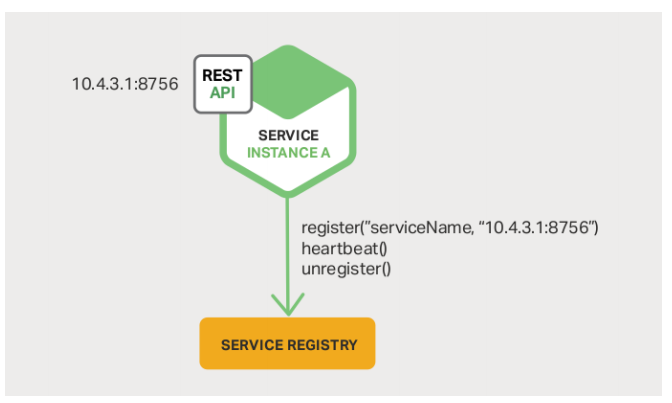
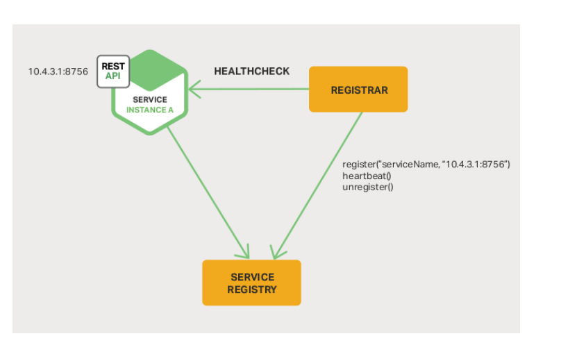
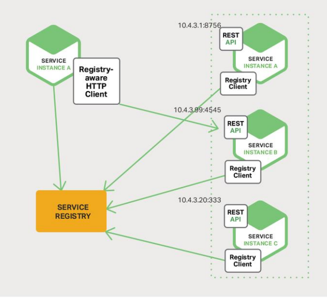

服务注册就是维护一个登记簿，管理系统内所有的服务地址，新的服务启动后，向登记簿交代自己的地址信息。服务依赖方直接向登记簿要Service Provider地址。服务注册工具非常多。

Zookeeper Consul Netflix 的eureka 服务注册有两种形式，客户端注册和第三方注册

#### 客户端注册（Zookeeper)

服务自身要负责注册与注销的工作。

当服务启动后向注册中心注册自身，当服务下线的时候注销自己。

期间还需要和注册中心保持心跳。

注册工作和服务耦合在一起。不同语言都要实现各自的逻辑。

#### 第三方注册(独立的服务registrar)

第三方注册由一个独立的服务Registar负责注册与注销。

服务启动后以某种方式通知Registar，然后registar负责向注册中心发起注册工作。同时注册中心要维护与服务之间的心跳（注册中心-Registar-服务 太麻烦了，如果registar故障了，万事介休）

服务不可用的时候，向注册中心注销服务。这种方式的缺点是Registar必须是一个高可用的系统。否则注册工作没法开张。

#### 客户端发现

客户端发现时值客户端负责查询可用服务地址，以及负载均衡工作，这种方式直接且方便做负载均衡。缺点子啊与多语言的时候会出现重复工作，

#### 服务端发现

服务端发现需要额外的Router服务，请求先打到Router上，Router负责查询服务与负载均衡，这种要保证Router的高可用