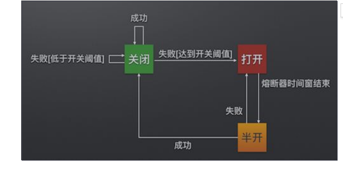

Hystrix

微服务种通常会有多个服务层调用，基础服务的故障可能会导致级联故障。进而整个系统不可用的情况。这种现象被称为服务雪崩效应，服务雪崩是服务提供者不可用导致服务消费者不可用，并将不可用逐渐放大的过程

熔断器，如同电力保护器。可以实现快速失败，如果他在一段时间内侦测到许多类似的错误。多强迫之后的多个调用快速失败，不再访问远程服务器。阻止应用程序不断尝试执行可能会失败的操作。

熔断器也可以使应用程序诊断错误是否已经修正，如果修正会再次调用操作

Hystrix断路器机制

当Hystrix Command请求后端服务失败数量超过一定比例 默认50% 断路器会切换到开路状态，这时候所有请求会直接失败而不会发送到后端服务。断路器保持在开路状态的一段时间后，自动切换到半开路状态，这时候判断下次请求的返回情况，如果成功 切回闭路状态。

避免发送大量无效请求 影响系统吞吐量，断路器有自我检测并恢复的能力