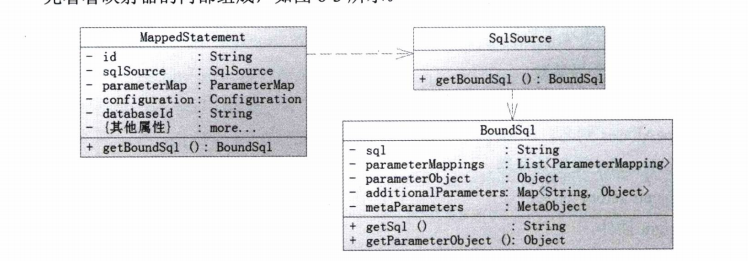

#### Mapper

##### 1.1Mapper的内部组成

- MapperStatement  保存映射器的一个节点（select|insert|delete|update) SQL、SQL's id 、cache info 、 resultMap  parameterType resultType languageDriver 等配置信息

- SqlSource 提供BoundSql对象 是MapperStatement的一个属性

- BoundSql 建立SQL和参数的地方 有三个常用的属性 SQL、parameterObject、parameterMappings 

  

对于参数和SQL而言 主要规则反映在BoundSql类对象上，在插件中拿到他进而获取当前运行的SQL

参数以及参数规则。作出修改 满足规则。

#### BoundSql

- parametereMappings

  parameterMappings 是个list 元素就是parameterMapping 对象描述我们的参数

  包括了属性 名称 表达式 jdbcType javaType typeHandler 通过这个实现参数与SQL的结合

  以便于prepareStatement 通过它找到parameterObject对象的属性并设置参数

- parameterObject 参数本身 可以传递简单对象 POJO Map 或者@Param注解的参数

   MyBatis在我们传递简单对象（int long float double ) 会改为包装类传递

  如果传入的是POJO或者Map 那么parameterObject不变

  如果多个参数且没有 @Param注解 MyBatis会把parameterObject 	变成一个Map<String,Object>对象 按照顺序 #{1}  

  如果有 使用@Param 那么MyBatis 也会干这种事 只不过 用@Param（“name") 这里的”name"代替数字 

- SQL

  就是我们在配置文件中写的sql 大多数时候无需修改