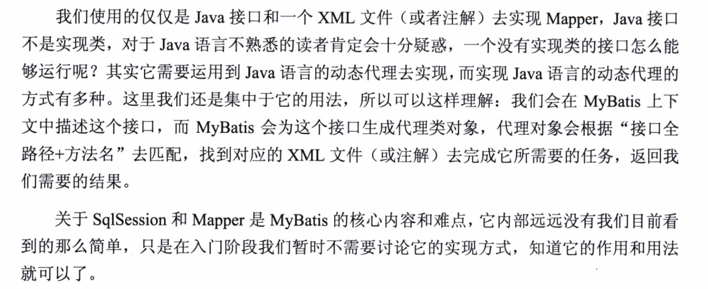
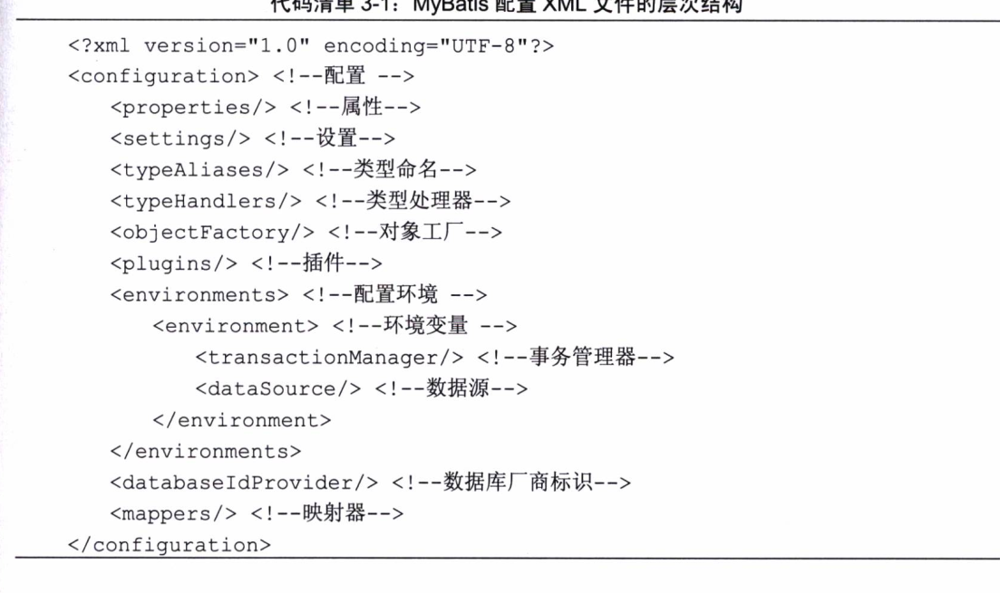

## MyBatis的构成

SqlSessionFactorybuilder 构造器

SqlSessionFactory 生成SqlSession(会话）的工厂类

SqlSession 两个作用:获取映射器（Mapper)、根据命名信息执行sql获取返回结果

SqlMapper MyBatis新组件 由一个java接口和XML文件（或者注解）构成，需要给出对应的sql和映射规则。负责发送SQL去执行，返回结果。

### SqlSessionFactory的构建方式

1.xml构建

2.java代码 

### Mapper（映射器）

由Java文件和XML（或注解）共同组成

1.定义参数类型

2.描述缓存

3.描述SQL语句

4.定义查询结果和POJO的映射关系

### MyBatis 的生命周期

##### SqlSessionFactoryBuilder 的生命周期

SqlSessionFactoryBuilder 利用XML或者java编码获取资源来配置SqlSessionFactory,如果构建成功，作用就已经完结，生命周期就完结 作用就是生成SqlSessionFactory对象

KeyWords: 一次性工具人 用完就丢

##### SqlSessionFactory

SqlSessionFactory 的作用是创建SqlSession ,SqlSession是个会话 ，相当于 Connection，每次应用程序需要访问数据库就需通过SqlSessionFactory 构建SqlSession，所以SqlSessionFactory应该存在在整个MyBatis的生命周期之中 如果多次创建SqlSessionFactory 数据库的连接资源很快就会被耗尽 所以SqlSessionFactory的责任就是创建SqlSession ,需要使用单例 ，减少数据库连接消耗，避免过多的连接消耗。

KeyWords:单例避免多于性能消耗 全周期

##### SqlSession（美女客服）

SqlSession是个会话 ，相当于JDBC的一个Connection对象 ，生命周期 是存在于请求数据库处理事物的过程中。每次创建都要记得销毁。存在于一个一个应用的请求和操作中，可以执行多条SQL,保证事务的一致性。

##### Mapper

mapper是个接口，没有任何实现类 作用是发送SQL返回结果 或者执行修改

## 配置

##### typeHandler（类型处理器）

常见操作是把 参数从jdbcType 转为javaType 或者 倒过来

### ObjectFactory

MyBatis返回结果时 ，都会使用ObjectFactory(对象工厂)构建pojo 可以在配置中指定 实现特定接口即可 ，大部分情况下不需要额外实现。

### 数据库事务

SqlSession 负责事务的commit 与 rollback

### 引入映射器的方法

1.文件路径

2.包名引入

3.类注册引入

## Mapper

传递多个参数

