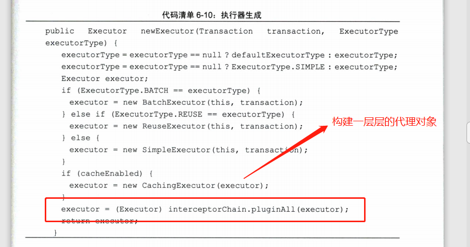
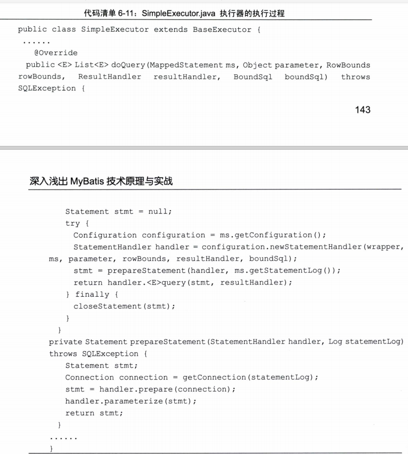
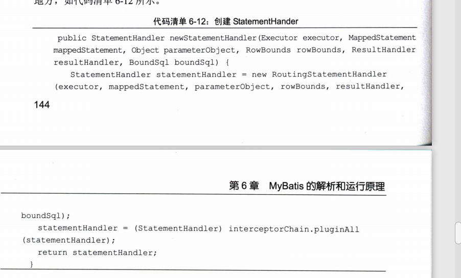
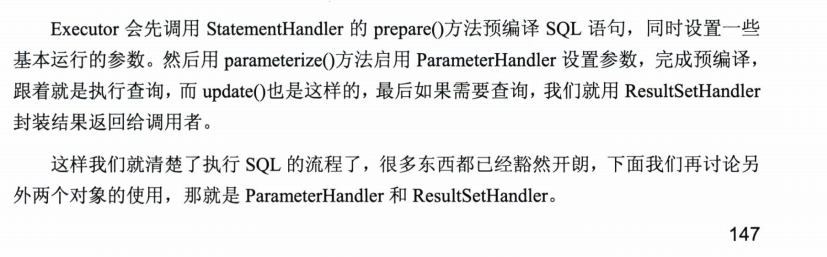

### SqlSession的运行过程

sqlSession是个接口

#### 映射器（Mapper）的动态代理

#### MyBatis使用Mapper接口能运行SQL的原因

Mapper的命名空间对应的就是接口的全路径 根据全路径和接口名就能够通过动态代理，让接口实现。采用命令模式 ，最后还是使用SqlSession的接口方法执行查询，说白了就是套了一层 ，实际上还是用sqlSession实现 只是多了层封装。

#### SqlSession下的四大对象

MapperMethod的execute 方法 经过简单判断 进入 删除 更新 查找 插入  。 这些方法是如何执行的呢

Mapper的执行过程 是通过 Executor StatementHandler ParameterHandler ResultHandler 来完成数据库的操作和结果返回 。

- Executor 执行器 调度StatementHandler ParameterHandler ResultHandler 来执行对应的SQL
- StatementHandler 使用数据库的Statement 执行操作 是四大对象的核心 
- ParameterHandler 用于SQL参数的处理
- ResultHandler 用于对数据集(ResultSet)的封装

##### Executor

真正执行数据库和JAVA交互的东西

有三种执行器

SIMPLE (DEFAULT) 简易执行器

REUSE 重用预处理语句

BATCH 执行重用语句和批量更新 批量专用执行器

###### 如何构造Executor

通过configuration 够早了StatementHandler 然后 通过prepareStatement对SQL编译 并对参数进行初始化。prepareStatement 调用prepare进行预编译和初始设置 ，再通过StatementHandler 的paramerize设置参数  并执行 。 resultHandler 组装查询结果 返回给调用者完成一次查询。

StatementHandler (数据库会话器) 专门处理数据库会话 

#### StatementHandler 的构造过程

实际上的StatementHandler是RoutingStatementHandler  而这个 也是是通过适配选择 三种 数据库会话器来执行的

1.SimpleStatementHandler   （SIMPLE）

2.PrepareStatementHandler （REUSE)

3.CallableStatementHandler (BATCH)

对应的是三种执行器

