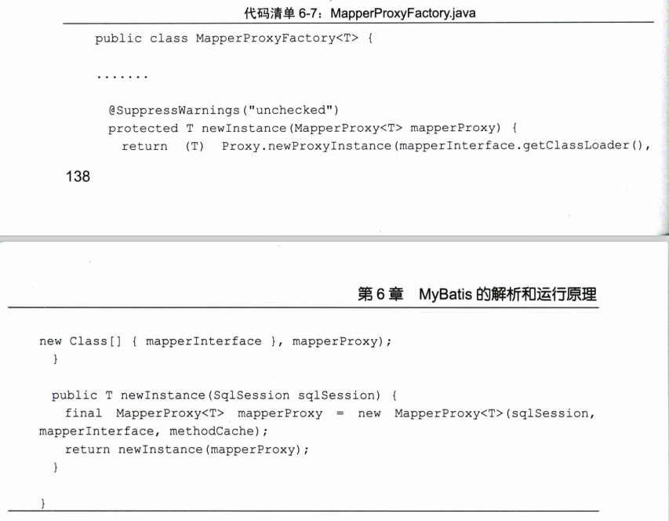
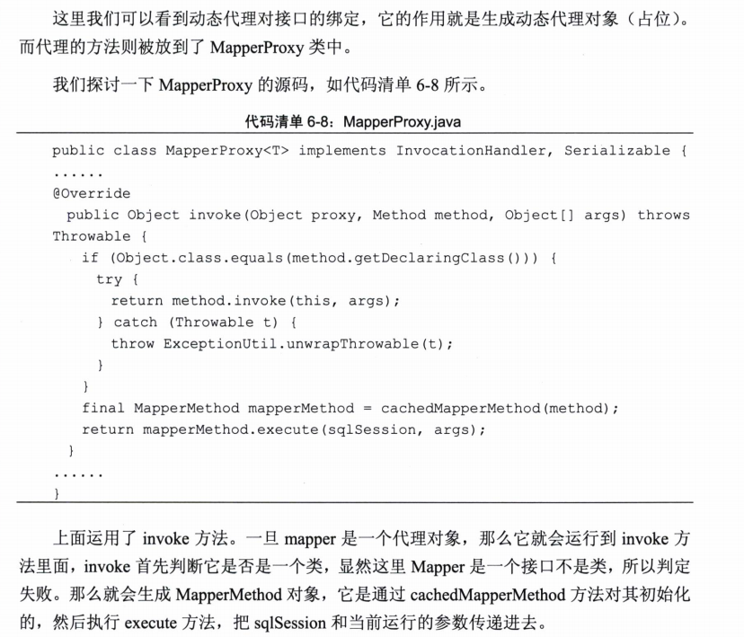
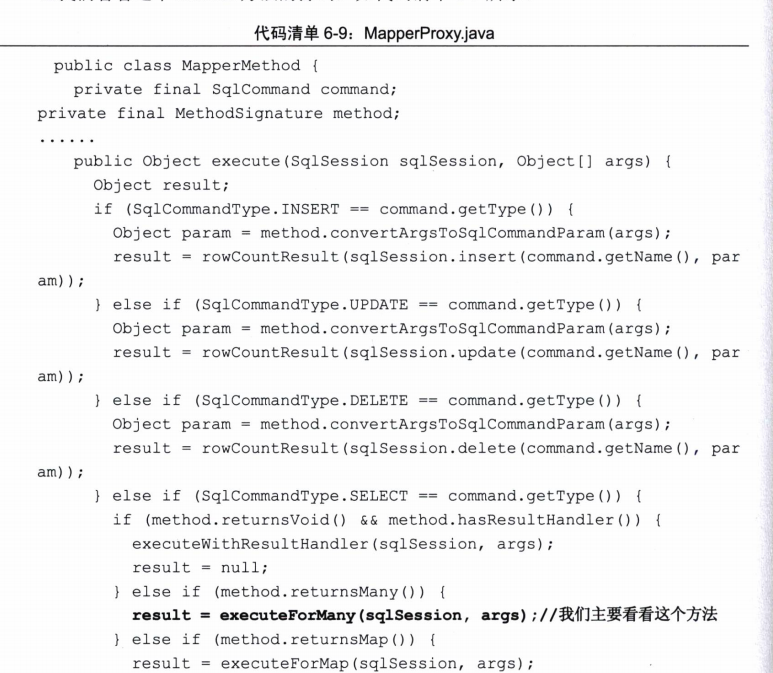
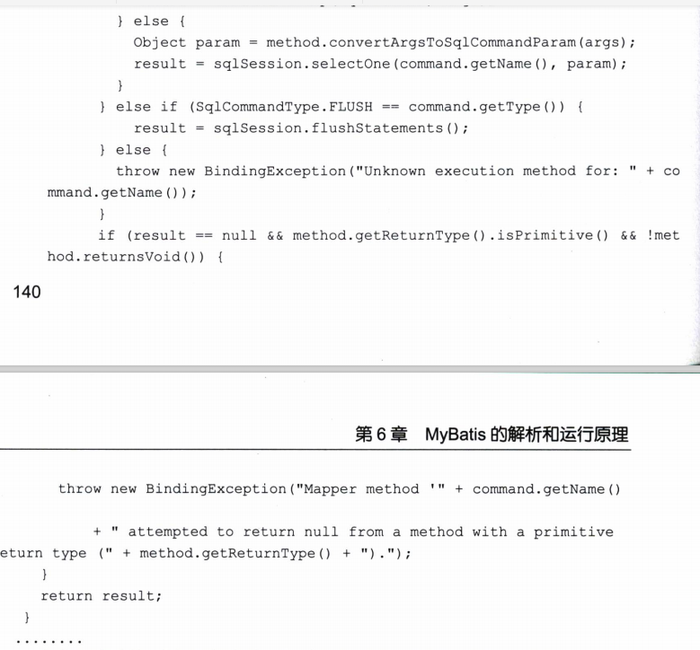
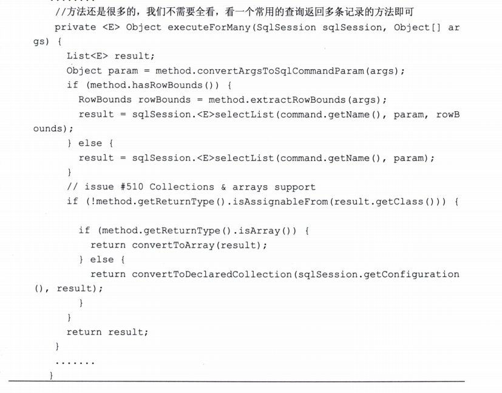

### SqlSession的运行过程

sqlSession是个接口

#### 映射器（Mapper）的动态代理

#### MyBatis使用Mapper接口能运行SQL的原因

Mapper的命名空间对应的就是接口的全路径 根据全路径和接口名就能够通过动态代理，让接口实现。采用命令模式 ，最后还是使用SqlSession的接口方法执行查询，说白了就是套了一层 ，实际上还是用sqlSession实现 只是多了层封装。

