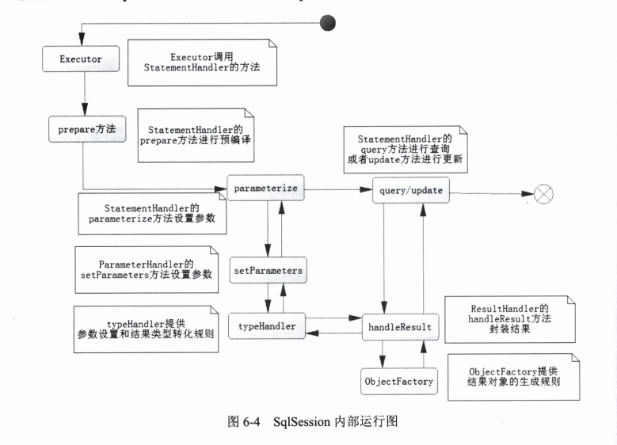

## SqlSession运行总结

##### SqlSession运行图

首先Executor调用StatementHandler 的方法  StatementHandler的prepare方法进行预编译 Statement的parametersize方法设置参数 （实际ParameterHandler的setParameter方法设置参数 其中用了typeHandler 提供了参数设置和结果类型类型转化规则）

StatementHandler query/update 返回结果 使用 ResultHandler 封装结果 也使用了typeHandler ObjectFactory 提供了结果对象的生成规则