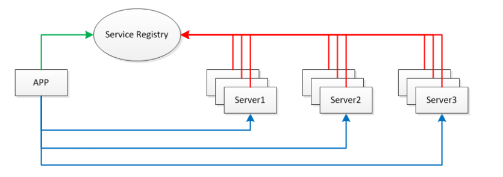

#### 核心流程

1.服务消费方调用以本地调用 调用服务。

2.client stub 接收到调用后，将方法参数 等组成能够进行网络传输的消息体。

3.client stub找到服务地址，并将消息发送到服务端

4.server stub 接收到消息后进行解码

5.server stub 根据解码结果调用本地的服务。

6.本地服务执行并将结果返回给server stub

7.server stub将结果打包成消息并发送至消费方

8.client stub接收到消息 ，进行解码。

9.服务消费方得到最终结果 

这就是RPC的目的

简化rpc调用（2-8)的步骤

消息编解码

（这种东西  全看自己需要，爱用啥就用啥）

#### 通讯过程

requestID生成AtomicLong

#### 1.client线程每次通过socket调用调用一次远程接口前，生成一个唯一id

在一个socket连接里面是唯一的，一般常常使用atomicLong从0开始累计数字生成的唯一id

#### 2.存放回调对象callback刀全局ConcurrenthashMap

put(requestId,callback)

#### 3.synchronized获取回调对象callback的锁，并自旋wait

#### 4.监听消息的线程收到信息，找到callback上的锁并唤醒

