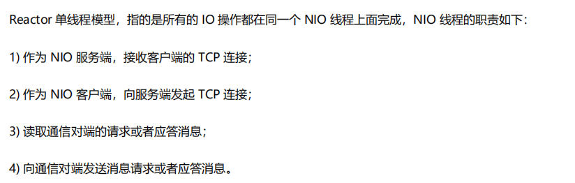
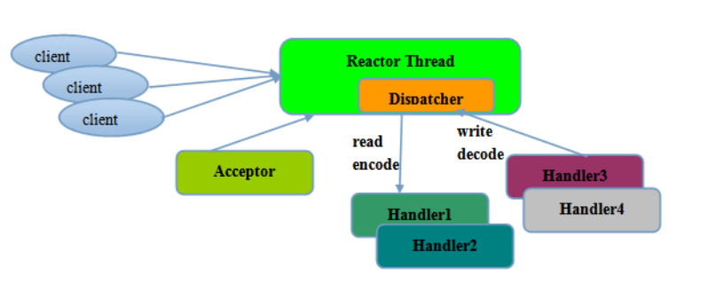
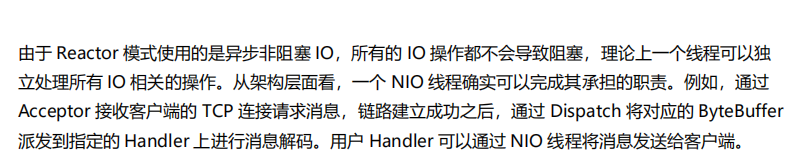
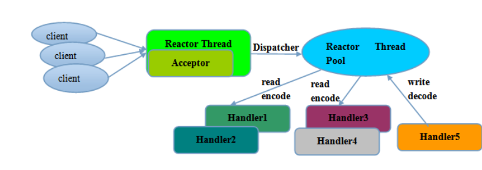
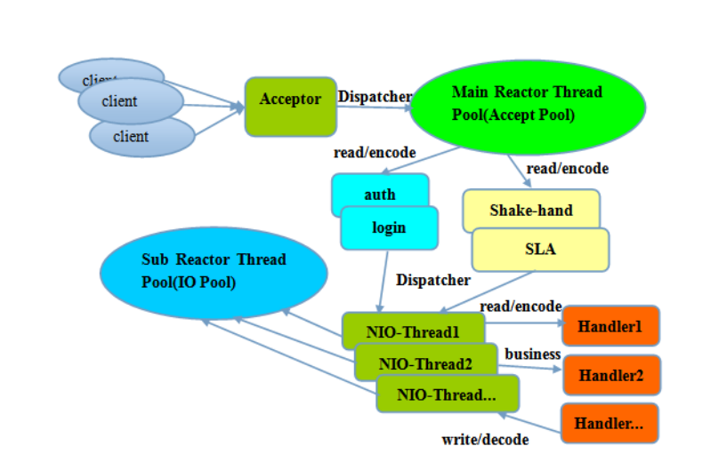

#### Reactor线程模型 

Reactor单线程模型

Reactor多线程模型

主从 Reactor多线程模型

##### Reactor多线程模型

Reactor多线程模型与单线程模型最大的区别就在于有一组nio线程处理io操作，有一个专门的nio线程-acceptor线程用于监听服务器端，接收客户端的tcp链接请求，网络io 操作 读写 等由一个nio线程池负责。线程池可以采用标准版的jdk线程池实现，包含一个任务队列和N的可用线程。

由这些nio线程负责消息的读取，解码 编码 和发送

#### 主从Reactor多线程模型

服务端用于接收客户端链接的不再是一个单独的nio线程，而是一个独立nio线程池。

Acceptor接收到客户端tcp连接请求完成后，将新创建的SocketChannel注册刀io线程池

（sub reactor线程池）的某个io线程上，由他负责SocketChannel的读写和编码工作。

Acceptor线程池仅仅用于客户端的登录 握手和安全认证。一旦链路建立成功。

九江链路注册到后端subReactor线程池的io线程上，由io线程负责后续的io操作。

