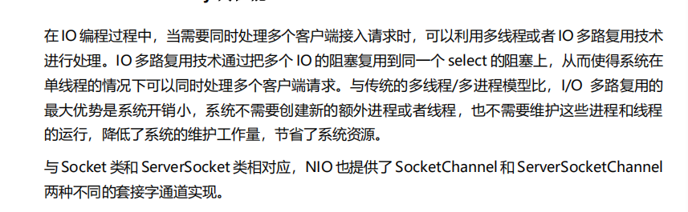
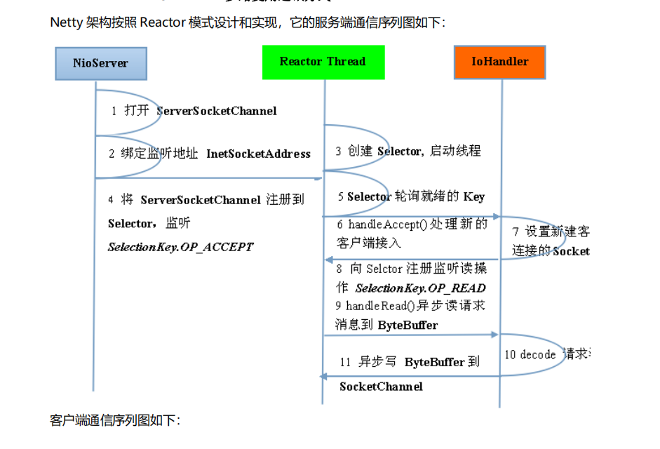
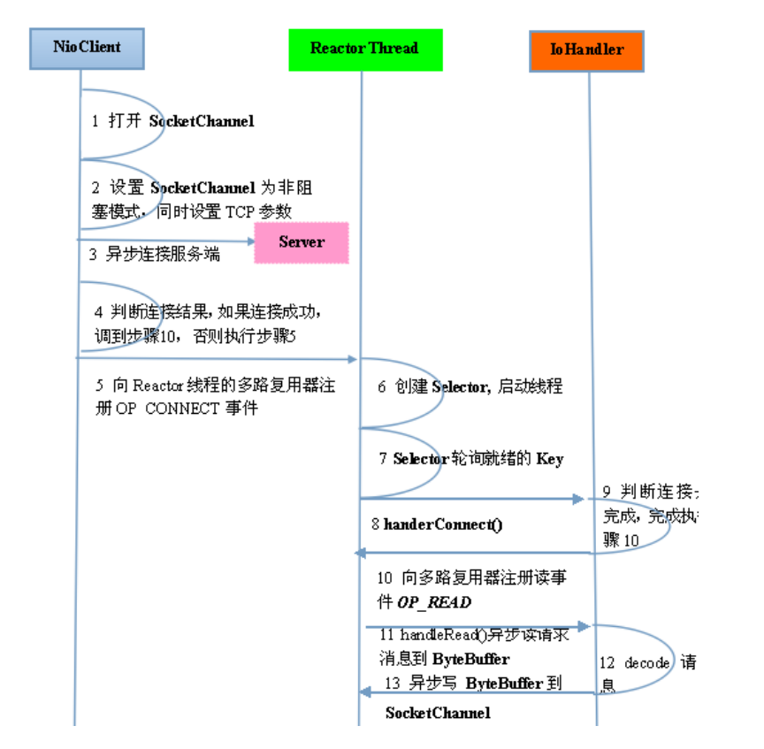
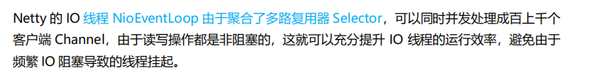
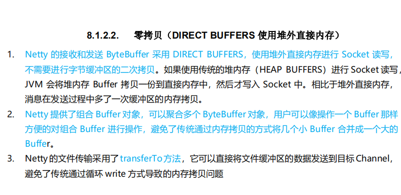
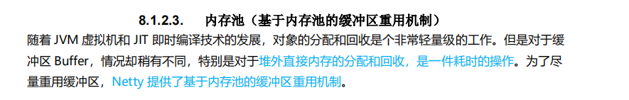
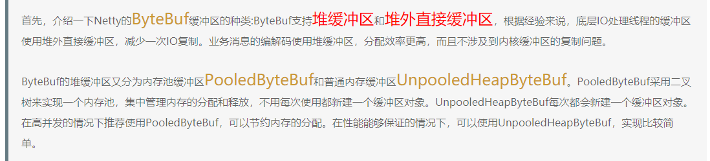
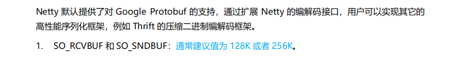
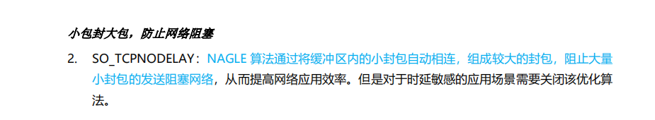
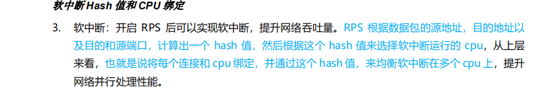

netty是个高性能的异步事件驱动NIO框架。基于JAVA NIO提供的api实现。提供了对tcp udp 文件传输的支持。作为异步NIO框架， netty所有IO操作都是异步非阻塞的。通过Future-listener机制，用户可以方便的主动获取或者通过通知机制获得io操作结果

netty高性能

零拷贝

Direct buffer

简而言之，就是把bytebuff池化了，从内存池获取这个对象，高并发情况下快很多

#### 高性能的序列化框架

