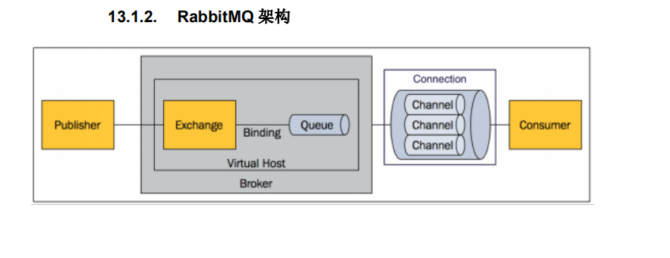
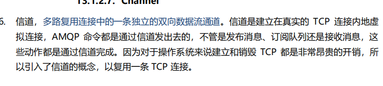
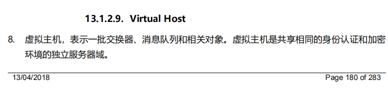
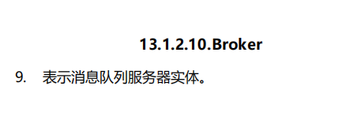

RabbitMQ是一个Erlang语言开发的AMQP开源实现

灵活的路由

消息集群 RabbitMq可以组成一个集群

高可用 队列可以在

Publish->Exchange（交换器）->Bingding->Queue->Connection->Consumer

### Exchange （将消息路由给队列）

1.topic 模式匹配 # 

2.direct 键的完全匹配

3.fanout 类似广播的全部通知

4.headers 匹配Advanced Message Queue Protocol （AMQP) 高级消息队列协议

#### Binding（消息队列和交换器之间的关联）

绑定交换器和消息队列之间的关联

一个绑定就是基于路由键将交换器和消息队列连起来的路由规则。

#### Queue

消息队列，用来保存消息直到发送给消费者。是消息的容器，也是消息的终点。一个消息可投入一个或多个队列。消息一直在队列里面，等待消费者练级得到这个队列将其取走。

#### Channel

