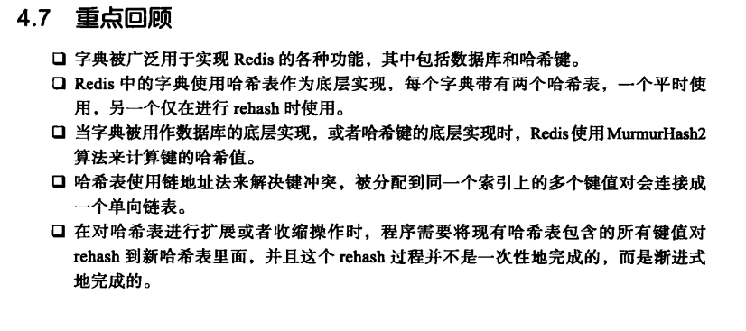

# Redis字典

## Redis字典的运用

Redis构建了自己的字典实现，对数据库的增删改查都是基于字典

字典也是hash键的底层实现

### Redis字典的实现

**Redis采用哈希表作为底层实现，一个哈希表可以有多个哈希表节点，每个哈希表节点就保存了字典中的一个键值对。**

#### 哈希表的实现

Map的实现都大同小异，后面看看这个hash 冲突（这里的索引冲突）情况下 是不是O(N)的复杂度

从这里看 复杂度是O(N) 只是用链表来处理哈希冲突的键

#### 字典

ht是个长度为2 的数组 ，数组中的每个项都是一个dictht 哈希表，一般只会使用ht[0],ht[1]只有在 对ht[0]rehash的时候使用。

rehashindex 记录了目前rehash的进度， 如果没有进行rehash这个值为-1.

## Redis计算哈希和索引的方法

#### Redis 自动Rehash

- 服务器目前没有执行BGSAVE 或者BGREWRITEAOF 命令 并且负载因子大于等于1
- 服务器目前在执行BGSAVE命令或者BGREWRITEAOF命令 并且负载因子大于等于5

- 当哈希表的负载因子小于0.1时，自动进行搜索收缩操作

### 渐进式Rehash

为什么要渐进式

因为不渐进 如果哈希表的内容过大 全部从ht[0] ht[1] 计算量过大 会导致 服务器停止服务。

如何保证rehash期间的完整性 

每次查询、更新、删除都在两个哈希表ht[0] ht[1] 上进行，一个没找到 找另外一个

而新增的操作 一律保存到ht[1] 中 这样子  ht[0] 在rehash的过程中 键值对数量或者说哈希表节点数量只减不增， rehase完成 也就变成了空表。

这时候再重新将ht[1] 指为ht[0] 新增个指向到空的ht[1]

