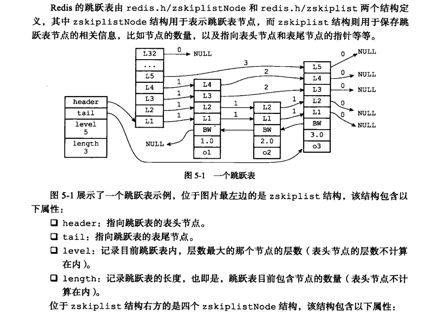
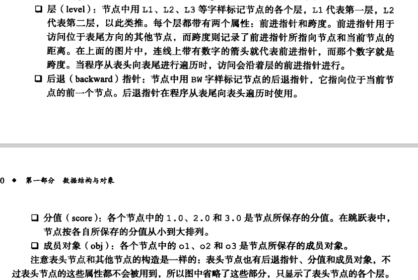
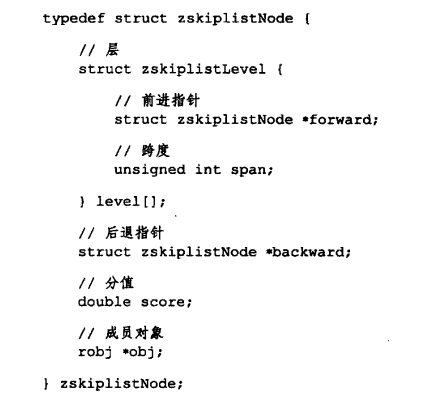
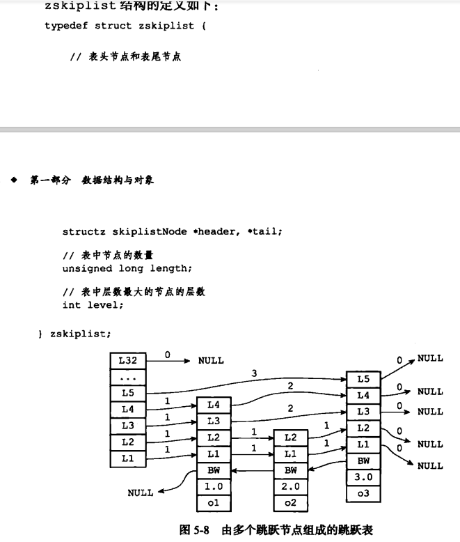
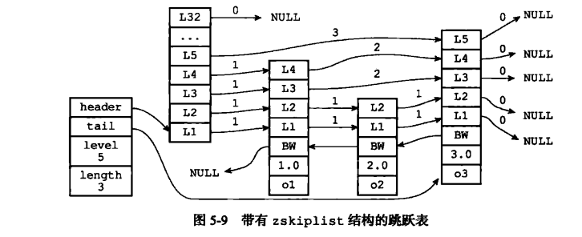

# Redis跳跃表（Skiplist)

跳跃表是一种有序数据结构，通过在每个节点中维持多个指向其他节点的指针，从而达到快速访问节点的目的。

跳跃表支持平均O(logN) 最坏O(N) 复杂度的节点查找。

Redis使用跳跃表作为有序集合键的底层实现 **之一** 如果一个有序集合包含的元素数量比较多，又或者

有序集合中元素的成员是比较长的字符串时，就会使用跳跃表来作为有序集合键的底层实现。

Redis只在两个地方使用了跳跃表，一个是有序集合键， 另一个是在集群节点中用作内部数据结构。

## 跳跃表的实现

#### 跳跃表节点

### 跳跃表

