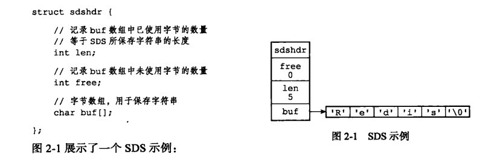
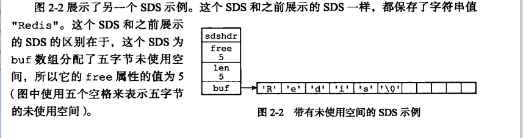
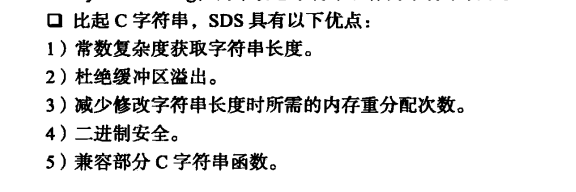
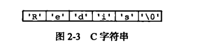
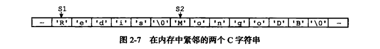
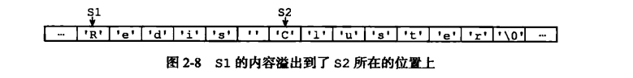
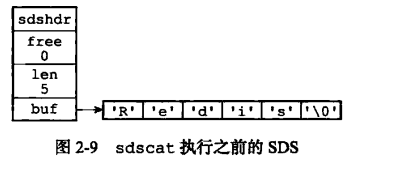
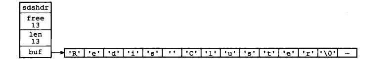
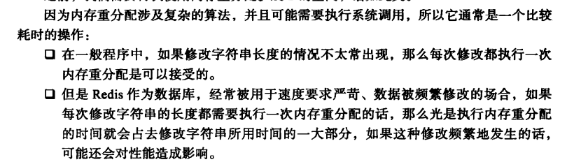

## 简单动态字符串

## SDS的作用

### 用来保存字符串值

Redis中只会将C字符串用在无需对字符串值进行修改的地方（如log)

平常情况下 客户端执行的命令 这些 字符串对象底层都是SDS

如 rpush fruits “apple" "banana" "cherry"   

- 这里的键 fruits 正是个保存了字符串”fruits" 的SDS
- 而这里的值是个列表对象 列表对象包含三个成员 每个成员都是包含”字符串“的SDS

### 用作缓冲区（buffer）

AOF和客户端状态中的输入缓冲区

## 为什么是SDS而不是C字符串

### SDS的定义

free length buf[]

len 属性的值为5 表明SDS保存了5字节长度的字符串

free属性的值为0 表明这个SDS没有分配任何未使用空间

buf属性是一个char类型的数组，前五个字节保存了‘r''e''d''i''s' 最后保留了一个空字符’\0‘

**保留空字符串是沿用c字符串以\0结尾的惯例，可以重用C字符串库里的函数**

##### 带有free属性的SDS

### SDS与C字符串的区别

#### **SDS比C字符串更具有效率性、安全性 满足redis使用需要**

- #### 为什么更有效率——常数复杂度获取字符串长度

比如

这个字符串我们想要获取字符串长度 时间复杂度就是O(N) 一定要遍历才能获取字符串的长度

而SDS的结构 维护了len这个属性 时间复杂度是O(1)

SDS的len属性是在执行api时自动完成的 无需手动修改len属性

- #### 为什么更安全——避免缓冲区溢出

C字符串不记录自身的长度，strcat假定用户已经为被追加者留出了足够的长度， 

所以会出现两个内存相邻的字符串   对前者strcat ”Cluster“之后 会溢出数据到 S2上

而SDS记录了字符串长度， 每次拼接会检查是否有足够空间  ，API会自动扩充空间 ，也不需要手动扩充空间大小，不会出现这种缓冲区溢出问题。

可以看到这个len 变长了 （原来’\0 变成 ‘’ ） 而且还为SDS增加了 13 字节未使用空间 （空间分配策略）

- #### 为什么更有效率——减少修改字符串带来的内存重分配次数

C字符串的特性容易导致频繁重新分配内存

##### SDS如何解决——free属性（未使用空间）

空间预分配和惰性释放空间

##### 空间预分配

规则 

1.SDS修改后的len属性小于1M ， 那分配的free为 len的大小 

SDS实际buf长度为 len + len(free) + 1 byte 

2.SDS修改后的len属性大于1M 分配的free属性为1M

SDS实际buf 长度为 len + 1m（free) + 1 byte 

通过预分配策略 SDS将连续增加N次字符串 带来的内存重新分配次数从 必定N次到最多N次

##### 惰性空间释放

用于优化SDS的缩短操作  比如执行了trim 操作 这些被去掉的部分 实际上 没有释放对应的空间 ，而是将其作为未使用空间留在buf里 长度就是free属性 SDS也提供了对应的手动释放空间方法。

- #### 为什么更安全——二进制安全

C字符串 中间不能出现空字符 ，不然会被识别成字符串结尾 

SDS使用len来判断字符串是否结束 所以没有问题

- #### 兼容部分C字符串函数

SDS兼容 部分C字符串函数

| SDS的好处                                   | C字符串                                       | SDS                       |
| ------------------------------------------- | --------------------------------------------- | ------------------------- |
| 常数时间复杂度获取字符串长度(有len属性存在) | O(N)                                          | O(1)                      |
| 减少内存分配次数（预分配空间+惰性释放）     | 必定N次                                       | 最多N次                   |
| 杜绝缓冲区溢出                              | 需要手动扩充 不然有覆盖连续内存区字符串的风险 | API每次都检查len 自动扩充 |
| 二进制支持完善                              | 只能保存文本数据                              | 可以保存二进制数据        |
| C字符串函数                                 | 全部兼容                                      | 部分兼容                  |

