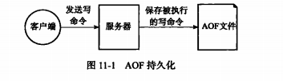

AOF (Append Only File )

与RDB通过保存数据库中的键值对 不同， AOF持久化 通过保存redis服务器中所执行的写命令来记录数据库状态的。

说明AOF文件的写入保存、载入等操作实现原理

### AOF持久化的实现

可以分为命令追加（append)、 文件写入、文件同步三个步骤

### 命令追加

服务器在执行完一个写命令后， 会以协议格式将被执行写命令追加到服务器状态的aof_buf缓冲区末尾，

### AOF文件的写入与同步

redis服务器京城就是个事件循环，每次结束一个事件循环之前，都会调用flushAppendOnlyFile函数，考虑是否写入到缓冲区中

### AOF文件的载入与数据还原

说白了就是模拟客户端执行AOF文件中的命令

### AOF重写

aof保存所有命令 文件会很大，所以通过创建一个新AOF文件来替代现有AOF文件，新旧两个AOF文件保存的数据库状态相同，但新AOF不包含浪费空间的冗余命令。

#### AOF文件重写的实现

实际上AOF文件重写并不是基于存量的AOF文件，而是直接读取服务器当前的数据库状态来实现的。

但是这有个问题

这种情况下 t5、t6、t7的命令就没有被同步到aof文件中，

为此redis设置了一个AOF重写缓冲区

### 重点回顾

AOF通过保存所有修改数据库的写命令请求来记录服务器的数据库状态

AOF文件中所有命令都用redis命令请求协议的格式保存

命令请求会先保存到aof缓冲区里，之后再定期写入同步到aof文件中

appendfsync选项（always seconds no) 对aof持久化功能安全性 和redis 服务器性能影响很大。

aof重写产生的文件与原有的aof文件保存的数据库状态一样，体积更小

执行BGREWRITEAOF命令时，redis服务器会维护一个AOF重写缓冲区，在子进程创建AOF文件期间，记录所有写命令，当子进程通知父进程完成后，会追加AOF重写缓冲区的内容到新aof文件的末尾，同时更改覆盖原有aof文件，此时两个aof文件保存的数据库状态一致。子进程通知父进程，父进程执行信号接收函数这个过程会造成阻塞，但是已经是最低的影响