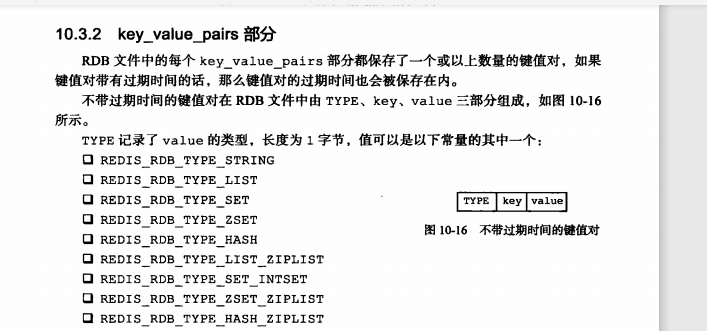

介绍了SAVE BGSAVE的实现方式

自动保存功能的实现原理

分析RDB文件的组成部分

分析实际的RDB文件

### RDB文件的创建与载入

### BGSAVE执行时服务器的状态

**BGSAVE期间，啥备份命令都会被拒绝，要不然竞争，要不然性能耗费巨大。**

（BGSAVE期间，SAVE请求会被拒绝。为了避免父进程和子进程同时执行两个rdbSave调用，防止产生竞争条件。

其次 BGSAVE期间  BGSAVE的请求也会被拒绝。因为两个bgsave也会产生竞争条件。

最后BGSAVE期间 BGREWRITEAOF 也会被拒绝，虽然两个命令不会产生竞争，但是为了性能考量，还是不会执行。）

**RDB载入文件期间，会一直处于阻塞状态，直到载入工作完成。**

### 自动间隔性保存

### 判断保存条件是否满足

这里用到的是定期检查 而不是每次执行都判断

### RDB的文件结构

### 压缩

#### 字符串

#### 列表对象

#### 集合对象

#### 哈希表对象

#### 有序集合对象

### 实战

可以通过 od 命令（od -c dump.rdb) 来观察rdb文件

### 重点回顾

RDB文件用于保存还原redis服务器所有数据库中的键值对数据

SAVE命令由服务器进程直接执行 会阻塞服务器

BGSAVE由子进程执行 不会阻塞

RDB文件是一个经过压缩的二进制文件，由多个部分组成。

对于不同类型的键值对， RDB文件 使用不同的方式保存他们。