事件驱动程序

<u>文件事件</u> Redis服务器通过套接字与客户端进行链接

<u>时间事件</u> 比如serverCron

#### 文件事件

基于Reactor模式开发了网络事件处理器，被称为文件事件处理器（file event handler)

​	 文件事件处理器使用IO多路复用 (multiplexing)来监听多个套接字，根据套接字目前执行的任务来为套接字关联不同的事件处理器 。

 	当被监听的套接字准备好执行链接应答（accept ) 读取 （read) 写入 （write) 关闭等操作时，与操作相对应的文件时间就会产生，这些feh就会调用套接字关联好的事件处理器来处理这些事件。

file event handler 以单线程方式运行，但通过multiplexing（多路复用） 监听多个套接字，feh既实现了高性能的网络通信模型，又很好地与redis服务器中其他以单线程方式运行的模块进行对接，保持了内部单线程设计的简单性。

#### 文件事件处理器的构成

套接字 、multiplexing多路复用程序 、 文件事件分派器 事件处理器 

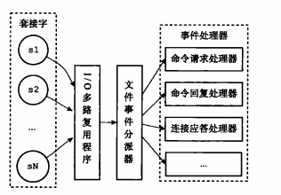

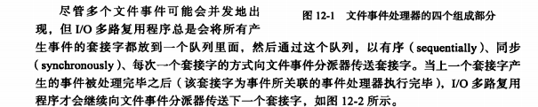

#### multiplexing 多路复用程序的实现

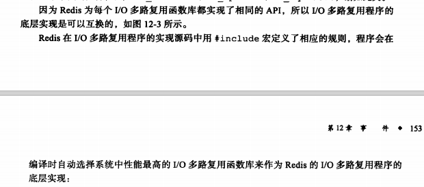

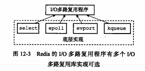

#### 事件的类型

AE_READABLE 套接字变得可读时，write、close、accept 套接产生AE_READABLE事件

AE_WRITEABLE  套接字变得可写时 （客户端对套接字执行read操作）

多路复用程序允许同时监听套接字的AE_READABLE和AE_WRITEABLE 事件，如果同时发生，那么优先处理AE_READABLE事件

也就是在redis中，套接字又可读又可写，那么会是先读后写

#### 文件事件处理器

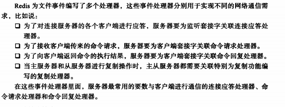

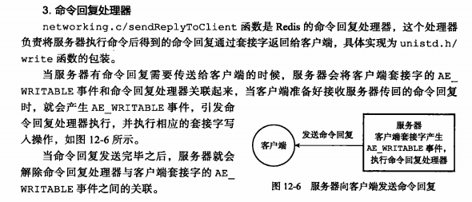

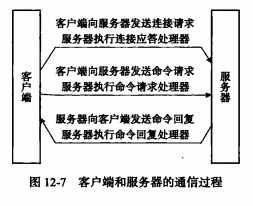

### 时间事件

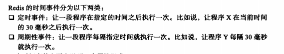

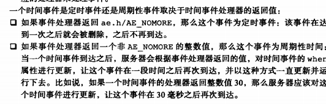

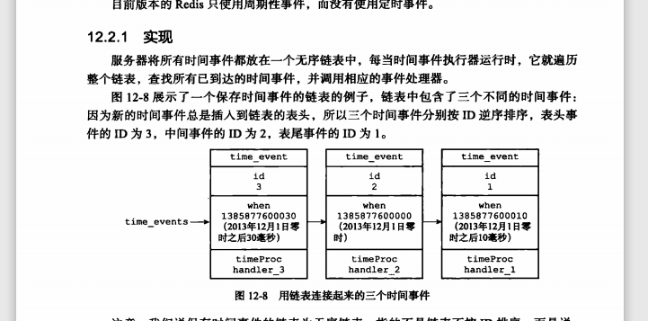

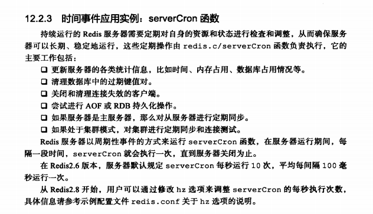

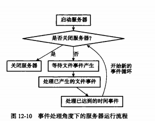

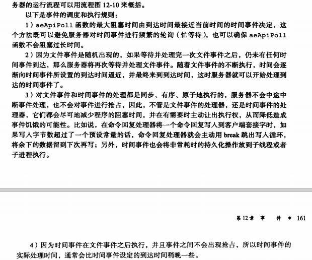

### 重点回顾

Redis服务器是一个事件驱动，分为文件时间和时间事件两类

文件事件处理基于Reactor模式实现的网络通信程序

文件事件是对套接字操作的抽象，套接字变为accept writeable 或者 readable 相应的文件事件就会产生。

文件事件分为AE_WRITEABLE 事件和AE_WRITEABLE两类

时间事件分为定时事件和周期性事件 

定时只执行一次，周期性事件每个一段时间到达一次

一般情况下只执行serverCron函数一个时间事件。并且这个是周期性事件。

文件事件和时间事件是合作关系，服务器轮流处理两类事件，处理过程中也不会抢占。

时间事件一般比预定时间晚点 因为处理文件事件过程中 不会中断。

