通过使用multiplexing 多路复用实现的文件事件处理器，redis服务器使用单线程单进程的方式来处理命令与请求，与多个客户端进行网络通信。

服务器状态结构的clients是个链表。保存了所有与服务器连接的客户端的状态结构，

对客户端进行批量操作，或者查找指定客户端，都可以通过遍历clients链表来完成。

#### 客户端属性

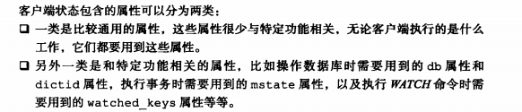

##### 套接字描述符

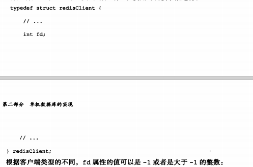

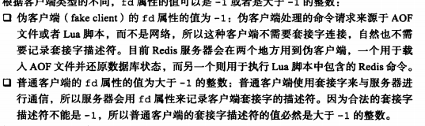

#### 标志

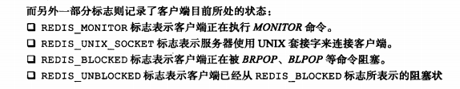

#### 输入缓冲区

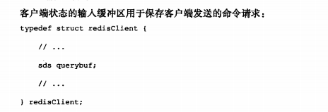

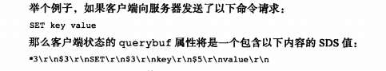

#### 命令与命令参数

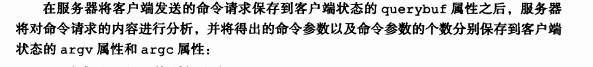

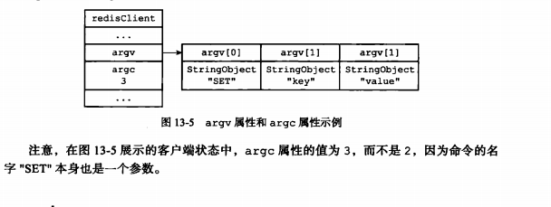

#### 命令实现函数

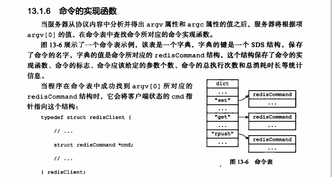

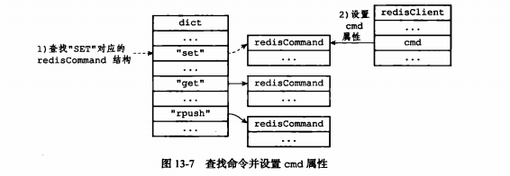

#### 输出缓冲区

执行命令得到的命令回复会被保存在客户端状态的输出缓冲区里。每个客户端都有两个输出缓冲区可用，一个缓冲区大小是固定的，一个缓冲区大小是可变的。

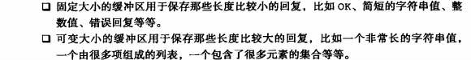

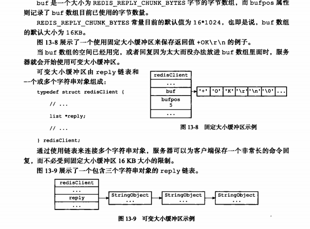

#### 客户端的创建和关闭

##### 创建普通客户端

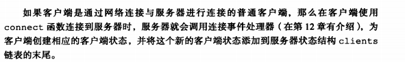

##### 

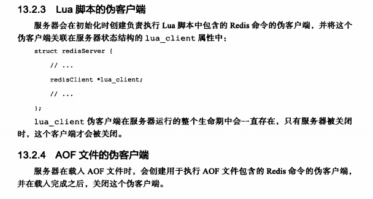

#### 重点回顾

​	服务器状态结构使用clients链表连接起多个客户端状态，新添加的客户端会被放到链表的末尾。

客户端状态的flag表明客户端的角色以及客户端当前所处的状态。

输入缓冲区记录了客户端发送的命令请求，这个大小不能超过1G

命令的参数和个数会被记录在argv 和argc属性里，cmd属性记录客户端执行命令记录的实现函数。

客户端有固定和可变缓冲区可用，固定缓冲区最大大小为16k，

输出缓冲区限制值有两种，如果输出缓冲区的大小超过服务器设置的硬性限制，那么立刻关闭，如果超过软性限制，那么客户端如果在一段时间内回复正常大小，那么客户端链接会得到保留。

lua脚本的伪客户端会一直存在，载入aof文件使用的伪客户端在载入工作开始的时候动态创建，载入工作完毕之后关闭。

