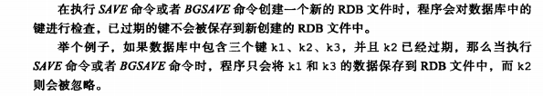

# 单机数据库的实现 ——数据库

说明服务器保存数据库的方法 客户端切换数据库的方法 数据库保存键值对的方法，以及针对数据库添加 删除 查看 更新操作的实现方法。 还会说明服务器保存键的过期时间的方法，以及服务器自动删除过期键的方法。  说明2.8引入的数据库通知功能的实现方法。

### 数据库键空间

Redis是一个键值对数据库服务器，其中redisDb结构的dict字典保存了数据库中的所有键值对，我们称这个字典为键空间 （key space)

### 设置过期时间

### 删除过期键策略

##### 优缺点

定时删除对内存很友好，但是一堆事件 导致cput占用过高

惰性删除对cpu很友好，但是很多早已过期的键值对存在， 	占用了过多的内存

定期删除 是二者的折中，

### Redis采用定期删除和惰性删除相结合的策略

定期删除

就是循环db 默认16个 读取配置获取上次操作到的位置 如果全部完成了那就重新开始。

每次都是抽取几个随机的键来判断（redisDB的expires 字典里有)

### RDB AOF 和复制功能对过期键的处理

#### 复制

当服务器在复制模式下时，服务器的过期删除动作由主服务器控制

从服务器不会主动删除过期的键  ，而是像未过期一样处理 只有接收到主服务发来的del命令后 才会删除

### 数据库通知

数据库通知是redis2.8新增加的功能，可以让客户端通过订阅给定的频道或者模式，获取到数据库中键的变化，以及数据库命令的执行情况。

### 重点回顾

redis服务器所有数据库都保存在redisServer.db中，数据库的数量则由redisServer.dbnum属性保存。

客户端通过切换目标数据库的指针来切换不同数据库

数据库主要由dict和expires两个字典构成，dict负责保存键值对

expires字典保存键的过期时间 就是一个以毫秒为单位的unix时间戳

数据库的键总是一个字符串对象，而值可以是任意一种Redis对象类型，字符串对象，列表对象，哈希对象，集合对象 ，有序集合对象

redis 使用惰性删除和定期删除两种策略相结合

SAVE / BGSAVE 所产生的新文件不会包含已经过期的键

执行BGREWRITEAOF 所产生的新AOF文件不会包括已经过期的键

当一个过期键被删除后，服务器会追加DEL命令到现有AOF文件的末尾

当主服务器删除一个过期键后，他会向所有从服务器发送一条DEL命令。显示删除过期键

redis服务器会根据配置向客户端发送数据库通知

## 