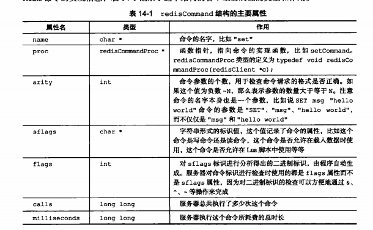
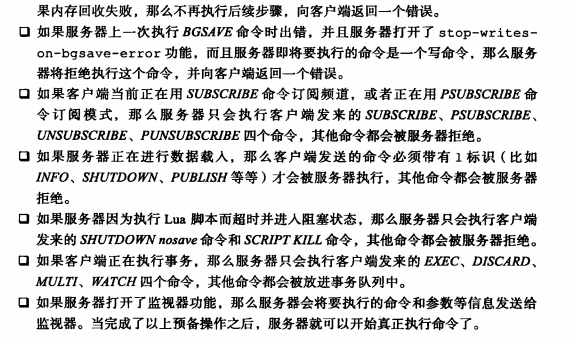
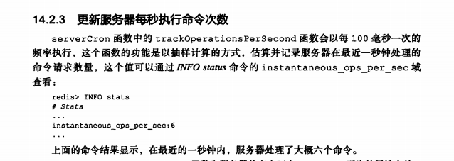

在执行命令的过程中，服务器和客户端进行了什么交互，服务器中的各个不同组件又是如何协作的。

介绍serverCron函数，详细列举这个函数执行的操作，说明这些操作对维护服务器正常运作有何帮助。

介绍服务器启动过程，

#### 命令请求的执行过程

#### 命令执行器（2）执行预备操作

### 命令执行器（3）调用命令的实现函数

### 命令执行器（4）执行后续工作

#### 将命令回复发送给客户端

#### serverCron函数

## 初始化服务器

一个Redis服务器从启动到能够接收客户端的命令请求，需要经过一系列的初始化和设置过程。

比如初始化服务器状态，接受用户指定的服务器配置。创建相应的数据结构和网络连接。

#### 初始化服务器的状态结构

#### 载入配置选项

#### 初始化服务器数据结构

#### 还原数据库状态

#### 执行事件循环

### 重点回顾

