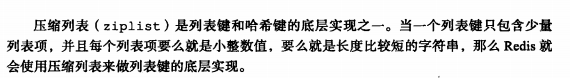
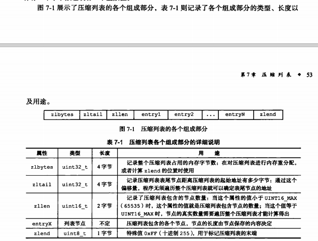
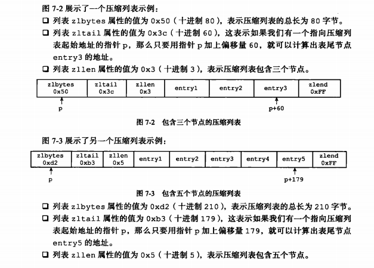
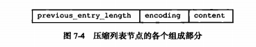
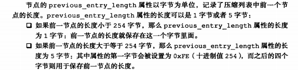
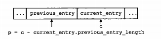
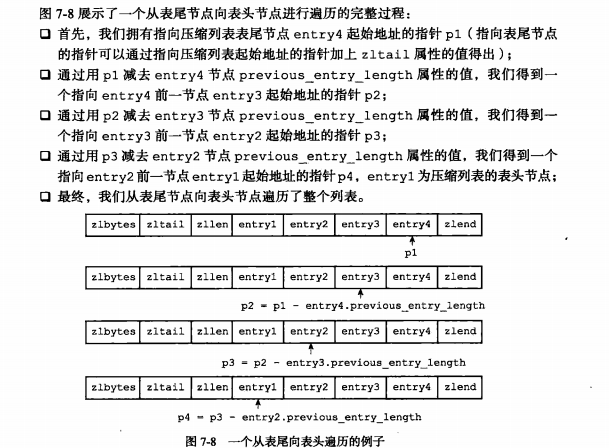
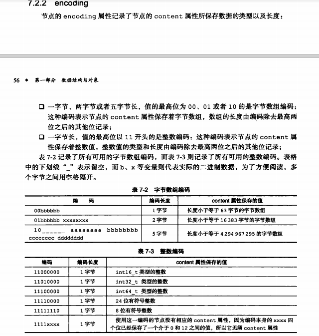
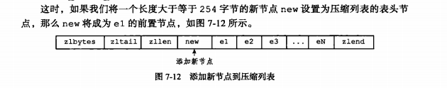

### 目的

压缩列表（ziplist) 是为了节约内存开发的，是由一系列特殊编码的连续内存块组成的顺序型数据结构

zlbytes (4)总长

zltail (4)起始位置到 最后一个节点（entry) 的位置

zllen (2) 表示压缩列表的节点个数

entries (未定)

zlend (1)  特殊值 标识压缩列表的末端

#### 压缩列表的节点（entry) 构成

##### previous_entry_length

#### encoding

#### content

​	content负责保存节点的值

### 连锁更新

 

大体意思上就是如果有多个连续的 节点长度介于250-253之间

这样每个节点的previous_entry_length 都会是一字节 因为没超过（0xfe) 

这时候如果在压缩列表表头新增长度大于254的一个节点   此时e1 的previous_entry_length 就超过了254 ，由于entry的特性 entry 的previous_entry_length 空间由 1字节 变为 5字节（0xfe........）因而导致后面多个节点产生了类似的操作 直到 一个previous_entry_length 的长度为5的节点为止

结论：知道连锁更新会在插入 删除的时候发生就行 ，别太在意解决

#### 要点

压缩列表是为了节约内存而开发的顺序型数据结构

压缩列表是列表键 哈希键的底层实现之一

压缩列表可以包括多个节点 ，每个节点保存一个整数 或 字节数组

添加或删除 压缩列表中的节点 ，可能会引发连锁更新操作 复杂度最糟糕的情况下可以到n平方

但是这种情况并不多见