首先说明旧版在断线重连上的低效，说明如何解决复制的低效，和部分重同步的实现原理。

说明心跳检测机制的实现原理，并对基于心跳检测实现的几个功能进行介绍

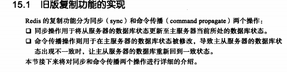

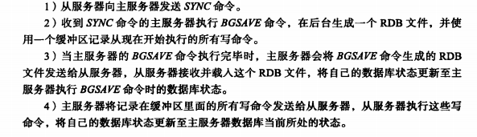

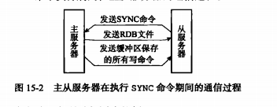

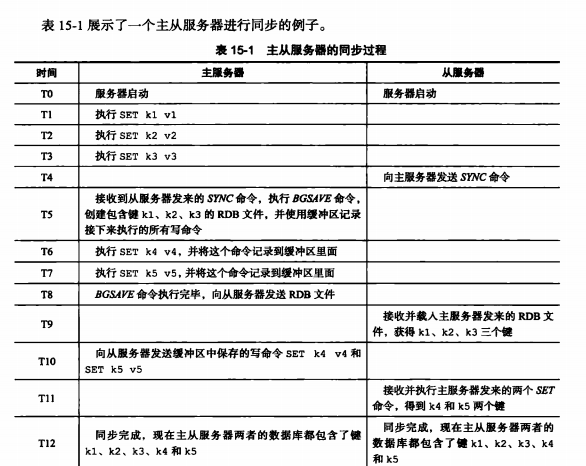

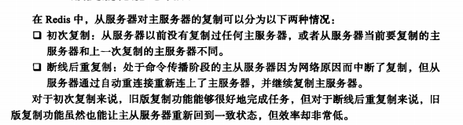

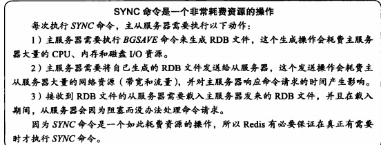

## 新版复制功能的实现

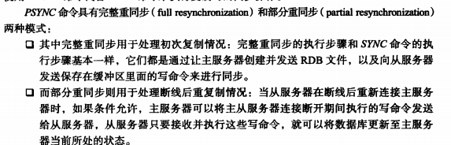

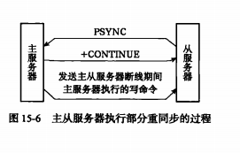

## 部分重同步的实现

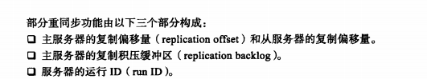

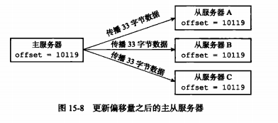

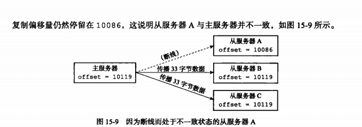

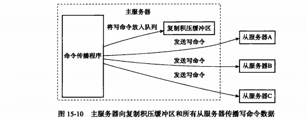

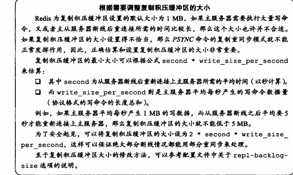

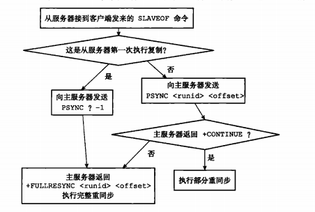

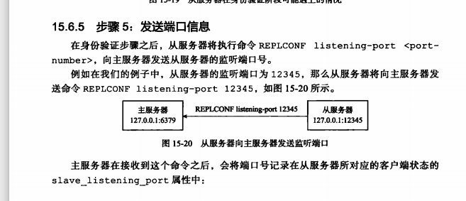

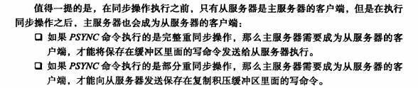

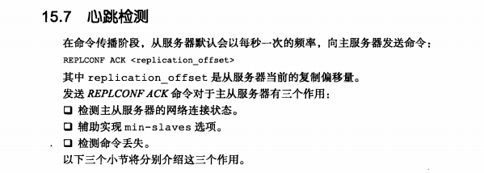

#### 检测主从服务器间的网络状态

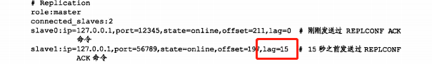

#### 辅助实现min-slaves配置选项

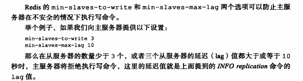

#### 检测命令丢失

### 重点回顾

Redis2.8之前的版本不能高效地处理断线后重连的问题，但redis2.8增加的部分重同步解决了这个问题。

部分重同步 通过复制偏移量replication offset， 复制挤压缓冲区 replication backlog  服务器运行id三个部分来实现

复制操作刚开始的时候，从服务器会成为主服务器的客户端，但是到了复制操作的后期，主从服务器会互相成为客户端（比如主服务器要把缓冲区的命令 更新到从服务器）

主服务器通过向从服务器传播命令 来更新从服务器状态。保持主从服务器一致。

而从服务器通过向主服务器发送命令来进行心跳检测，以及命令丢失检测。