Redis集群是redis提供的分布式数据库方案，集群通过分片来进行数据分享，并提供复制和故障转移功能。

将对集群的节点、槽指派、命令执行、重新分片、转向、故障转移、消息等方面进行介绍

#### 节点

一个redis集群一般由多个节点node构成， 

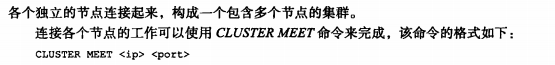

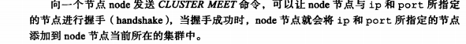

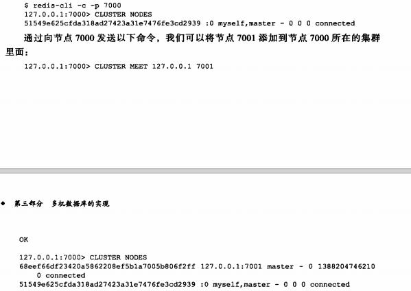

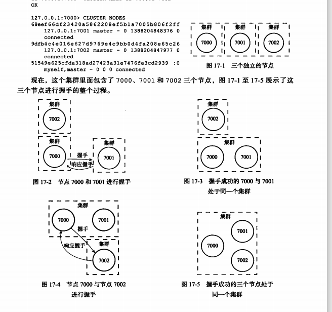

#### 集群数据结构

clusterNode结构保存了一个结点的当前状态，比如结点的创建时间 结点的名字 节点的配置妓院 节点的ip位置 和端口号等

每个节点都会用clusterNode来记录自己的状态 并为集群中的其他节点都创建一个相应的clusternode

结构。以此记录其他节点的状态

每个节点都保存着一个clusterState结构，这个结构记录了当前节点视角下，集群目前所处的状态，比如集群是上线还是下线，包括多少节点。集群当前的配置纪元

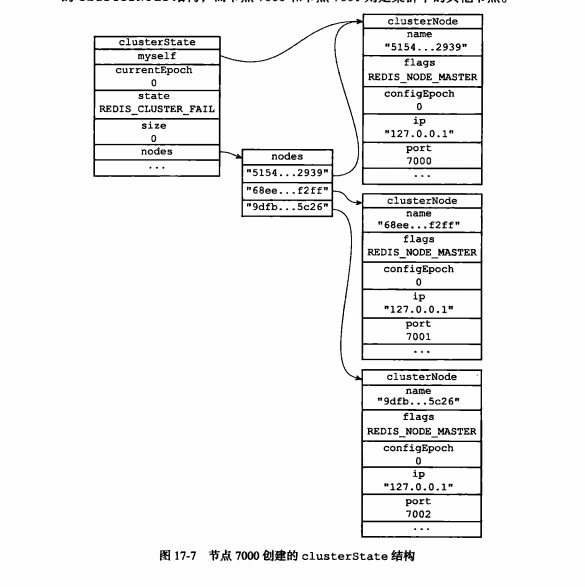

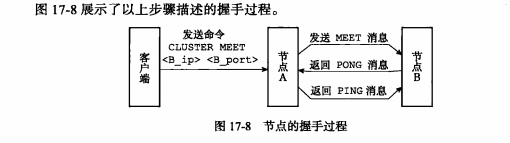

### 槽指派

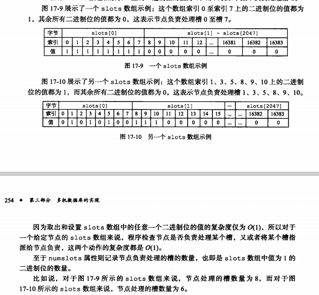

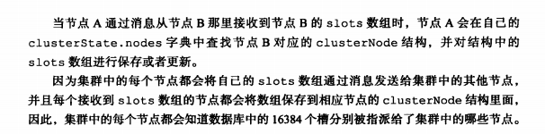

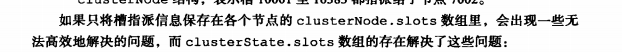

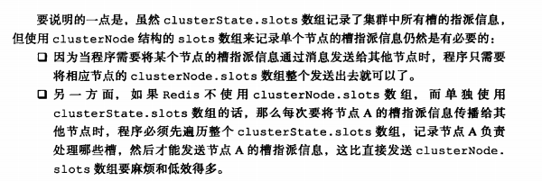

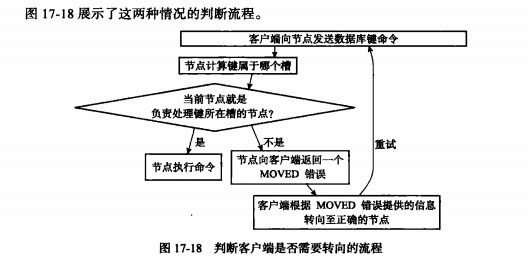

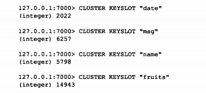

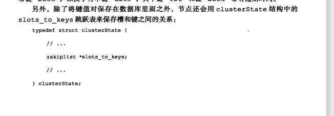

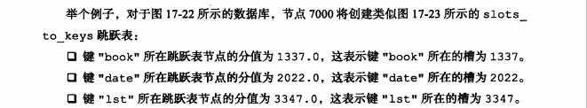

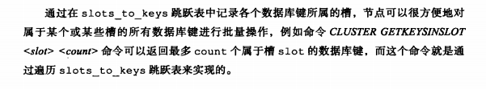

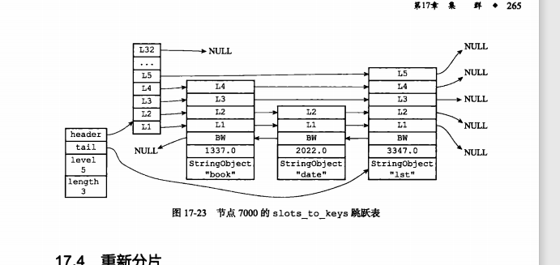

#### 重新分片

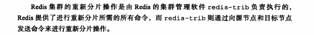

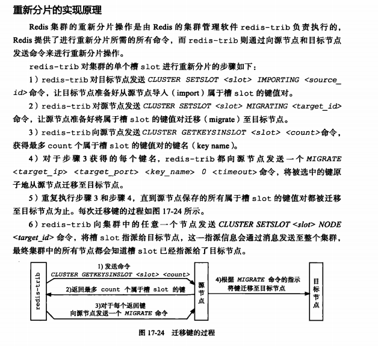

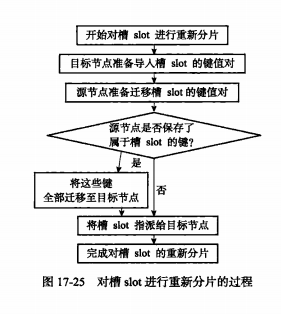

#### ASK错误

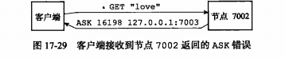

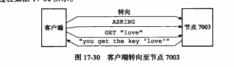

#### 复制与故障转移

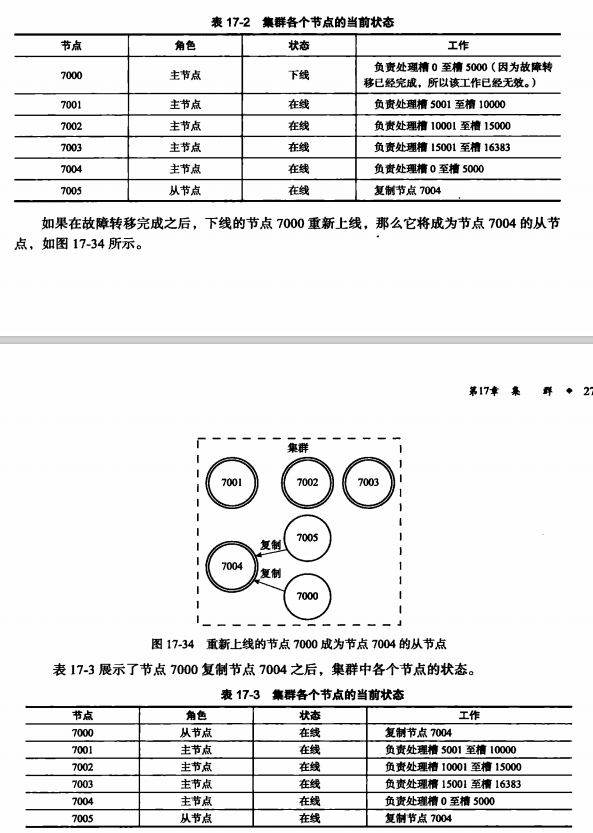

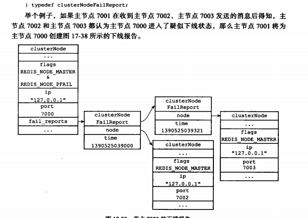

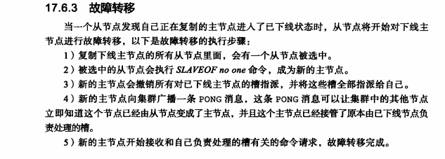

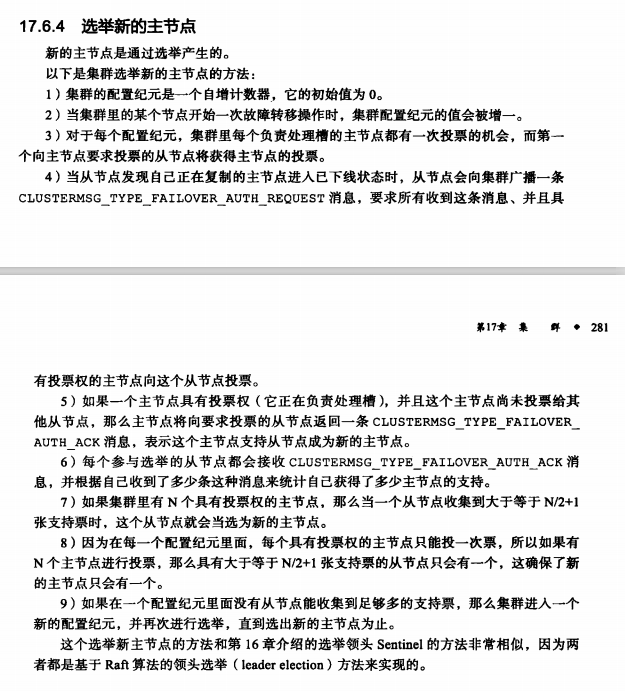

#### 消息

分为PING\PONG\MEET\FAIL\PUBLISH

由消息头和消息正文组成

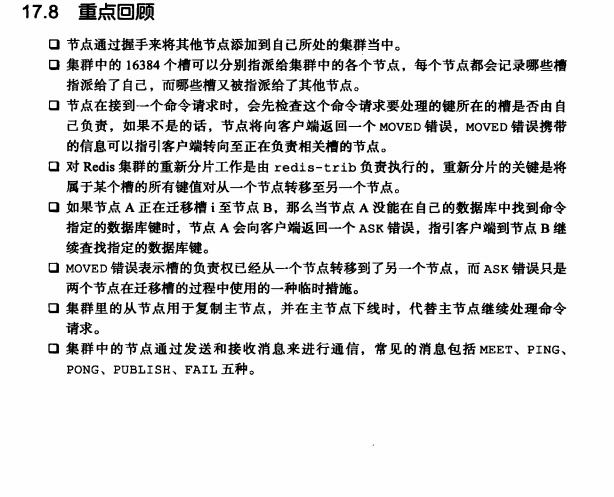