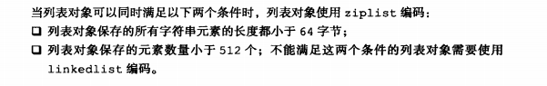

## 对象

redis没有直接运用简单动态字符串、双向链表、字典、压缩列表、整数集合  来实现键值对数据库，而是基于这些数据结构构建对象系统。

这个系统包括字符串对象 列表对象 哈希对象 集合对象 和有序集合对象

#### 使用对象的好处

针对不同的使用场景  为对象设置多种不同的数据结构实现， 从而优化对象在不同场景下的使用效率

redis通过引用计数实现了对象共享机制 。

这一机制在适当的条件下 ，让多个数据库键共享同一个对象来节约内存。

redis对象带有时间访问记录信息 ， 信息用于计算 数据库键空转时长  在服务器启动了 maxmemory 功能的情况下， 空转时间较大的键可能会被服务器删除

#### 对象的类型与编码

### 列表对象

列表对象可以是ziplist（压缩列表） linkedlist (双端链表)

### 哈希对象

#### ziplist 转为hashtable(哈希情况) 转为 linkedlist (列表情况)

### 集合对象

集合对象的编码可以是intset 或者是 hashtable

### 有序集合对象

有序集合对象可以是ziplist 或者是skiplist

#### 为什么有序集合需要同时使用ziplist 和skiplist 来实现

### 类型检查与命令多态

###  内存回收

跟java的引用计数差不多，初始的时候为1 有新的引用+1  没有减一 为0的时候就结束

### 对象共享

### 对象空转时长

大体上就是redisObject 有个属性lru记录 最后一次被程序访问的时间。也就是访问完更新这个值。

但是

## 重点回顾

Redis数据库中的每个键值对的键和值都是一个对象

Redis共有字符串、列表、哈希、集合、有序集合五种类型的对象，每个对象都有至少两种以上的编码方式。这样子主要是为了在不同场景上优化对象的使用效率。

服务器在执行某些命令前。会检查给定键的类型能否执行该类命令，检查键的类型就是检查键对应的值的类型。

Redis会共享0 到 9999的字符串对象 原因是因为0 到9999的字符串对象 在redis初始化的时候就保存好了

redisObject会有一个属性lru记录最后一次被程序访问的时间，可以用这个计算对象的空转时间。