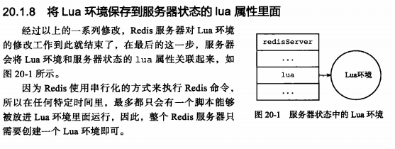
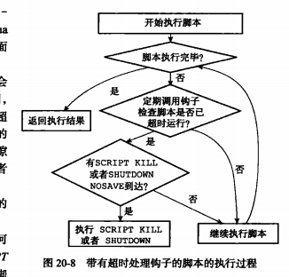

通过在服务器嵌入lua环境，redis客户端可以使用lua脚本，直接在服务器端原子的执行多个redis命令

介绍Redis服务器中与lua脚本有关的各个部分进行介绍。

本章介绍Redis服务器初始化lua的整个过程，说明redis对lua环境进行那些修改，这些修改对用户执行lua产生了什么影响

接着 本章介绍lua进行协作的两个组件， 一个是执行lua脚本的伪客户端（另一个伪客户端是aof文件还原）以及负责保存传入服务器的lua脚本的脚本字典。

了解伪客户端可以知道脚本中的redis命令在执行时，服务器与lua环境的交互过程。

了解脚本有助于理解script exist命令和脚本复制功能的实现原理。

介绍eval命令和evalsha命令的实现原理，说明lua脚本在redis服务器中是如何被执行的，并对

script flush script exist script load  script kill 命令的实现原理进行介绍。

最后，本章介绍redis在主从服务器之间复制lua脚本的方法作为本章的结束。

#### 创建并修改lua环境

#### 脚本管理命令的实现

EVAL命令和EVALSHA命令之外，redis与lua脚本有关的命令还有四个，分别是script flush scrit exist 

script load script kill

