Redis

通过multi exec watch 等命令实现事务transaction

事务提供了一种将多个请求打包，然后一次性，按顺序执行多个命令的机制。

并且在事务执行期间，服务器不会中断事务而改去执行其他客户端的命令请求，它会将事务中的所有命令都执行完毕，再去处理其他客户端的命令请求。

事务先以multi 开始，然后将多个命令放入事务当中，最后以exec将这个事务提交（commit)给服务器执行。

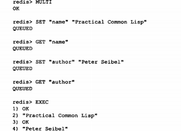

介绍如何使用multi和exec命令实现事务功能，事务中的多个命令如何被保存到事务里面。

这些命令又是如何被执行的。

介绍完事务的实现原理之后，我们将对WATCH命令的作用进行介绍，说明WATCH命令的实现原理

常见的ACID对redis事务的原子性 一致性隔离性 持久性说明。

#### 事务的实现

事务开始

入列

事务执行

##### 事务开始

multi标志着redis事物的开始  将客户端从非事务状态切换到事务状态，这一切换是通过在客户端状态的flags属性中打开redis_multi表示来完成的

##### 命令入队

当客户切换到事务状态后,服务器会根据这个客户端发来的不同命令执行不同操作

如果客户端发送的是exec discard watch multi ，服务器会立刻执行

如果客户端发送的是这以外的命令，服务器不立即执行这个命令，而是把这个放入事务队列里，然后返回queued回复

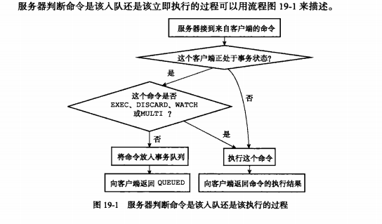

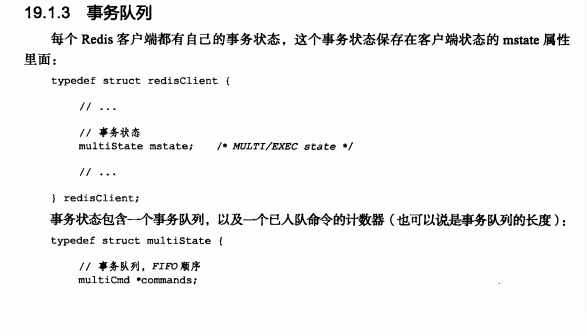

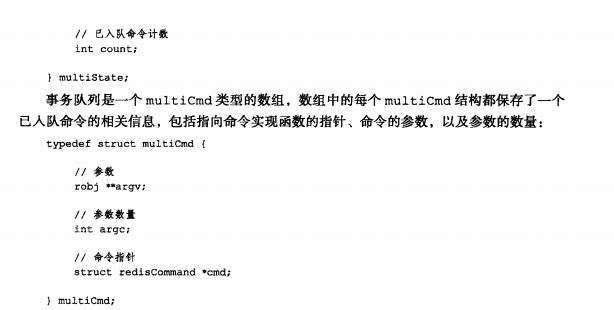

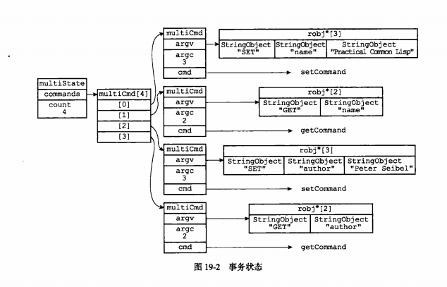

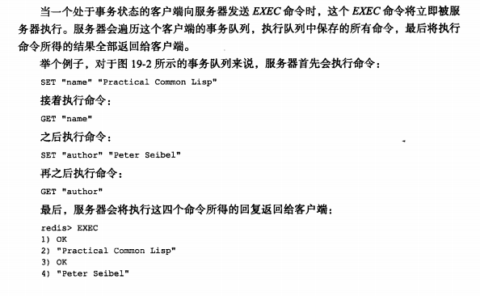

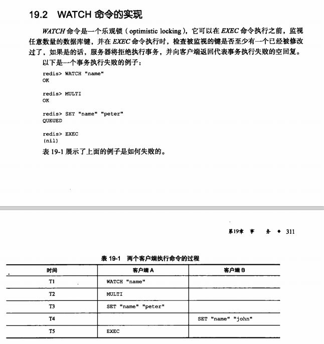

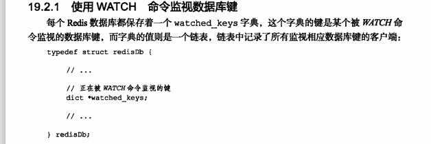

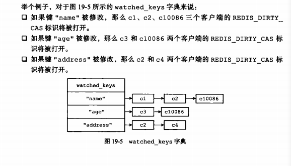

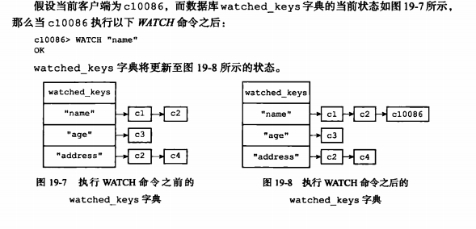

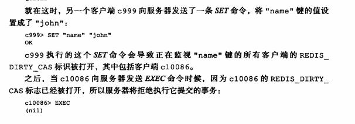

#### 事务的ACID性质

atomicity consistency isolation durability

##### 原子性

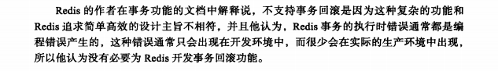

##### 一致性

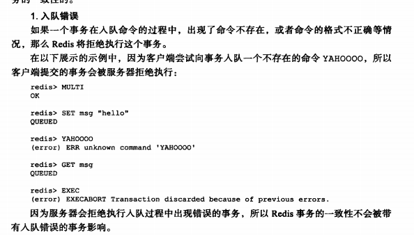

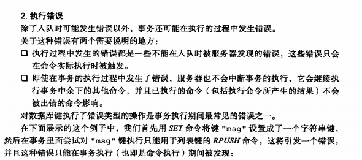

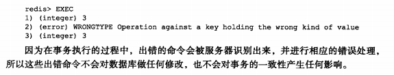

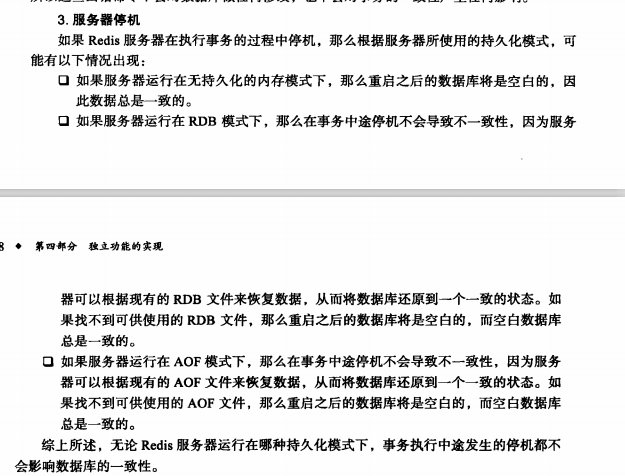

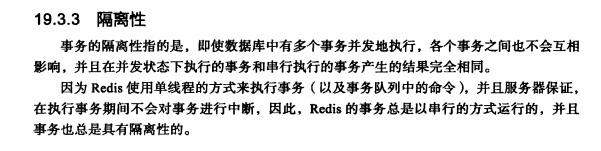

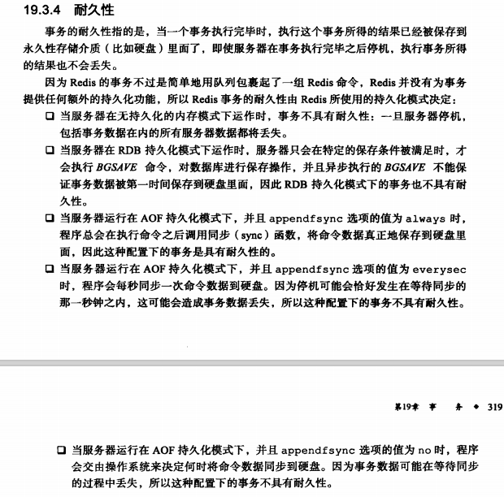

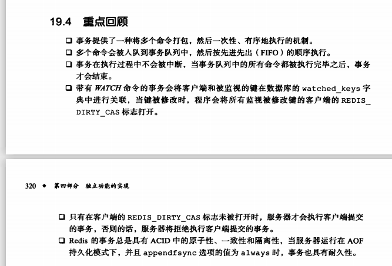