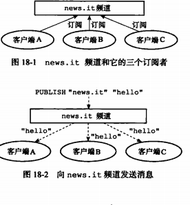

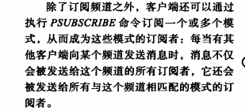

可以执行PSUBSCRIBE订阅一个或多个模式，

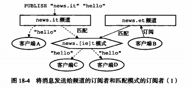

将要介绍subscribe 和 unsubscribe命令的实现原理，然后介绍订阅模式psubscribe命令和推定模式punsubscribe命令的实现原理

介绍完之后，本章将会对publish命令的实现原理进行接好，说明消息是如何发送给频道的订阅者和模式的订阅者的

最后将介绍 pubsub 命令的三个子命令，说明三个子命令的实现原理

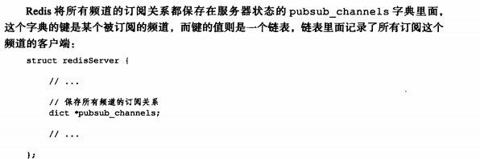

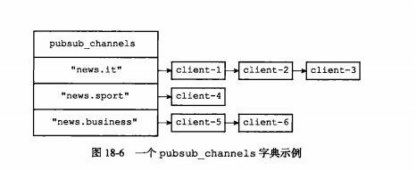

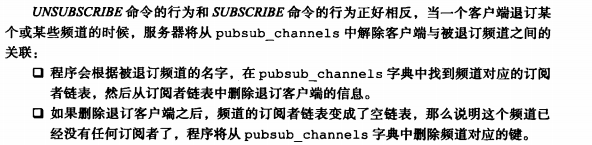

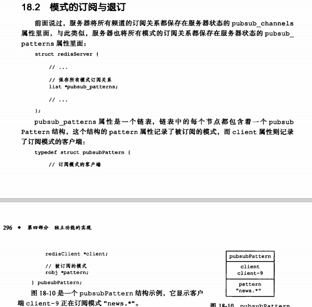

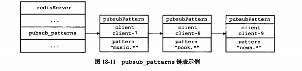

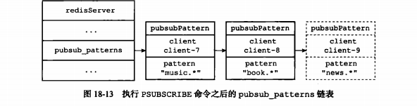

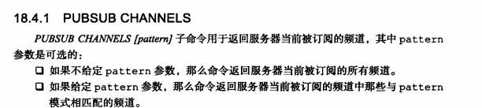

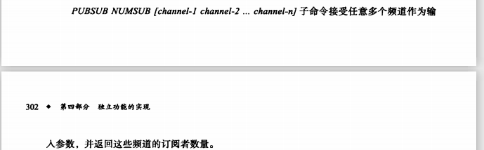	

### 重点回顾

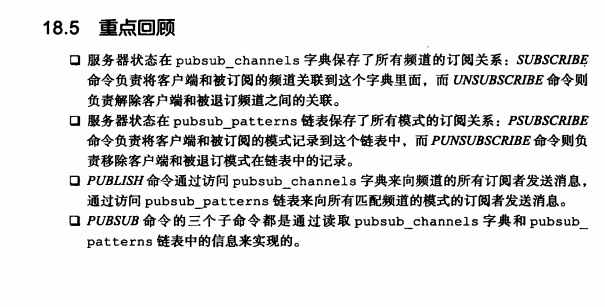