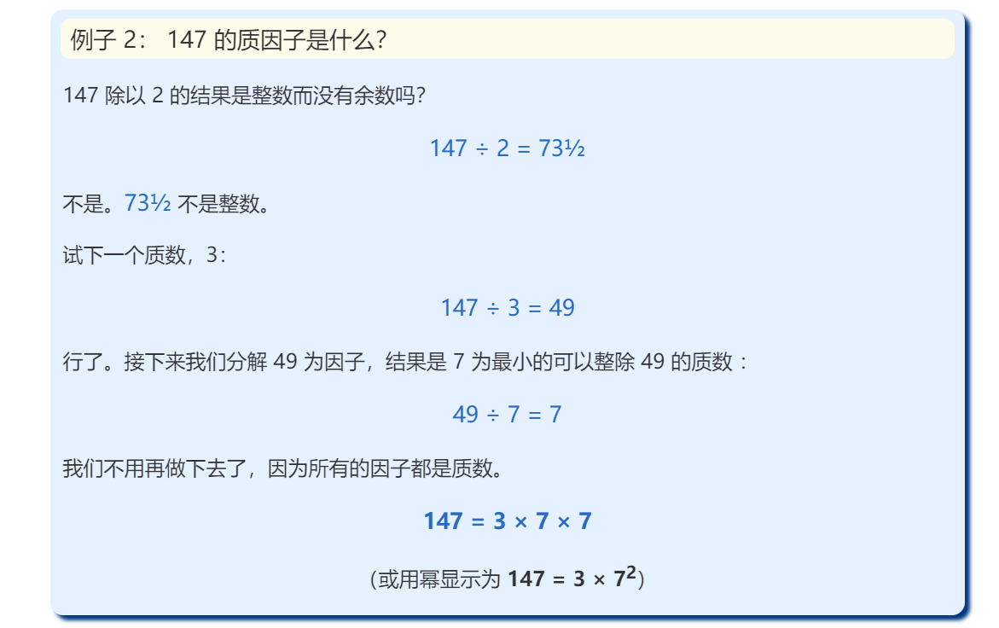
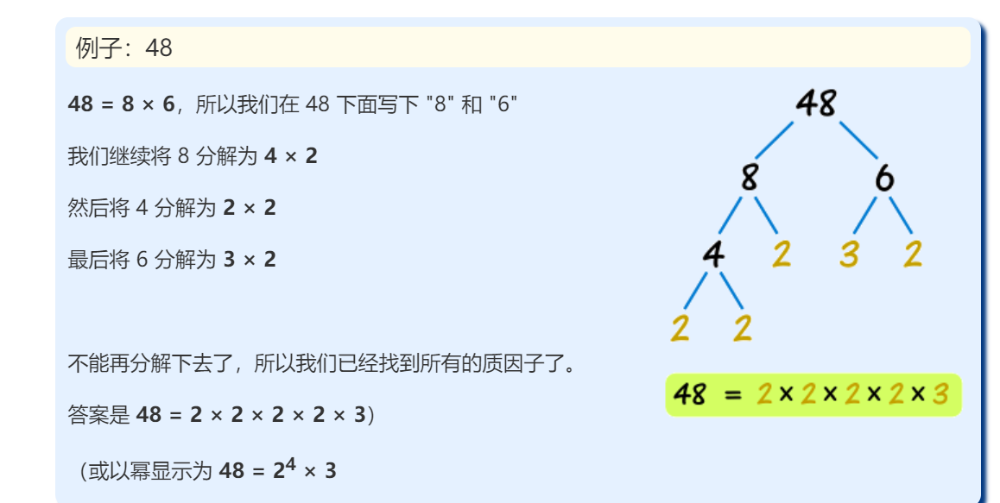
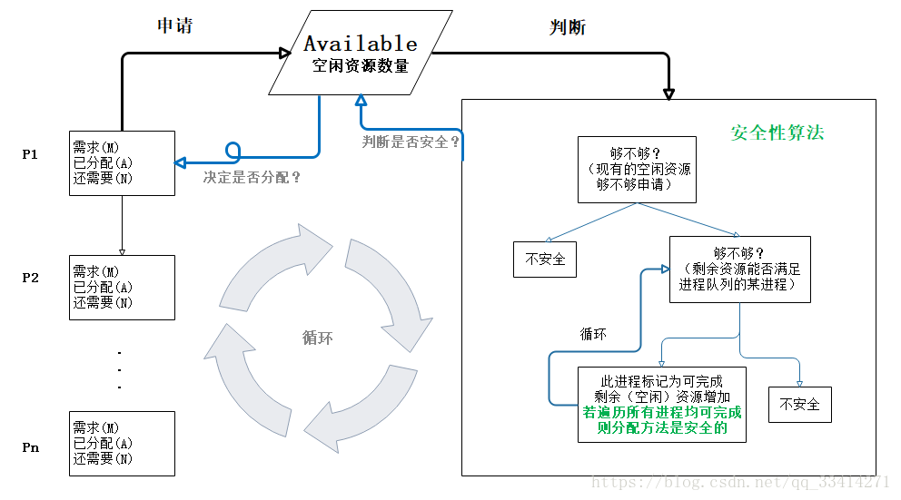
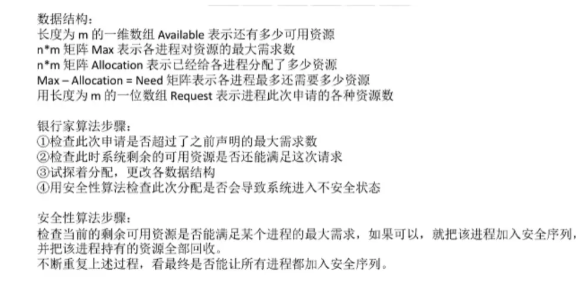
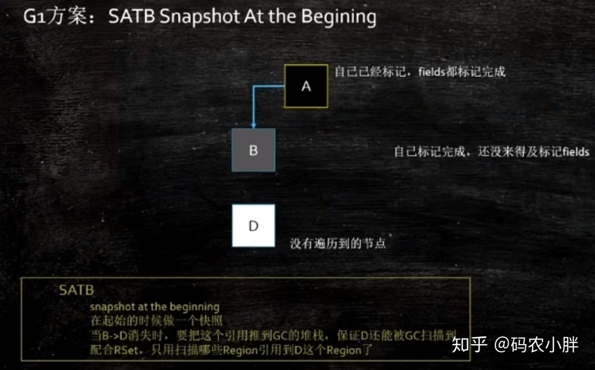

编辑于 2021-01-22 18:21:03
算法题考字符串转二进制和16进制

二面 面试 1.21 两个面试官
1. python new和init方法的区别
2. 数组和链表的区别
3. 动态规划算法和贪心算法的区别
4. 空间复杂度和时间复杂度怎么计算
5. 简历上的项目
11


java三大IO模型的原理和应用。
阻塞IO，阻塞的是谁。
java抽象类和接口区别。（送分题）
给你一个API，我要限制他并发访问的客户端数量，怎么实现。
客户端第一次访问被拒绝，要怎么实现循环等待。


作者：头发第一
链接：https://www.nowcoder.com/discuss/546352
来源：牛客网

自我介绍
IO口
前端会不会（不会）
Https加密过程，答错了一部分。。
开源框架用过啥（基本都没用过。。）
JVM用的什么虚拟机
新生区垃圾回收的过程
CMS收集器
算法题
判断两条链表是否有相交
二叉树层序遍历


作者：旺旺旺仔
链接：https://www.nowcoder.com/discuss/539779
来源：牛客网

10.15 日 （邮件说是2:05开始，面试官迟到到2:16开始）
4个面试官，都不开摄像头。
1、面试官迟到了，也不道歉，直接开始。没有自我介绍
2、面试官1：讲一个你熟悉的 项目或者课题。（讲 项目的时候直接被打断）
3、面试官2：说一下你的课题，说的时候被怼，是不是现在的研究生加一点东西就觉得是创新！语气极其差！
4、面试官3：讲一下java里的列表。讲一下jSpring怎么实现事务？GBK和utf-8的区别？
5、面试官4：说下java中$和#的区别，数据库里数据表特别大怎么办？
6、面试官4：java里乐观锁和悲观锁的区别？
7、 面试官4：请求乱码怎么处理？SpringBoot你用的配置文件是什么？SpringBoot自带的tomcat有bug怎么处理？


作者：what????
链接：https://www.nowcoder.com/discuss/586074
来源：牛客网

一面12.22 笔试题目
二面技术面12.28 两位面试官 问的问题比较基础
1. 对spring的理解
2. session和cookie的区别，这个技术是解决什么问题
3. TCP和UCP协议
4. Java垃圾回收机制
5. socket编程
6. 使用Java按行读取txt文件
7. TCP三次握手
8. 索引的优点和缺点
三面hr面 12.29
没有问技术相关，问了一下实习时间安排，最后还问了对于996的看法


 单选多选和一道编程  java基础 网络 spring都有 其它的记不清了


作者：Mia-y
链接：https://www.nowcoder.com/discuss/394581?type=0&order=0&pos=37&page=1
来源：牛客网

小结：
1.关于笔试：
兴业数金的java岗：时长120min（1）选择题40道（不太确定是不是40），大部分单选和最后几道多选；（2）编程题1道（3）简答题2道
兴业数金的测试岗： 时长120min（1）选择题40道（ 不太确定是不是40），包括单选和多选；（2）sql相关2道；（3）简答题1道


作者：牛客953714162号
链接：https://www.nowcoder.com/discuss/541721?type=2
来源：牛客网

说一说java三大io模型的原理和应用
阻塞io阻塞的是谁
java抽象类和接口的区别
给你一个API，我要限制它的访问客户端数，怎么实现
没有访问成功的客户端，如何等待访问成功
明天复试，笔试做的太垃圾。估计没戏。


和你的专业相关，我投的java岗位，单选题，多选题，和一道编程题（如上），最后2个问答题，一个是树形结构表设计，第二个接口和抽象类的区别，总体难度不高，编程题也不难（但是我没通过）😂


作者：寂寞如雪W7
链接：https://www.nowcoder.com/discuss/609726
来源：牛客网

#兴业#
哈，前段时间兴业的面试都通过了，感谢站内的面经，目前我已经在内审，所以特地来发个帖子，供后来的朋友们参考哈！
我就按时间线的顺序来吧：
2.5     和HR勾搭上；
2.19   发笔试链接；这个要两天内做完，题目有若干单选，多选，一道编程。选择的题目很杂，不仅包含数据结构、操作系统，机组计网，还包括数据库，java，人工智能等等一些问题，反正这个我好多不会，瞎选的，多选题为了保险起见我只选了一个选项。编程题是一道进制转化的题目，10转2和转16来着（不确定），这个编程题好像重复度挺高的，我看站内好多兴业的面经都是进制转换。我选择瞎选的，编程题A了出来，力扣上我记得有类似的题目；
3.3     一面；集体面试的形式，有两个面试官问我，他们没开视屏；第一个面试官问项目，问一些java问题，包括hashmap和hashtable，StringBuilder和StringBuffer的区别，jdbc的连接过程，事物传播等，然后问我了解Spring吗，我说不是太了解就没继续问了；第二个面试官就问了一个算法问题，一个非常长的字符串怎么进行存储，我说找出现频繁度较高的公共子串，他说那个可能时间复杂度高了；总体一面感觉答的七七八八，以为要挂，没想到过了；
3.5    综合面；这面就一个面试官，开了视频，就问了一些基本的个人问题，包括怎么知道兴业的，为什么选择杭州，有无女朋友等等；原本这面应该分为二面三面的，应该上午面试过了就会通知下午接着进行面试，但我一直没等到，以为要没了，还百思不得其解；没想到到下午就直接给我发心理测评让我交材料了；后来问hr，说二面三面可能合二为一；
注意：兴业那个心理测评不仅仅包括心理测评，还包括一些行测的内容，比如语义分析，数学计算，情景分析，英语测试，图形辨别等等，幸亏我当时留了不少时间做，不然做不完


作者：陈迹
链接：https://www.nowcoder.com/discuss/616130?type=post&order=time&pos=&page=1&channel=-1&source_id=search_post_nctrack
来源：牛客网

进入线上会议室等待邀请开始。
两位面试官，言语温和，不傲慢。
首先自我介绍
摁着项目问
介绍项目
如何保证库存不出现负数
SpringBoot和SpringMVC区别，回答了Spring核心组件及Springboot的自动装配，SpringMVC的消息处理流程；不知道是不是该这么答。
SpringAOP；
项目中一定会用到AOP的功能；
如何使用日志；
Mybatis如何分页；
数据库分页；
反问环节

前后不到十五分钟，感觉要凉。发帖寄托美好希望。


作者：牛客389977939号
链接：https://www.nowcoder.com/discuss/650008?type=0&order=0&pos=24&page=1&channel=-1&source_id=discuss_center_0_nctrack
来源：牛客网

1. 笔试
主要考察Java基础，操作系统，计算机网络，安全相关的内容
一道算法题，给定一个数，返回8位的二进制字符串和十六进制字符串，首位是符号位，长度不够8位置的补0，
应该笔试都用的一套题？

2. 一面 30min
  自我介绍，重点介绍项目，及使用的技术
  讲一讲笔试的算法思路
  一些计算机基础
  计算机网络
  IP地址转MAC地址的协议

  arp

3. UDP和TCP的区别

  #### TCP连接是如何实现可靠连接的

  t**一、确认应答：ACK（Positive Acknowled-gement）意指已经接收。**  **二、序列号**   **三、重发控制**  **四、窗口控制**

  数据库

  #### MySQL的数据存储引擎有哪些

  innodb  myisam  memoery

  什么是事务
  脏读，不可重复读，幻读

  ### MySQL的默认隔离级别

  rr 可重复读

4. Java

  #### Java自带的注解有哪些

  @Overrdie @Documented @Retention @Target @Nullable  @Deprecated 

  什么是双亲委派
  数组和链表的区别
  HashMap的原理是什么
  HashMap设置的装填因子的值是多少，为什么是这个值
  Spring
  JDBC的使用过程

  #### application.properties和application.yml文件加载的优先级

  properties优先加载 实际上就是优先加载的优先级更高 

  其他
  平时是如何学习的
  遇到难以解决的问题的时候该怎么办
  基础不足的情况下，如何平衡学习和工作任务
  薪资要求
  工作地点

5. 综合面 10~15min
  自我介绍
  上一家公司的优势
  为什么选择离职
  业余爱好


一面：兴业数金
一、面试提前准备：【注意回答的时候的细节，不深不浅！】
1、自我介绍：（1）针对简历会多问一点；具体在项目中负责了哪些
基础相关：
（1）final能不能修饰抽象类
回答：不能，因为抽象类是为了实现对子类的统一管理和约束，是多态用到的统一管理办法，而final使得它无法被继承。
（2）String 属于基础的数据类型吗？
答：String 不属于基础类型，基础类型有 8 种：byte、boolean、char、short、int、float、long、double，而 String 属于引用数据类型（复合数据类型）。
（3）抽象类必须要有抽象方法吗？
答：不需要，抽象类不一定非要有抽象方法。
（4）静态方法和静态代码块：
 静态方法：不依赖类的对象实例化调用，它在类加载时就存在于静态方法区。
 静态代码块：
（5）==和equals区别（针对引用对象之间的比较）
1）== 比较的是变量(栈)内存中存放的对象的(堆)内存地址是否相同，即是否是指相同一个对象；2）equals用来比较的是两个对象中的内容是否相等。
由于基本数据类型存放值，引用数据类型存放对象地址，所以后者不可以用==。
（6）double几个字节、int几个字节、char几个字节（几个byte=8位）
答：Java采用Unicode编码，1 byte=1字节=8bit；boolean=1byte; char=2byte;   short=2byte；int=4byte；long=8byte；float=4byte；double=8byte；标志位占用一位
JDK与JRE区别.
 JDK：Java Development Kit 的简称，java 开发工具包，提供了 java 的开发环境和运行环境。
 JRE：Java Runtime Environment 的简称，java 运行环境，为 java 的运行提供了所需环境。
具体， JDK 包含了 JRE，同时还包含了编译 java 源码的编译器 javac，还包含了很多 java 程序调试和分析的工具。总之，若要运行 java 程序，只需安装 JRE 就可以了，若需要编写 java 程序，需要安装 JDK。
2、Java的IO流相关问题：采用数据流的目的就是使得输出输入独立于设备
（1）读和写的过程讲一下：针对字节流这边分讲一下
答：1）读的过程：
Step1.实例化File类的对象，指明要操作的路径下的文件，读入的文件一定要存在，否则之后过程就会报文件不存在异常FileNotFoundException；
Step2.给定具体流，并获取流对象，一般采用字节流中的FileInputStream实例；
Step3.以异常的处理的方式，利用输入流的核心方法read()来获取数据，此时可以借助InputStream提供的重载方法将数据先读到缓冲区，然后再数据进行操作。
关键点：底层仍然是逐字节的读取文件数据，直到-1停止（表示文件读完）；
异常处理以保证流资源一定可以执行关闭操作（try-catch-finally）；
2）写过程：
Step1.同样，先实例化File类的对象，指明要写出的路径下的文件，若文件不存在，会在执行写出后先创建；
Step2.给定具体流，并获取流对象，一般采用字节流中的FileOutputStream实例；
Step3. 同理需要借助异常的处理，利用输出流的核心方法wirte()来写数据，将程序中的数据逐字节写入到缓冲区；之后用flush()将缓冲区内容输出到目的文件。
关键点：频繁操作磁盘开销大，利用缓冲区是解决办法，缓冲区实际是个数组。
（2）字节流和字符流区别：流是个抽象的概念,是对输入输出设备的抽象
答：1）字节流操作的基本单元为字节；字符流为Unicode码元（2字节字符）。
2）字节流通常用于处理二进制数据，实际上它可以处理任意类型的数据，但它不支持直接写入或读取Unicode码元；字符流通常处理文本数据，它支持写入及读取Unicode码元。
3）常见字节流：OutputStream / InputStream（抽象类），FileOutputStream / FileInputStream（这两个的底层没用到缓冲区），BufferedInputStream!
（5）java序列化应用场景：
答：1）首先，序列化是指把一个Java对象变成二进制内容，本质上就是一个byte[]数组；
2）为什么要把Java对象序列化呢？因为序列化后可以把byte[]保存到文件中，或者把byte[]通过网络传输到远程，这样就相当于把Java对象存储到文件或者通过网络传输出去了。
3）反序列化，即把一个二进制内容（也就是byte[]数组）变回Java对象。有了反序列化，保存到文件中的byte[]数组又可以“变回”Java对象，或者从网络上读取byte[]并把它“变回”Java对象。
4）简单场景：两个客户端A和B试图通过网络传递对象数据，首先A端将对象序列化为二进制数据传给B，然后B反序列化得到该对象信息。
3、Java线程/多线程！
（1）线程的创建方式讲：
1）创建多线程的方式: 我了解的有三种  
    通过实现Runnable接口，重写run方法，执行start(),就绪等待资源分配。
    通过继承Thread类，重写run方法；
【看到】通过实现Callable接口,重写call方法 结合FutureTask创建线程
2）Callable和Runnable的区别
    Runnable没有返回值；Callable可以返回执行结果，是个泛型，和Future、FutureTask配合可以用来获取异步执行的结果
    Callable接口的call()方法允许抛出异常；Runnable的run()方法异常只能在内部消化，不能往上继续抛
    注：Callalble接口支持返回执行结果，需要调用FutureTask.get()得到，此方***阻塞主进程的继续往下执行，如果不调用不会阻塞。
（2）线程池是什么，如何设置线程优先级，
答：1）首先创建线程需要操作系统资源（线程资源，栈空间等），频繁创建和销毁大量线程需要消耗大量时间。为了提高效率，可以把很多小任务让一组线程来执行，而不是一个任务对应一个新线程。而线程池就是内部维护了多个线程，并能接收大量小任务进行分发处理的接口。
    2）通过setPriority()方法来设置优先级。

* 线程优先级有10个等级，分别用整数1-10表示。其中1位最低优先级，10为最高优先级，5为默认值。
（3）线程间如何通信、如何停止线程、Thread和Runnable的区别：
答：1）可以通过等待唤醒机制：（wait()、notify()）来完成，即在一个线程进行了规定操作后，就进入等待状态（wait），等待其他线程执行完他们的指定代码过后，再将其唤醒（notify），此时其他线程正在wait()；
2）a.在合适的位置上设置exit标志位终止线程；b.使用interrupt()中断线程，这需要判断中断是否被打断，并设置好相应的中断逻辑，然后退出，不设置处理发生的中断退出和stop()后果相同。
3）Thread是Runnable的实现类；其次，如果一个类继承Thread，则不适合资源共享。但是如果实现了Runable接口的话，则很容易的实现资源共享。
（4）什么是线程安全
答：多线程并行操作共享数据或方法时，它们能够保证或通过同步机制保证各自都能以正常正确的逻辑执行，且每次运行结果以及变量的值与预期一样，没有出现数据污染等问题。
（5）synchronized锁升级过程 【暂时不清楚】
（6）什么时候该用乐观锁，什么时候用悲观锁
1）StampedLock（乐观锁）在读写过程中需要提高并发效率，且读过程中有少量写入，可以交替使用乐观读或悲观读控制，此时需要一些验证逻辑配合使用；2）ReadWriteLock（悲观锁）有大量线程读取，但仅有少数线程修改，一般需要数据库级别设计更好；
（7）volatile：当多线程共享统一资源时，某线程对资源进行改变时，可以让所有线程感知到变化。
4.字符串相关：
（1）String常用API：
 indexOf()：返回指定字符的索引。
 charAt()：返回指定索引处的字符。
 replace(“某个字符/子串”, “目标字符/串”)：字符串替换。
 replaceAll(“针对某个子串或者用正则”，“符号或串”)
 trim()：去除字符串两端空白。
 split( “正则例如\\*”)：以逗号分割字符串并返回。
 getBytes()：返回字符串的 byte 类型数组。
 length()：返回字符串长度。
 toLowerCase()：将字符串转成小写字母。
 toUpperCase()：将字符串转成大写字符。
 substring()：截取字符串。
 equals()：字符串比较。
（2）String、StringBuilder和StringBuffer的区别：
1）String 字符串常量，每次改变值等操作会产生新的对象；StringBuffer 字符串变量（理论上线程安全）；StringBuilder 字符串变量（非线程安全）
2）运算速度上：StringBuilder> StringBuffer> String，这是在大多数情景下，例如频繁变更字符串内容时，String最慢；在字符串拼接场景下，String反而快。
3）根据应用场景选择，操作少量字符串时用String，可减少一些类型转换开销；单线程下在字符串缓冲区有大量操作时StringBuilder；多线程下StringBuffer。
（3）JDK1.8中，常量池和堆在一起，new String 对象的方式将在堆和常量池同时创建对象！
5.常用的Java集合类，
（1）ArrayList和LinkedList的理解，以及区别联系：
答：ArrayList是List接口的一个实现类，它实际是一个可变长数组，即基于数组结构，能够对有序列表进行增删查操作，其中增删操作需要对数组元素进行移位，而增加空间，是创建一个更大的新数组，然后把旧数组的所有元素复制到新数组，紧接着用新数组取代旧数组。
LinkedList是也是一个List实现类，它利用双向链表原理实现，每次增加的元素会被原有的元素线性连接，从而形成线性链表。
联系：二者都是List集合的实现类，且都支持泛型；
区别： 先从增删方面说：ArrayList增删需要移动元素，而LinkedList不需要；ArrayList数组空间不足时需要开辟更大空间，而这个空间有上限；与之相比LinkedList无需移动元素位置即可实现增删，另外理论上LinkedList增加元素的空间无上限；因此A这方面效率比LinkedList低；
而按序查找方面，ArrayList的查找效率比LinkedList高；
此外LinkedList占用空间大于ArrayList。
（2）HashMap和HashTable的区别
1）HashMap不是线程安全的，而HashTable则是线程安全；
2）HashMap的父类是AbstractMap，后者父类是Directory；
3）HashMap允许空（null）键值（key），而后者不允许有空值；
4）对外提供的接口不同：Hashtable比HashMap多提供了elments() 和contains() 两个方法；其实，在HashMap中存在containsValue和containsKey，可见后者是对前者的跟新利用，是个新版本，拓展到其他场景的产物。 
（4）线程安全的集合类：
1）老版本的有：Vector、Stack、HashTable；
2）ConcurrentHashMap、ConcurrentLinkedQueue、等
3）CopyOnWriteArrayList、CopyOnWriteArraySet等；另外HashMap等可通过外部增加一些线程安全机制；
6.反射
（1）简述：Java的反射是指程序在运行期可以拿到一个对象的所有信息，即通过类的实例获取类的信息。
（2）为什么用？因为在调用、访问某个对象的方法或者字段，通常会传入对象实例，但是若不能获得方法的入口形参的类，只有一个Object实例，此时任何操作都很不方便，或无法进行，此时需要反射原理对未知对象实例进行操作。
8.框架相关【重在理解和什么时候用】
（1）Spring事物，
答：1）实际业务场景中，经常会遇到数据频繁修改读取的问题，此时可能发生冲突操作，所以需要用事务来对数据进行管理；
2）于是这个事务就是一系列操作的集合；
3）想要形成事务，这些集合必须服从ACID原则。ACID指的是原子性（atomicity）、一致性（consistency）、隔离性（isolation）

和持久性（durability）。通俗理解，事务其实就是一系列指令的集合。
（2）jdbc的连接过程，事物传播等，
（看情况！）jdbc如何防止sql注入
（3）逻辑和原理
（4）Spring-AOP；AOP为什么需要被提出来：
1）OOP处理一个功能时，把它分为几个业务方法区分别处理和设计；而AOP，把功能分为核心业务功能，和周边功能。所谓的核心业务，可以简单理解为数据库的增删改查；而周边功能，比如性能统计，日志，事务管理等。
2）首先实现接口中不必要功能或同一功能实现好几遍十分繁琐，其次大型项目中仅采用实现接口功能OOP方式，可能会加剧模块间的耦合度，不利于管理、拓展和维护，AOP的提出就是为了解决上述问题。
（5）IOC理解：
1）控制反转，是面向对象编程中的一种设计原则，可以用来减低计算机代码之间的耦合度；
2）IOC的提出是为了解决一下三个核心问题：谁负责创建组件？谁负责根据依赖关系组装组件？销毁时，如何按依赖顺序正确销毁？
3）常用方法：依赖注入（DI），还有一种方式叫“依赖查找”（Dependency Lookup）
（4）Mybatis如何分页；数据库分页；
1）数组分页；
2）借助Sql语句进行分页
3）RowBounds实现分页
（5）redis使用过么？了解么？
（6）spring的controller是单例还是多例
（7）servlet生命周期
（8）SpringBoot和SpringMVC区别，回答了Spring核心组件及Springboot的自动装配，SpringMVC的消息处理流程；
10.计算机网络：
（1）tcp的三次握手四次挥手
1）三次握手是建立连接的过程，首先客户端发送序列号（seq=x）包到服务器，并进入发送状态，等待服务器确认；然后服务器收到包，必须确认客户的序列号包（ack=x+1），并将确认号包连同自己的序列号包（syn=y）一同返回，此时服务器进入接收状态；客户端收到服务器的两个包，向服务器发送确认号包ACK(ack=y+1），此包发送完毕，客户端和服务器进入ESTABLISHED（TCP连接成功）状态。
2）四次挥手是断开连接的过程，S1：首先客户端进程发出连接释放报文FIN=1，并且停止发送数据，进入FIN-WAIT-1（终止等待1）状态；S2:然后服务器收到连接释放报文，发出确认报文，并且带上自己的序列号seq=v，随后进入了CLOSE-WAIT（关闭等待）状态，接着客户端收到服务器的确认请求后，客户端就进入FIN-WAIT-2（终止等待2）状态，等待服务器发送连接释放报文；S3:服务器将最后的数据发送完毕后，就向客户端发送连接释放报文，并进入了LAST-ACK（最后确认）状态，等待客户端的确认；S4：客户端收到服务器的连接释放报文后，必须发出确认，此时客户端先进入TIME-WAIT（时间等待）状态，而服务器收到了客户端发出的确认后，立即进入关闭状态，最后经过2MSL（最长报文段寿命）的时间后，当客户端撤销相应的TCB后，才进入关闭状态。
（2）什么时候使用tcp什么时候使用udp，举出具体应用场景例子 ：
（3）对于tcp的掌握能到什么程度，具体底层算法是否理解
（4）为什么连接的时候是三次握手，关闭的时候却是四次握手？
答：因为当Server端收到Client端的SYN连接请求报文后，可以直接发送SYN+ACK报文。其中ACK报文是用来应答的，SYN报文是用来同步的。但是关闭连接时，当Server端收到FIN报文时，很可能并不会立即关闭SOCKET，所以只能先回复一个ACK报文，告诉Client端，"你发的FIN报文我收到了"。只有等到我Server端所有的报文都发送完了，我才能发送FIN报文，因此不能一起发送。故需要四步握手。
11.数据库相关的，
（1）数据库三范式
答：第一范式：保证每列的原子性
    第二范式：保证一张表只描述一件事情
    第三范式----保证每列都和主键直接相关
（2）几个连表查询主要是定义和理解，group by和order by的执行顺序，
（3）SQL中的索引 ：了解它是sql优化时会考虑使用
（4）什么事务：数据库事务是构成单一逻辑工作单元的操作集合，就是一个集合它包含了某些单元操作。例如：1.将A账户的金额减少100元；2.将B账户的金额增加100元。
MySQL的事务隔离级别：如果事务没有隔离性，就容易出现脏读、不可重复读和幻读等情况。
1） 读未提交（READ UNCOMMITTED）
2） 读提交 （READ COMMITTED）
3） 可重复读 （REPEATABLE READ）
4） 串行化 （SERIALIZABLE）
（5）having的使用场景，
（6）联合查询，将多条select语句的结果，合并到一起，称之为联合操作。
内连接（inner join）：根据两个或多个表中的列之间的关系，从这些表中查询数据、外连接，其中外连接：left join, right join。
12.Linux相关：
（1）你熟悉的linux指令：文件与目录管理
ls：列出目录及文件名
cd：切换目录
rm：删除文件或目录，时刻注意rm –r的使用，可能需要跑路。
cp：复制文件或目录
pwd：显示目前的目录
mkdir：创建一个新的目录；

7. 异常处理
（1）throw和throws的区别
1）throw在方法体内主动返回异常；2）throws写在方法名后方法体前，用于自动（即被动）返回异常，它的异常将被接收者处理；

JVM相关：
（1）jvm了解多少
（2）jvm有垃圾回收机制为什么还会oom

Java Web相关：
（1）cookie与session
Java设计模式：
（1）工厂模式
（2）代理模式：
 1）动态代理
2)动态代理与cglib区别
9.计算机组成原理：
（1）线程和进程的关系	
（2）进程间通信方式

##### 基础: 时间复杂度和空间复杂度的计算，为什么有些是logN

O(n²)：算法复杂度和问题规模是平方关系。换句话说，算法复杂度随着问题规模以平方关系迅速增长。

O(n)：算法复杂度和问题规模是线性关系。换句话说，数据量大K倍，消耗时间/空间就大致增加K倍。

O(1)：算法复杂度和问题规模无关。换句话说，哪怕你拿出几个PB的数据，我也能一步到位找到答案。

O(nlogn)：算法复杂度和问题规模比线性更大，但比平方更小。

O(logN)：算法复杂度和问题规模是对数关系。换句话说，数据量大幅增加时，消耗时间/空间只有少量增加（比如，当数据量从2增加到2^64时，消耗时间/空间只增加64倍）

#### （1）如何求质因子：





我们可以先除以质数 2 3 5 7 这样除过去   获得到的结果如果是个整数 再 开始从2 3 7 这样除过去  直到我们获得商为质数

#### （2）一个非常长的字符串怎么进行存储，我说找出现频繁度较高的公共子串，他说那个可能时间复杂度高了；

霍夫曼编码 频率越高的词汇编码越短

#### （3）银行家算法

1、目的：避免死锁

​    而银行家算法的核心思想，即在进程提出资源申请时，先预判此次分配是否会导致系统进入不安全状态。如果会进入不安全状态，就暂时不答应这次请求，让该进程先阻塞等待。





首先这是为了避免出现死锁的算法 对新进入的资源请求进行安全检查。如果这次请求会导致系统进入不安全状态。就让线程阻塞等待。  这里涉及资源总数   总需求  分配数   还需数  以及 现在所剩的空闲资源数 

首先判断下这次申请是否超过 最大需求书     检查系统的剩余是否满足这次需求

##### （4）一个循环的双向列表元素不重复，想要删除一个node，如何用最小时间复杂度去定位该node（不许直接遍历）

O(1) 无非取prev 改prev的next指针指到nex  取next改next prev指针指到prev 然后删除node 节点的prev和next 

##### （5）进制转换：注意M是32位整数，可能是负数和0，如果是0的话直接返回；如果是负数，就先转化成正数，最后再加上符号位；

##### java类的加载时机

##### collection容器

##### jvm对类的垃圾回收

jvm对类的垃圾回收采用了分代收集的策略，将堆空间分为了老年代和年轻代 年轻代使用了复制算法

具体来说就是使用了Eden S0 S1  8 1 1          老年代 3 1               

老年代主要使用标记清除  标记整理

还有G1收集器 这个东西  将堆化为小块 0-32m     copying 每次清理的时候减少了内存的收 

### 三色标记算法

提到并发标记，我们不得不了解并发标记的三色标记算法  。它是描述追踪式回收器的一种有效的方法，利用它可以推演回收器的正确性  比如添加引用要把对象改为灰色    删除应用要保留原本的应用  不删掉



- 我们将对象分成三种类型:
- **黑色**:根对象，或者该对象与它的子对象都被扫描过(对象被标记了，且它的所有field也被标记完了)
- **灰色**:对象本身被扫描,但还没扫描完该对象中的子对象( 它的field还没有被标记或标记完)
- **白色**:未被扫描对象，扫描完成所有对象之后，最终为白色的为不可达对象，即垃圾对象(对象没有被标记到)

GC ROOT  本地方法栈引用的对象  栈中的引用对象  方法区中的静态属性引用的对象  方法区常量引用的对象

##### tomcat开发的请求流程

tomcat 是个servlet容器 四大容器Context Engine Host Wrapper


##### 多线程中网络编程如何应对多请求

##### rabbitmq消息队列

##### spring的配置分类


##### sql调优

工作用的比较多的是MySQL，主要的调优方式是使用explain 观看索引的类型  constant ref_eq ref   range   index full  当然具体上还是要看业务情况  预估表的数据增长趋势  和展示需求这样。注意的是要避免查询结果出现 全表查询 或者排序 出现 file sort 这种情况      属于不稳定排序  

##### 快速排序的思想

快速排序利用了分治的思想 首先选取一个节点，将元素分为两组，一组比这个节点大，一组比这个节点下 递归的过程，要注意如果是有序的 效率很差 logN 会退化到 n2 

##### 设计模式。网关了解吗，网关添加过滤器使用什么设计模式？（职责链）

这实际上用了责任链的设计模式， 这种模式确定了一个handler 接口   维持了一个同类对象的引用， 判断是自己处理还是交由后继处理器来处理  （当然标准的处理流程种 是只处理一次 就返回结果 ，）

##### JVM的内存布局

1.8为例   堆  方法区              栈 本地方法栈 程序计数器


##### 看你项目用过SpringBoot，SpringBoot了解吗。@Controller和@RestController的区别

@RestController是个组合注解

```
@Controller
@ResponseBody
实际上就是全部的返回方法 会被绑定到respondbody
```

##### Git使用过吗

嗯 实际项目大部分使用注解  上线使用tag功能保存版本快照   平时开发使用stash change比较多 在多分支的情况下

##### Maven的三元组

groupid artiifactId version

##### MySQL了解吗，索引失效的情况

嗯 比如如果我们查询的数据超过全表的一半 观察到的结果就是mysql 放弃使用了索引   （forceIndex）

或者连表的时候 字段的字符集不匹配  

当然更常见的是 没有按照最左匹配的原则去查询       使用like时 前面加了% 

当然这是一种部分失效的情况 只使用到了部分的索引


##### 是数组去重，数组里包括对象、数组、字符串、数字等


作者：#疾如风#
链接：https://www.nowcoder.com/discuss/665995?channel=-1&source_id=circle_feed_interview_nctrack
来源：牛客网


 

  [面经]()：根据简历情况问，比较厉害的简历深入问，具体可以从： 

  （1）面向对象 

  （2）JAVASE高级部分：集合、泛型、异常、反射中常见知识点问（同类型“兴业[面经]()”贴有相关人士总结的很全面） 

  （3）常见框架，不会问太难； 

  （4）周边知识：数据库（索引、联合查询等重要又不难思考的问题）、计算机组成/网络（目前较少，但是可能会问） 

  再说说我的，本人简历内容少，可问点少以上基本没问，全是基础知识，然而由于个人大脑抽经，在一些地方上犯了错，自己没意识到！人家就追问了，static可以修饰的类有哪些？（我一想坏啦！通常哪个类static不都public 吗！！） 

  （1）static场景举例延伸； 

  （2）JMM简单理解的知识给我讲讲，延伸类！ 

  （3）并行并发区别 

  （4）Java一般使用传值还是传引用（？？懵） 

  （5）this延伸的讲讲 

  （6）子类重写父类方法，返回值类型可否更改（仔细思考后，竟然莽撞的回答了，）里面掺杂了“泛型”<T>，没听到！困啦大概！ 

  （7）[算法]()，给定字符串，返回它所有组合情况！（大致说个思路！）
