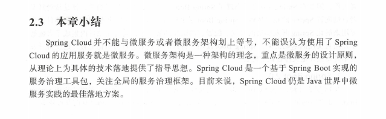

# SpringCloud总览

#### 服务注册和发现组件

Eureka\Consul\Zookeeper

#### 服务调用组件

Hystrix/Ribbon/OpenFeign

##### Hystrix 在依赖服务失效情况下，通过隔离依赖服务的方式，防止服务级联失败，提供失败回滚机制。Ribbon提供客户端的负载均衡算法，完善了配置项如超时 重试等等。OpenFeign是一个声明式的Restful网络请求客户端，是Ribbon上的封装。

#### 路由和过滤组件

Spring Cloud Gateway/Zuul

Spring Cloud Gateway 提供了构建在Spring生态上的Api网关。提供横切关注点，安全性，监控指标

弹性。

#### 消息组件 

Spring Cloud Bus/Spring Cloud Stream

Spring Cloud Stream 对于分布式消息的各种需求进行了抽象，包括了发布订阅，分组消费，消息分区等功能，实现了微服务的异步通信。Spring Cloud Bus 提供了服务间的时间通信（刷新Config配置）

#### 配置中心组件

Spring Cloud Config 

实现了配置的集中管理，动态刷新。

#### 安全控制组件

Spring Cloud Security 等基于Oauth2.0 微服务环境下的单点登录、资源授权、令牌管理

#### 链路监控组件

Spring Cloud Sleuth 提供了全自动 可配置的数据埋点，收集服务调用链路上的性能数据

### Spring Cloud特性

Spring Cloud 提供了一系列组件 

两个公共库 Spring Cloud Context 和Spring Cloud Commons

Spring Cloud Context 位Spring Cloud  提供了大量实用工具和特性服务

Spring Cloud Commons 针对不同的Spring Cloud 实现 比如 Eureka 和Spring CLoud Consul两种不同的服务注册和发现实现 提供上层抽象和公共类

##### Spring Cloud Context : 应用上下文

##### Bootstrap 

除了应用上下文配置 application.yml SpringCloud额外提供了与Bootstrap相关的应用属性。

Bootstrap对于主程序而言是个父级上下文，支持从外部资源加载配置文件。Boostrap上下文和应用上下文共享一个环境。

与主程序规则不同来加载外部配置。因此 bootstrap.yml 用于为Bootstrap上下文加载外部配置。区别于应用上下文application.yml 

##### 应用上下文层级

Spring上下文有个特性：子级上下文从父级继承属性元和配置文件，如果通过SPringAPplication或者

SPringApplicaitonBuilder构建应用程序上下文。那么Bootstrap上下文会成为应用程序的父级上下文。

