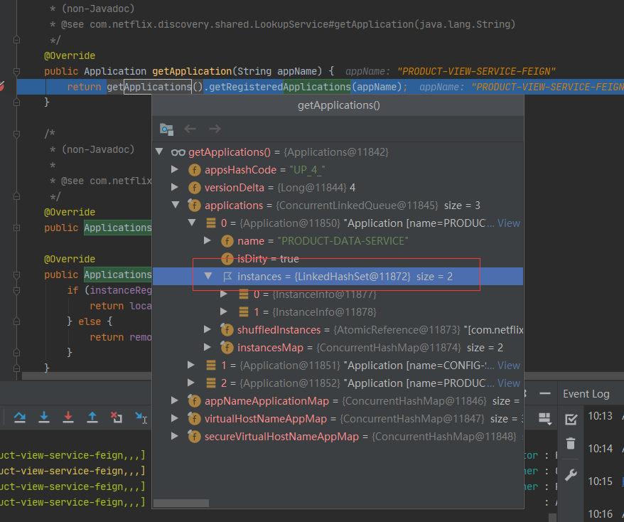

# 服务注册与发现

#### 服务发现原理

#### 服务发现客户端

这东西其实很简单 Applications 说白了就是service的集合

但是你的service不是可以搞负载均衡吗 data-service 就是一个Application，有两台服务器也是一个Application ， Application维持着一个instances 这个列表实际上  保存着这两个服务器。

### 按需注册的定时任务

#### 服务下线

#### Eureka Server 源码解析

LeaseManager:租约的接口规范（renew register cancel evict）

Lookup (服务检索)

PeerAwareInstanceRegistry 集群的	Eureka 集群的同步操作

AbstractInstanceRegistry InstanceRegistry具体实现

PeerAwareInstanceRegistryImpl 对本地中注册表的基础上加入了对peer节点的同步

#### 集群同步

意思就是要有同步 不然Config缓存不到注册表的信息

