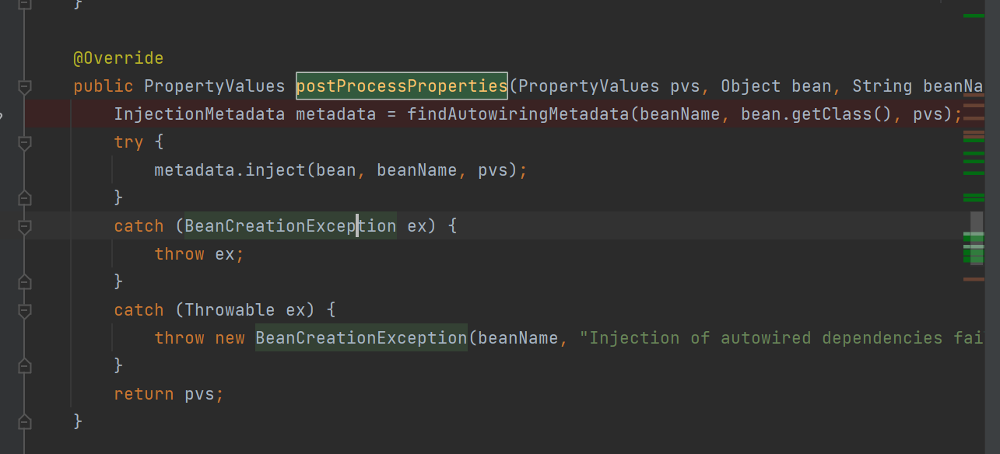
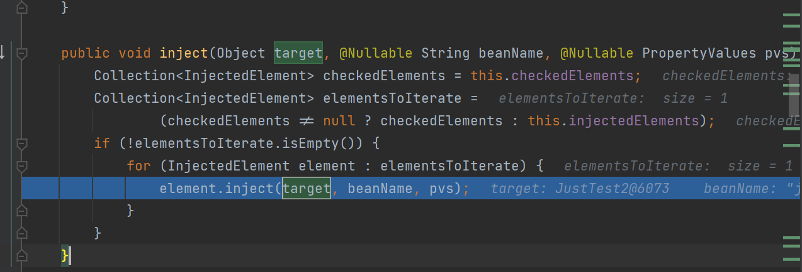

# Autowired的原理

其实是个beanPostProcessor

也是SmartInstancetionAwareBeanPostProcessor

这个东西调用的地方还是很灵活的 determineCandidateConstructors

比创造实例前更早调用

这个也实现了MergeBeanPostProcessor 在实例化之后就解析了 注解信息主要就是@Autowired @Value两个注解

没想到还是在populateValue期间 调用了InstanceAwareBeanPostProcessor的

```
postProcessProperties
```

这个方法



我们可以看到 是吧 在实例化之前 实例化之后 都没有 给Aurtowired实际的对象 

而在POstProcessBeforeInit 这个方法里就有了 说明就是populate中完成的



我们看到也确实是在这里王城的


这里实际上用反射的方法把 对象写入进去