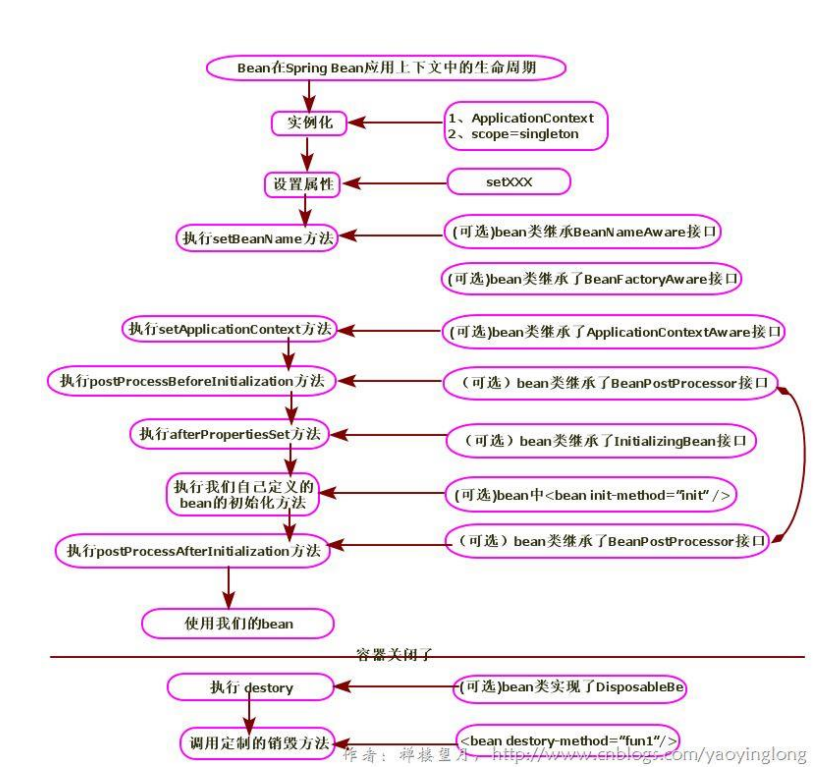
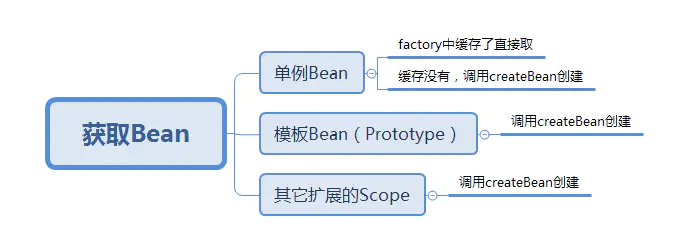
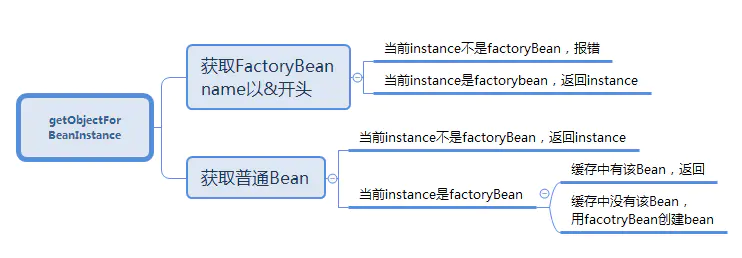
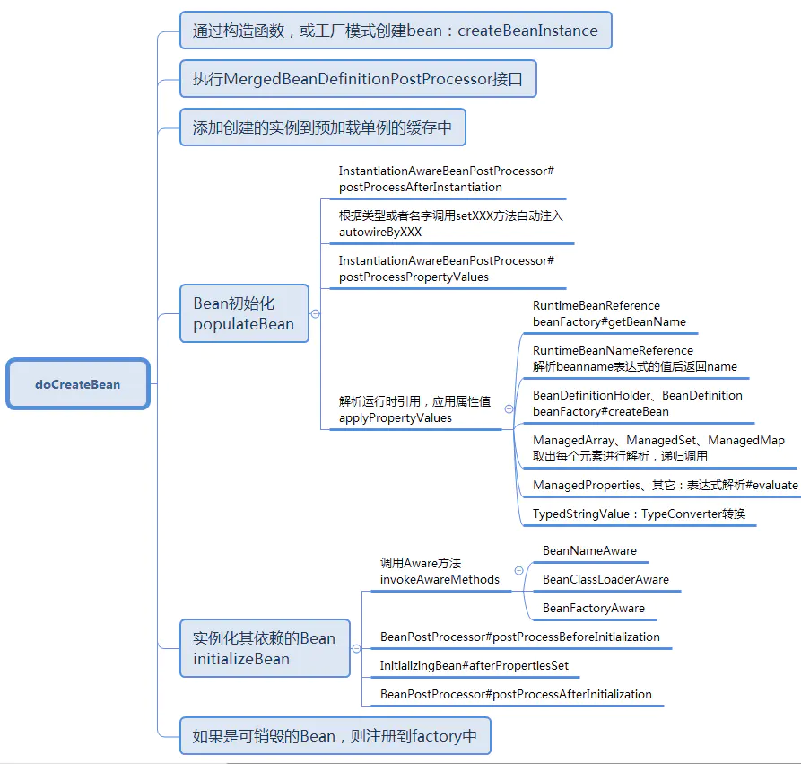

Bean容器在配置文件中找到Spring Bean的定义。

Bean容器使用Java Reflection API创建Bean的实例。

如果声明了任何属性，声明的属性会被设置。如果属性本身是Bean，则将对其进行解析和设置。

如果Bean类实现`BeanNameAware`接口，则将通过传递Bean的名称来调用`setBeanName()`方法。

如果Bean类实现`BeanClassLoaderAware`接口，则将通过传递加载此Bean的ClassLoader对象的实例来调用`setBeanClassLoader()`方法。

如果Bean类实现`BeanFactoryAware`接口，则将通过传递BeanFactory对象的实例来调用`setBeanFactory()`方法。

如果有任何与BeanFactory关联的BeanPostProcessors对象已加载Bean，则将在设置Bean属性之前调用`postProcessBeforeInitialization()`方法。

如果Bean类实现了`InitializingBean`接口，则在设置了配置文件中定义的所有Bean属性后，将调用`afterPropertiesSet()`方法。

如果配置文件中的Bean定义包含`init-method`属性，则该属性的值将解析为Bean类中的方法名称，并将调用该方法。

如果为Bean Factory对象附加了任何Bean 后置处理器，则将调用`postProcessAfterInitialization()`方法。

如果Bean类实现`DisposableBean`接口，则当Application不再需要Bean引用时，将调用`destroy()`方法。

如果配置文件中的Bean定义包含`destroy-method`属性，那么将调用Bean类中的相应方法定义。

所以可以看出MergedBeanDefinitionPostProcessors

 这个beanPostProcess可以在实例化之后 populate之前被调用

很多操作比如Autowire就是实现了这个接口 ，在这弄得

