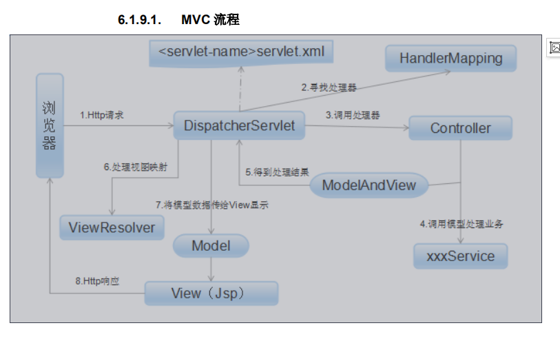

Spring MVC 模型 视图 控制器是围绕一个DispatcherServlet来设计的

这个Servlet会把请求分发给各个处理器 并支持可配置的处理器映射，视图渲染 本地化 时区和主题渲染，甚至支持文件上传。

1请求到达DispatcherServlet-> HandlerMapper寻找处理器 

HandlerAdapter->Controller->调用实际业务处理->ModelAndView得到视图结果，处理视图映射，ViewResovle 将模型 传给view显示 ->响应

拦截器就是是附加在HandlerExecutionChain里也就是这里的MapperHandler