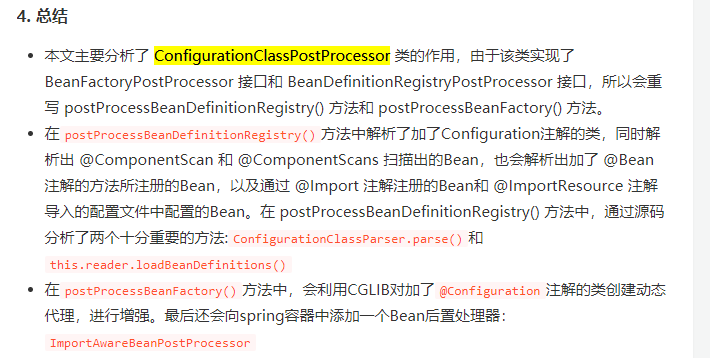

默认看还是使用了AnnotationConfigServletApplicationContext

```

//调用了父类AbstractApplicationContext的refresh方法
@Override
public void refresh() throws BeansException, IllegalStateException {
//
   synchronized (this.startupShutdownMonitor) {
      // Prepare this context for refreshing.
      //设置开始时间，启用active状态 初始化配置源  然后监听环境信息
      prepareRefresh();

      // Tell the subclass to refresh the internal bean factory.
      //获取默认的内置beanFactory ConfigurableListableBeanFactory
      ConfigurableListableBeanFactory beanFactory = obtainFreshBeanFactory();

      // Prepare the bean factory for use in this context.
      //为了上下文准备下beanFactory
      //1.告诉beanFactory使用上下文的类加载器
      //2.用上下文的回调配置beanFactory （增加ApplicationContextAwareProcessor）
      //3.设置特殊的类型对应的bean。BeanFactory对应刚刚获取的BeanFactory；ResourceLoader、ApplicationEventPublisher、ApplicationContext这3个接口对应的bean都设置为当前的Spring容器 （说白了就是beanFactory提供者很多，你需要手动告诉这些类，用ConfigListableBeanFactory作为依赖）
      //4.新增ApplicationListenerDetector这个后置处理器，用来找到Application的监听类
      //5.配置一些环境信息
      prepareBeanFactory(beanFactory);

      try {
         // Allows post-processing of the bean factory in context subclasses.
         //This allows for registering special
	 * BeanPostProcessors etc in certain ApplicationContext implementations
	 //允许各自的应用上下文注册自己特殊的后置处理器
         postProcessBeanFactory(beanFactory);

         // Invoke factory processors registered as beans in the context.
         //调用上下文中的工厂后置处理器
         //实例化并且调用所有注册的BeanFactory后置处理器beans 这些beanFacroty的后置处理器实在SpringApplication#run ->prepareContext里存入的 
         //必须在单例实例化之前调用
         //invokeBeanFactoryPostProcessors方法总结来说就是从Spring容器中找出BeanDefinitionRegistryPostProcessor和BeanFactoryPostProcessor接口的实现类并按照一定的规则顺序进行执行。 值得说的是ConfigurationClassPostProcessor这个处理器实际上是在SpringApplication的createContext生成AnnotationConfigrreWebServletApplicationContext时候顺便生成的，然后在这里的beandefinitionResitryPostProcessor中执行这个 之后，还会调用regis ConfigurationClassParser解析完成之后，被解析出来的类会放到configurationClasses属性中。然后使用ConfigurationClassBeanDefinitionReader去解析这些类。
         invokeBeanFactoryPostProcessors(beanFactory);

         // Register bean processors that intercept bean creation.
         //注册干预bean创建的bean后置处理
         //实例化并调用所有注册的bean 后置处理器 必须在应用bean的实例化之前被调用
         //和invokeBeanFaroryPostProcessor一样，都有个一个@PriorityOrdered 和order 这些的开始顺序 按顺序注册这些bean
         //最后 重新注册内置BeanPostProcessor
         //找到应用监听器
         registerBeanPostProcessors(beanFactory);

         // Initialize message source for this context.
         //国际化配置
         initMessageSource();

         // Initialize event multicaster for this context.
         //初始化上下文的组播者 直接从beanFacrtory中获取 在Spring容器中初始化事件广播器，事件广播器用于事件的发布。
         initApplicationEventMulticaster();

         // Initialize other special beans in specific context subclasses.
         //一个模板方法，不同的Spring容器做不同的事情。 可以初始化
         onRefresh();

         // Check for listener beans and register them.
         	/**
	 * Add beans that implement ApplicationListener as listeners.
	 * Doesn't affect other listeners, which can be added without being beans.
	 */
	//把Spring容器内的时间监听器和BeanFactory中的时间监听器都添加的事件广播器中。
   // 然后如果存在early event的话，广播出去。
         registerListeners();

         // Instantiate all remaining (non-lazy-init) singletons.
         实例化的过程各种BeanPostProcessor开始起作用。
         finishBeanFactoryInitialization(beanFactory);

         // Last step: publish corresponding event.
         //finishRefresh方法
refresh做完之后需要做的其他事情。

初始化生命周期处理器，并设置到Spring容器中(LifecycleProcessor)
调用生命周期处理器的onRefresh方法，这个方法会找出Spring容器中实现了SmartLifecycle接口的类并进行start方法的调用
发布ContextRefreshedEvent事件告知对应的ApplicationListener进行响应的操作
调用LiveBeansView的registerApplicationContext方法：如果设置了JMX相关的属性，则就调用该方法
发布EmbeddedServletContainerInitializedEvent事件告知对应的ApplicationListener进行响应的操作
         finishRefresh();
      }

      catch (BeansException ex) {
         if (logger.isWarnEnabled()) {
            logger.warn("Exception encountered during context initialization - " +
                  "cancelling refresh attempt: " + ex);
         }

         // Destroy already created singletons to avoid dangling resources.
         destroyBeans();

         // Reset 'active' flag.
         cancelRefresh(ex);

         // Propagate exception to caller.
         throw ex;
      }

      finally {
         // Reset common introspection caches in Spring's core, since we
         // might not ever need metadata for singleton beans anymore...
         resetCommonCaches();
      }
   }
}
```


