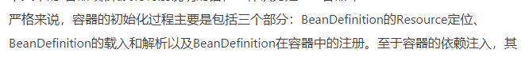

### **spring ioc初始化流程?**

resource定位 即寻找用户定义的bean资源，由 ResourceLoader通过统一的接口Resource接口来完成 beanDefinition载入 BeanDefinitionReader读取、解析Resource定位的资源 成BeanDefinition 载入到ioc中（通过HashMap进行维护BD） BeanDefinition注册 即向IOC容器注册这些BeanDefinition， 通过BeanDefinitionRegistery实现

### **BeanDefinition加载流程?**

定义BeanDefinitionReader解析xml的document BeanDefinitionDocumentReader解析document成beanDefinition

### **DI依赖注入流程? （实例化，处理Bean之间的依赖关系）**

过程在Ioc初始化后，依赖注入的过程是用户第一次向IoC容器索要Bean时触发

- 如果设置lazy-init=true，会在第一次getBean的时候才初始化bean， lazy-init=false，会容器启动的时候直接初始化（singleton bean）；
- 调用BeanFactory.getBean（）生成bean的；
- 生成bean过程运用装饰器模式产生的bean都是beanWrapper（bean的增强）；
  **依赖注入怎么处理bean之间的依赖关系?**
  其实就是通过在beanDefinition载入时，如果bean有依赖关系，通过占位符来代替，在调用getbean时候，如果遇到占位符，从ioc里获取bean注入到本实例来