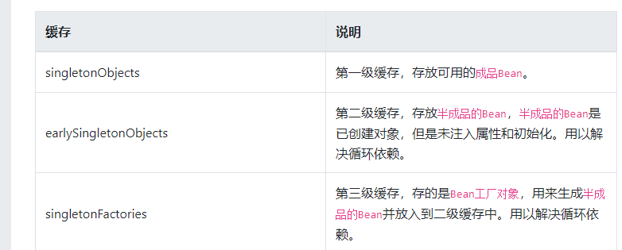
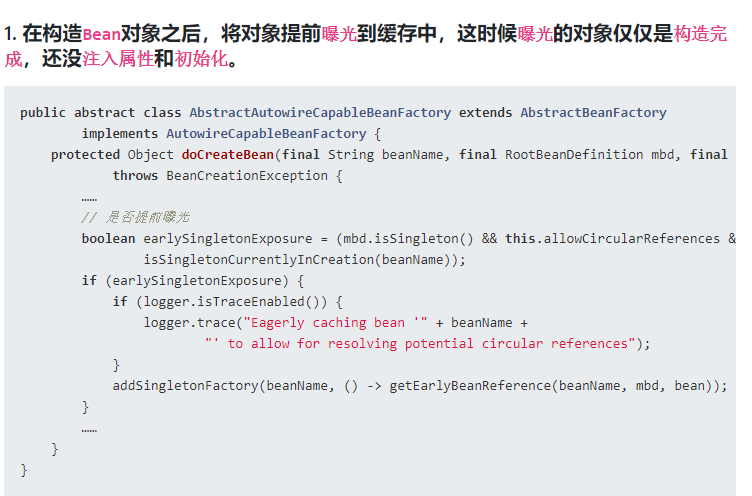
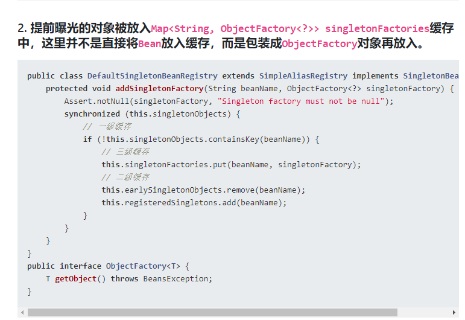
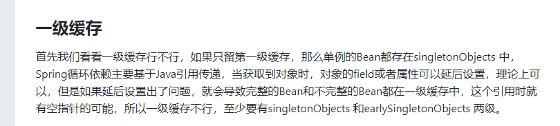

## 小总结 | 面试这么答

#### B 中提前注入了一个没有经过初始化的 A 类型对象不会有问题吗？

虽然在创建 B 时会提前给 B 注入了一个还未初始化的 A 对象，但是在创建 A 的流程中一直使用的是注入到 B 中的 A 对象的引用，之后会根据这个引用对 A 进行初始化，所以这是没有问题的。

#### Spring 是如何解决的循环依赖？

Spring 为了解决单例的循环依赖问题，使用了三级缓存。其中一级缓存为单例池（`singletonObjects`），二级缓存为提前曝光对象（`earlySingletonObjects`），三级缓存为提前曝光对象工厂（`singletonFactories`）。

假设A、B循环引用，实例化 A 的时候就将其放入三级缓存中，接着填充属性的时候，发现依赖了 B，同样的流程也是实例化后放入三级缓存，接着去填充属性时又发现自己依赖 A，这时候从缓存中查找到早期暴露的 A，没有 AOP 代理的话，直接将 A 的原始对象注入 B，完成 B 的初始化后，进行属性填充和初始化，这时候 B 完成后，就去完成剩下的 A 的步骤，如果有 AOP 代理，就进行 AOP 处理获取代理后的对象 A，注入 B，走剩下的流程。

#### 为什么要使用三级缓存呢？二级缓存能解决循环依赖吗？

如果没有 AOP 代理，二级缓存可以解决问题，但是有 AOP 代理的情况下，只用二级缓存就意味着所有 Bean 在实例化后就要完成 AOP 代理，这样违背了 Spring 设计的原则，Spring 在设计之初就是通过 `AnnotationAwareAspectJAutoProxyCreator` 这个后置处理器来在 Bean 生命周期的最后一步来完成 AOP 代理，而不是在实例化后就立马进行 AOP 代理。


Spring解决循环依赖的核心思想在于提前曝光

1.通过构建函数创建a对象 

2.a对象发现要注入b对象，但是缓存里没有b对象，将半成品对象a放入半成品缓存

2。通过构建函数创建b对象  b对象也是半成品， 还没注入属性和init方法

4.b对象注入a对象，从半成品缓存中拿半成品对象a （这里实际上是先访问三级缓存，拿到之后移入二级 因为a被放入三级缓存后，只要有一个bean尝试获取他的单例，那就会把他从三级移动到二级）

5.b完成后放入完成品缓存

a继续注入属性，从完成品中获得完成品b对象并注入

完成后将a对象放入完成品缓存







### 一级缓存singletonObjects

用于保存BeanName和创建bean实例之间的关系,beanName -> bean instance

> private final Map<String, Object> singletonObjects = new ConcurrentHashMap(256);

### 二级缓存earlySingletonObjects

保存提前曝光的单例bean对象

> private final Map<String, Object> earlySingletonObjects = new HashMap<>(16);

### 三级缓存singletonFactories

保存beanName和创建bean实例之间的关系,与singletonObjects不同的地方在于，当一个单例bean被放到这里面后，bean在创建过程中，可以通过getBean方法获取到,目的是用来检测循环引用

> private final Map<String, Object> singletonFactories = new HashMap(16);

在创建bean的时候，首先从缓存中获取单例的bean，这个缓存就是**singletonObjects**，如果获取不到且bean正在创建中，就再从**earlySingletonObjects**中获取，如果还是获取不到且允许从singletonFactories中通过getObject拿到对象，就从**singletonFactories**中获取，如果获取到了就存入**earlySingletonObjects**并从**singletonFactories**中移除。



那么我们再看看两级缓存行不行

```
现在有A的field或者setter依赖B的实例对象，同时B的field或者setter依赖了A的实例，A首先开始创建，并将自己暴露到 earlySingletonObjects 中，开始填充属性，此时发现自己依赖B的属性，尝试去get(B)，发现B还没有被创建，所以开始创建B，在进行属性填充时初始化A，就从earlySingletonObjects 中获取到了实例化但没有任何属性的A，B拿到A后完成了初始化阶段，将自己放到singletonObjects中,此时返回A，A拿到B的对象继续完成初始化，完成后将自己放到singletonObjects中，由A与B中所表示的A的属性地址是一样的，所以A的属性填充完后，B也获取了A的属性，这样就解决了循环的问题。
```

似乎完美解决，如果就这么使用的话也没什么问题，但是再加上AOP情况就不同了，被AOP增强的Bean会在初始化后代理成为一个新的对象，也就是说：

```
如果有AOP，A依赖于B，B依赖于A，A实例化完成暴露出去，开始注入属性，发现引用B，B开始实例化，使用A暴露的对象，初始化完成后封装成代理对象，A再将代理后的B注入，再做代理，那么代理A中的B就是代理后的B，但是代理后的B中的A是没用代理的A。
```

显然这是不对的，所以在Spring中存在第三级缓存，在创建对象时判断是否是单例，允许循环依赖，正在创建中，就将其从earlySingletonObjects中移除掉，并在singletonFactories放入新的对象，这样后续再查询beanName时会走到singletonFactory.getObject()，其中就会去调用各个beanPostProcessor的getEarlyBeanReference方法，返回的对象就是代理后的对象。


跟源码的时候，发现在创建 beanB 需要引用 beanA 这个“半成品”的时候，就会触发"前期引用"，即如下代码：

```
ObjectFactory<?> singletonFactory = this.singletonFactories.get(beanName);
if (singletonFactory != null) {
    // 三级缓存有的话，就把他移动到二级缓存
    singletonObject = singletonFactory.getObject();
    this.earlySingletonObjects.put(beanName, singletonObject);
    this.singletonFactories.remove(beanName);
}
```

```
singletonFactory.getObject() 是一个接口方法，这里具体的实现方法在

protected Object getEarlyBeanReference(String beanName, RootBeanDefinition mbd, Object bean) {
    Object exposedObject = bean;
    if (!mbd.isSynthetic() && hasInstantiationAwareBeanPostProcessors()) {
        for (BeanPostProcessor bp : getBeanPostProcessors()) {
            if (bp instanceof SmartInstantiationAwareBeanPostProcessor) {
                SmartInstantiationAwareBeanPostProcessor ibp = (SmartInstantiationAwareBeanPostProcessor) bp;
                // 这么一大段就这句话是核心，也就是当bean要进行提前曝光时，
                // 给一个机会，通过重写后置处理器的getEarlyBeanReference方法，来自定义操作bean
                // 值得注意的是，如果提前曝光了，但是没有被提前引用，则该后置处理器并不生效!!!
                // 这也正式三级缓存存在的意义，否则二级缓存就可以解决循环依赖的问题
                exposedObject = ibp.getEarlyBeanReference(exposedObject, beanName);
            }
        }
    }
    return exposedObject;
}


@Override
public Object getEarlyBeanReference(Object bean, String beanName) throws BeansException {
   Object cacheKey = getCacheKey(bean.getClass(), beanName);
   this.earlyProxyReferences.put(cacheKey, bean);
   // 对bean进行提前Spring AOP代理
   return wrapIfNecessary(bean, beanName, cacheKey);
}
```


onrefresh方法里的finishBeanFactory Inilization  就是执行bean后置处理器 把非懒加载的bean初始化


doGet 不到就要解决 doCreate create的过程中 这时候要先把自己放入singleLectonFactory中 （三级缓存）   再要populatie 注入属性 ，然后解决依赖 ， 继续向下获取依赖对象 

依赖对象也是一样 get doget  create docreate populate 然后把自己放入三级缓存

然后获取a的单例  一样查询 一级  查不到 查二级     然后查三级 

返回a的代理对象 这时候把 a放到二级缓存中，移除三级缓存

这时候b就完成了populate过程，解决了依赖，执行回调    beanpostprocess的before  开始初始化   afterPropertyset 等（如果有） init_method 等   beanpostprocess的after  等  


然后把 注入好对象的b 放入singleton中 移出二级缓存（虽然从来没放进去过）  三级缓存

最后 a也完成了 依赖处理 完成了populate 

开始初始化-> 各种回调  beanpostprocess的before afterPropertyset 等 init_method    beanpostprocess的after

然后把自己移出二级缓存 放入一级缓存。